# 🧩 Twisted CTF Challenges — 10 retos locales Twisted TCP

<p align="center">
  
  
  
  
  
</p>

<p align="center">
  <i>Batería de 10 desafíos CTF sobre protocolo TCP raw desarrollados con Twisted (Python). Retos de carácter académico propuestos por el profesorado del módulo de Hacking Ético, basados en recursos de la comunidad CTF y adaptados para entorno local con Docker. Nueve de ellos derribados; uno documentado como reto abierto para el futuro.</i>
</p>

---

> [!NOTE]
> Estos retos son de **uso estrictamente académico y local**. Han sido desplegados en un entorno aislado (Docker) para practicar técnicas ofensivas de forma controlada dentro del marco del **Máster en Ciberseguridad**. No están pensados para ser expuestos en redes públicas.

---

## 📑 Índice

1. [Resumen Ejecutivo](#-1-resumen-ejecutivo)
2. [Infraestructura y Despliegue](#-2-infraestructura-y-despliegue)
3. [Catálogo de Retos](#-3-catálogo-de-retos)
4. [Estructura del Proyecto](#-4-estructura-del-proyecto)
5. [Herramientas de Apoyo](#-5-herramientas-de-apoyo)
6. [Writeup Integral: Proceso de Explotación](#-6-writeup-integral-proceso-de-explotación)

---

## 📌 1. Resumen Ejecutivo

Los *Twisted CTF Challenges* son una batería de diez desafíos TCP raw levantados en un contenedor Docker local. Cada reto escucha en su propio puerto consecutivo, del 9001 al 9010, y el atacante interactúa con ellos mediante conexiones `nc` puras. No hay interfaz web, no hay panel de administración: solo un socket que habla y espera una respuesta correcta. El rango de materias es deliberadamente amplio: hashing con sal, criptografía clásica, inyección de comandos, aritmética de precisión infinita, endianness, y manipulación de protocolos JSON. Esa amplitud convierte estos retos en un mapa de competencias muy completo de cara al examen del módulo. El único que queda abierto es el cuarto: un sandbox de Python con los builtins completamente anulados que requiere técnicas de introspección fuera del temario actual. Los nueve restantes, derribados.

---

## 🐳 2. Infraestructura y Despliegue

Para comenzar con los retos, lo primero es descomprimir el contenido del repo, ubicarlo en una carpeta de trabajo en Kali y levantar el entorno con Docker. El fichero `Dockerfile` ya contiene todo: la imagen base `python:3.11-slim`, la instalación de Twisted y el arranque del servidor unificado. El operario solo tiene que apuntar al directorio actual con el `.` del build — sin él, Docker no encuentra el contexto de construcción y aborta.

```bash
sudo docker build -t challs-twisted .
```

Tras los diecisiete segundos que tarda la descarga de capas y la instalación de Twisted, `docker images | grep challs` confirma que la imagen de 173 MB está registrada y lista.

<p align="center">
  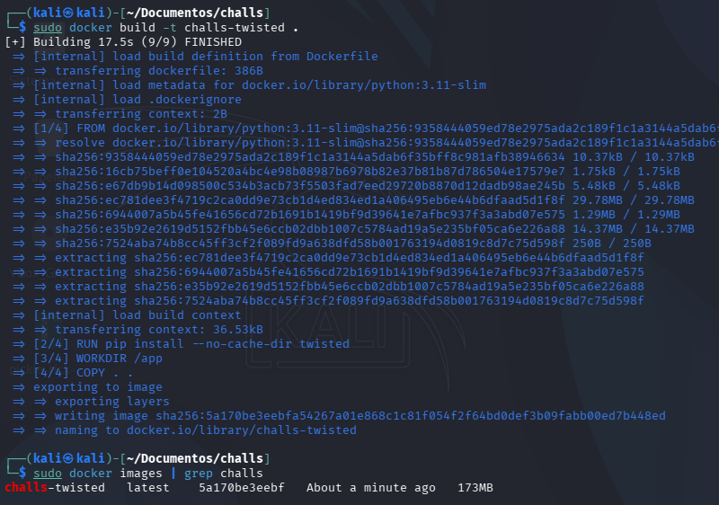
</p>

Con la imagen disponible, levanto el contenedor mapeando el rango completo de puertos y usando `--rm` para que se autodestruya al pararlo, sin acumular basura:

```bash
sudo docker run --rm -d --name challenges -p 9001-9010:9001-9010 challs-twisted
```

<p align="center">
  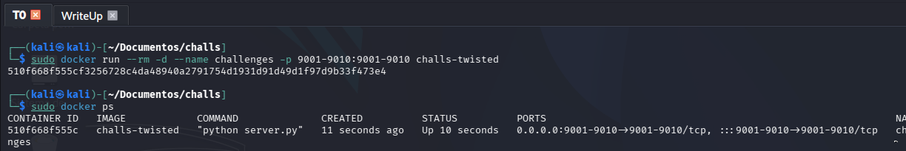
</p>

Antes de lanzar el primer `nc`, necesito la IP interna del contenedor. Docker asigna su propia red privada al contenedor, y esa IP es la que debo usar para simular un acceso de red real, como si el servidor estuviese en una máquina diferente:

```bash
sudo docker inspect challenges | grep -i "IPAddress"
```

<p align="center">
  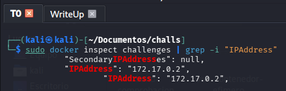
</p>

En mi entorno, el objetivo queda fijado en `172.17.0.2`. El método a partir de aquí es siempre el mismo: `nc 172.17.0.2 <puerto>`, leer el enunciado, y resolver.

---

## 🎯 3. Catálogo de Retos

| # | Puerto | Nombre | Categoría | Dificultad | Estado |
|:-:|:------:|--------|-----------|:----------:|:---:|
| 1 | 9001 | Base64 Maze | Criptografía | 🟢 Fácil | ✅ Done |
| 2 | 9002 | XOR Cipher | Criptografía | 🟢 Fácil | ✅ Done |
| 3 | 9003 | Weak Hash Auth | Hashing / Brute Force | 🟡 Media | ✅ Done |
| 4 | 9004 | Sandboxed REPL | Python Jailbreak | 🔴 Difícil | 🕰️ Pendiente |
| 5 | 9005 | CMD Injection | Inyección | 🟢 Fácil | ✅ Done |
| 6 | 9006 | Caesar Shift | Criptografía | 🟢 Fácil | ✅ Done |
| 7 | 9007 | Big Integer Sum | Aritmética | 🟢 Fácil | ✅ Done |
| 8 | 9008 | Guess the Number | Algoritmia | 🟢 Fácil | ✅ Done |
| 9 | 9009 | JSON Access | Manipulación | 🟢 Fácil | ✅ Done |
| 10 | 9010 | Endianness Puzzle | Bajo nivel | 🟡 Media | ✅ Done |

---

## 📁 4. Estructura del Proyecto

```text
ctf/challs/
├── retos/                      # Módulo Python con los 10 retos
│   ├── c1.py … c10.py
├── imagenes/                   # Capturas y evidencias
├── server.py                   # Runner unificado Twisted
├── Dockerfile
├── docker-compose.yml
├── solver_c3_bruteforce.py     # Fuerza bruta offline — Reto 3
├── solver_c7_bigsum.py         # Suma de precisión infinita — Reto 7
└── README.md
```

---

## 🛠️ 5. Herramientas de Apoyo

| Herramienta | Propósito |
|:---|:---|
| `nc (Netcat)` | Conexión TCP raw al puerto de cada reto. |
| `CyberChef` | Decodificado en cadena: Hex, B64, XOR Brute Force, Caesar. Disponible también offline. |
| `Python3 (REPL)` | Cálculos de precisión infinita y conversión hexadecimal → decimal. |
| `solver_c3_bruteforce.py` | Ataque de diccionario offline contra el token SHA-256 truncado a 6 hex. |
| `solver_c7_bigsum.py` | Suma exacta de enteros de 200 bits fuera del alcance de calculadoras convencionales. |

---

## 📝 6. Writeup Integral: Proceso de Explotación

### 🔐 Reto 1 — Base64 Maze `(puerto 9001)`

**Categoría:** Criptografía | **Dificultad:** 🟢 Fácil

Me conecto al primer reto y el servidor me escupe un tronco gigante de caracteres pidiéndome que lo decodifique para obtener la flag. A simple vista, el bloque está en hexadecimal: solo contiene dígitos del 0 al 9 y letras de la `a` a la `f`. No necesito más pistas.

```
nc 172.17.0.2 9001
Welcome!
Decode the following string to obtain the flag.
5554465352316778556c685452453433575770524d553136575442594d6c46335a46644b6330307a4d44303d
Send the decoded flag followed by newline.
```

Me dirijo a **CyberChef** — que se puede descargar en local sin requerir conexión a internet — y aplico `From Hex`. Lo que sale a continuación también está, a simple vista, en Base64. Le aplico `From Base64` una vez. El resultado sigue siendo Base64. Lo decodifico por segunda vez y la flag aparece limpiamente. Doble codificación, doble desenmascaramiento.

<p align="center">
  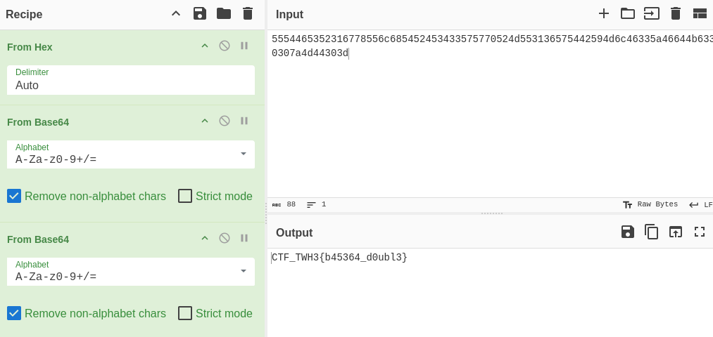
</p>

La envío al servidor como respuesta y la confirma sin contemplaciones.

```
CTF_TWH3{b45364_d0ubl3}
Correct! Here is your flag: CTF_TWH3{b45364_d0ubl3}
```

<p align="center">
  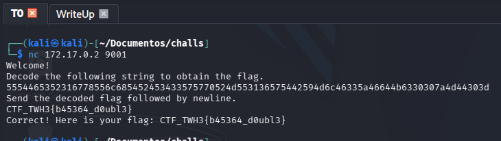
</p>

**Flag:** `CTF_TWH3{b45364_d0ubl3}`

---

### 🔑 Reto 2 — XOR Cipher `(puerto 9002)`

**Categoría:** Criptografía | **Dificultad:** 🟢 Fácil

Me conecto al segundo reto. La premisa es que un mensaje ha sido cifrado con XOR y una clave de un solo byte, y que debo mandarle como respuesta los dos dígitos hexadecimales que identifican esa clave.

```
nc 172.17.0.2 9002
Welcome to XOR Cipher!
The secret message has been XOR'd with a VERY simple key.
Ciphertext (hex): 697e6c757e7d621951521a58751e444e75481b5e5957
Send the key as a two-digit hex (e.g. 0f) to decode.
```

El texto ya se ve que está en hexadecimal, así que antes de lanzar cualquier fuerza bruta, primero lo paso por `From Hex` en CyberChef para trabajar con los bytes reales. Después aplico `XOR Brute Force` sobre los 256 posibles valores de un solo byte y uso `Ctrl+F` buscando el patrón `CTF`. Lo que aparece lo deja claro: `Key = 2a: CTF_TWH3{x0r_4nd_b1ts}`. La clave era `2a`.

<p align="center">
  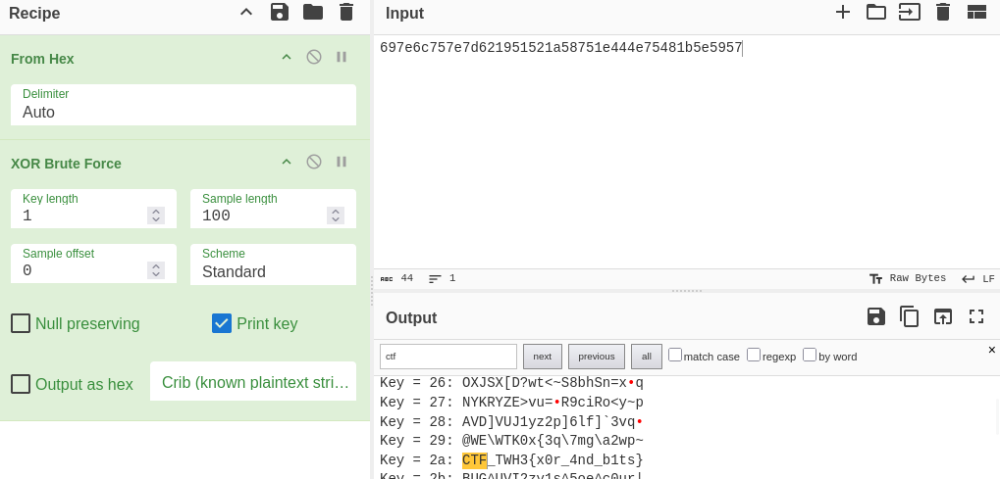
</p>

Mando `2a` al servidor.

```
2a
Nice! You found the key. Flag: CTF_TWH3{x0r_4nd_b1ts}
```

<p align="center">
  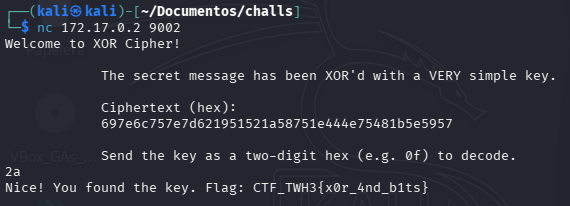
</p>

**Flag:** `CTF_TWH3{x0r_4nd_b1ts}`

---

### 🔒 Reto 3 — Weak Hash Auth `(puerto 9003)`

**Categoría:** Hashing / Brute Force | **Dificultad:** 🟡 Media

Este es bastante más complejo que los anteriores. El servidor me indica que debo autenticarme como `admin` enviando su contraseña, pero añade un detalle crucial: solo compara los primeros **6 dígitos hexadecimales** del hash `SHA256(salt + password)`. Es decir, no importa que la contraseña sea la correcta; importa que su hash empiece por los mismos 6 caracteres. Además, advierte explícitamente de no hacer fuerza bruta por el socket.

```
nc 172.17.0.2 9003
Authenticate as 'admin'. Stored truncated token (first 6 hex chars): 9689a7
DO NOT BRUTEFORCE THIS VIA SOCKET, DO IT OFFLINE.
```

<p align="center">
  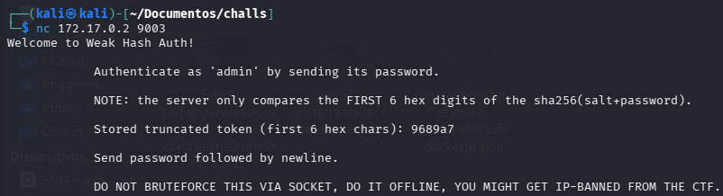
</p>

Mi primer movimiento es probar a fallo intencionado para ver qué me cuenta el servidor. Al fallar, el propio backend me regala algo de valor incalculable: me muestra su lógica interna completa, incluyendo la `SALT = "s0m3_s4lt"`. Con eso, puedo reproducir el proceso exactamente en local y hacer la fuerza bruta offline con toda la potencia de mi máquina.

<p align="center">
  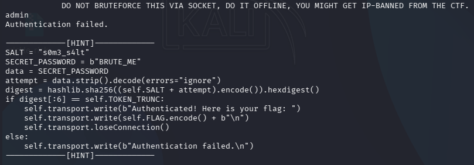
</p>

Construyo el script `solver_c3_bruteforce.py`: recorre `rockyou.txt` línea a línea, concatena la sal a cada candidata, calcula el SHA-256, y compara solo los primeros 6 hex con el token objetivo. Si hay coincidencia, la contraseña es válida para el servidor aunque su hash completo sea diferente. Esa es exactamente la vulnerabilidad que este reto modela.

```python
import hashlib

SALT = "s0m3_s4lt"
TOKEN_TRUNC = '9689a7'

with open("/usr/share/wordlists/rockyou.txt", "r", encoding="utf-8") as f:
    for linea in f:
        palabra = linea.strip()
        hash_palabra = hashlib.sha256(SALT.encode() + palabra.encode()).hexdigest()
        if hash_palabra[:6] == TOKEN_TRUNC:
            print(f"Encontrado: {palabra}")
            break
```

Tarda apenas unos segundos. `letmein123` es suficiente para que el hash comience por `9689a7`.

<p align="center">
  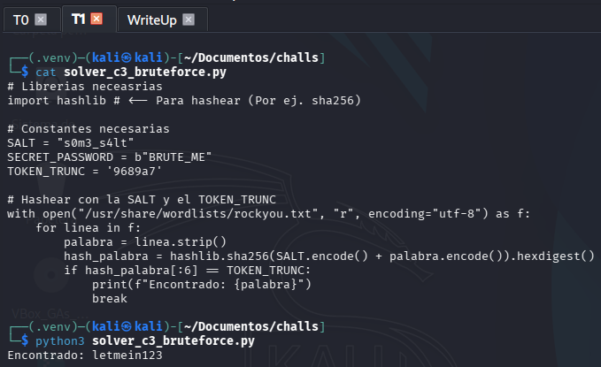
</p>

Valido `letmein123` contra el servidor y el reto 3 queda finiquitado.

```
letmein123
Authenticated! Here is your flag: CTF_TWH3{h45h_trunc_weak}
```

**Flag:** `CTF_TWH3{h45h_trunc_weak}`

---

### 💣 Reto 5 — CMD Injection `(puerto 9005)`

**Categoría:** Inyección | **Dificultad:** 🟢 Fácil

El reto 5 me llama la atención desde el primer momento: una especie de buscador de archivos con interfaz de texto. Me conecto y el servidor me explica cómo usarlo. El instinto natural del hacker es salirse del uso previsto, así que pruebo `ls -lah` de primeras. Respuesta inmediata: `Invalid command. Try: help`.

```
nc 172.17.0.2 9005
Welcome to TinySearch!
ls -lah
Invalid command. Try: help
help
Commands:
    search <pattern> (ALL USERS)
    reveal (ADMIN ONLY)
```

El menú de `help` me revela la clave del asunto: existe un comando `reveal` reservado exclusivamente para administradores. No puedo llamarlo directamente porque lo filtra. Pero tengo `search`, que acepta cualquier entrada. Mi razonamiento es que quizás el servidor construye el comando internamente usando la entrada del usuario sin separar bien los tokens. Pruebo diferentes separadores — pipes, doble ampersand, coma — hasta que el `;` funciona a la primera: `search <algo>; reveal`. El servidor lo interpreta como dos comandos encadenados y ejecuta `reveal` sin verificar el origen de la llamada.

```
search flag; reveal
ADMIN: revealing secret...
CTF_TWH3{s1mul4t3d_cmd_inj}
```

<p align="center">
  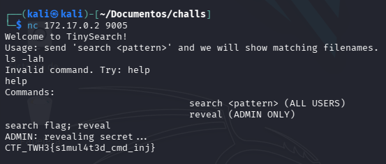
</p>

**Flag:** `CTF_TWH3{s1mul4t3d_cmd_inj}`

---

### 🏛️ Reto 6 — Caesar Shift `(puerto 9006)`

**Categoría:** Criptografía | **Dificultad:** 🟢 Fácil

El sexto reto es sencillo a la vista. El servidor me entrega directamente lo que parece ser una flag, pero algo chirría: en vez de `CTF_` pone `QHT_`, y en vez de `TWH3` pone `HKV3`. La estructura del formato de flag se conserva, pero las letras se han desplazado un número fijo de posiciones. Cifrado César. La cuestión es cuántas rotaciones.

```
nc 172.17.0.2 9006
Ciphertext: QHT_HKV3{q43g4f_gv1th}
Send the decoded flag.
```

<p align="center">
  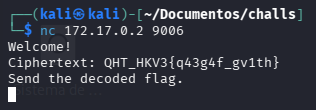
</p>

En CyberChef uso `Caesar Cipher` y deslizo el valor de rotación mientras tengo `Ctrl+F` buscando `CTF`. En cuanto el texto decodificado muestra `CTF_TWH3{...}` en claro, tengo el desplazamiento exacto y la flag lista para enviar.

<p align="center">
  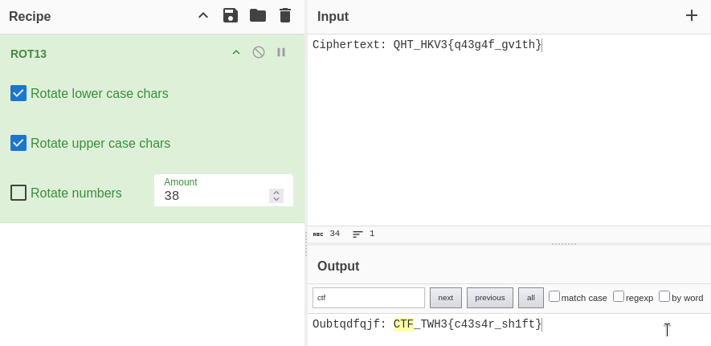
</p>

```
CTF_TWH3{c43s4r_sh1ft}
Correct! Flag: CTF_TWH3{c43s4r_sh1ft}
```

<p align="center">
  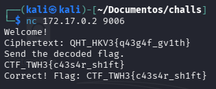
</p>

**Flag:** `CTF_TWH3{c43s4r_sh1ft}`

---

### 🧮 Reto 7 — Big Integer Sum `(puerto 9007)`

**Categoría:** Aritmética | **Dificultad:** 🟢 Fácil

El siguiente reto en el puerto 9007 es ridículamente fácil, pero solo si caes en lo correcto: el servidor te lanza dos números de sesenta dígitos cada uno y te pide su suma exacta. Si intentas resolverlo con una calculadora de escritorio o incluso con la mayoría de lenguajes de programación de bajo nivel, el resultado saldrá redondeado y será incorrecto. Python, en cambio, gestiona aritmética de enteros con precisión infinita de forma nativa sin instalación alguna. La respuesta exacta sale de un simple `print`.

```
nc 172.17.0.2 9007
Add these numbers exactly:
396235879977718804183686283202004597008746752200574793460649
904448554954075627506624934933699553722565872199283920581068
```

<p align="center">
  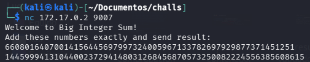
</p>

El script `solver_c7_bigsum.py` es literal: un `print` con la suma. Python no necesita librerías especiales para esto.

<p align="center">
  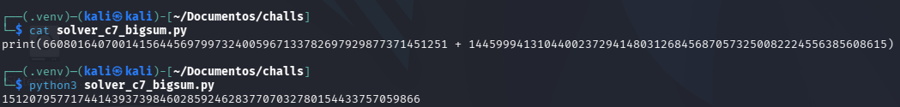
</p>

Valido el resultado y el servidor lo acepta sin rechistar.

```
1512079577174414393739846028592462837707032780154433757059866
Correct! Flag: CTF_TWH3{b1g_num5_sum}
```

<p align="center">
  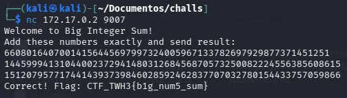
</p>

**Flag:** `CTF_TWH3{b1g_num5_sum}`

---

### 🎲 Reto 8 — Guess the Number `(puerto 9008)`

**Categoría:** Algoritmia | **Dificultad:** 🟢 Fácil

El reto 8 era un minijuego de adivinanza: el servidor escoge un número entre 0 y 500 y por cada intento te dice si el número real es mayor o menor. La estrategia óptima es la búsqueda binaria clásica. Se empieza en el centro del rango (250), y según el feedback se parte el rango restante por la mitad en cada turno. En un rango de 500, el número exacto se alcanza siempre en menos de diez intentos.

```
nc 172.17.0.2 9008
Welcome to Guess the Number (0-500)!
250 → Lower!  |  150 → Lower!  |  100 → Higher!
122 → Higher! |  133 → Higher! |  144 → Higher!
148 → Lower!  |  146 → Higher! |  147 → Correct!
Flag: CTF_TWH3{num_gu355}
```

<p align="center">
  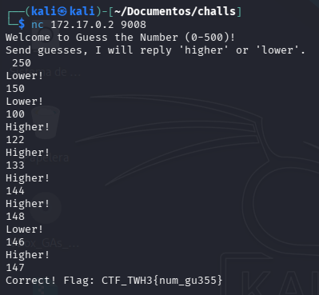
</p>

**Flag:** `CTF_TWH3{num_gu355}`

---

### 📦 Reto 9 — JSON Access `(puerto 9009)`

**Categoría:** Manipulación de protocolo | **Dificultad:** 🟢 Fácil

El reto 9 me pide que mande un objeto JSON diciendo que soy admin y que tengo acceso. El enunciado es casi un spoiler en sí mismo; la única trampa sutil es que `true` en JSON es un tipo booleano nativo, no una cadena de texto. Mandar `"true"` entre comillas sería un string y fallaría silenciosamente.

```
nc 172.17.0.2 9009
Welcome to JSON Access!
Send a JSON object saying that you are 'admin' and have access :)
{"username":"admin","access":true}
Correct! Flag: CTF_TWH3{js0n_4dm1n}
```

<p align="center">
  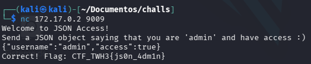
</p>

**Flag:** `CTF_TWH3{js0n_4dm1n}`

---

### 🔄 Reto 10 — Endianness Puzzle `(puerto 9010)`

**Categoría:** Bajo nivel | **Dificultad:** 🟡 Media

El "último reto" — porque el 4 lo hemos dejado para el futuro. El servidor me da un valor hexadecimal de 32 bits en formato **Little-Endian** y me pide el equivalente decimal en **Big-Endian**. La diferencia entre ambas representaciones es el orden en que se almacenan los bytes: Little-Endian los guarda del menos significativo al más significativo; Big-Endian, al revés.

```
nc 172.17.0.2 9010
Here is a 32-bit hex value (little-endian bytes): f3dd0aa3
Send the decimal value when interpreted in big-endian.
```

<p align="center">
  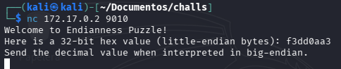
</p>

Uso CyberChef con `Swap Endianness` para reorganizar los bytes del valor recibido al orden Big-Endian. Con el hex ya reorganizado, abro un `python3` y le escribo el valor con `0x` delante: Python lo interpreta directamente como un entero decimal, que es exactamente lo que el servidor espera.

<p align="center">
  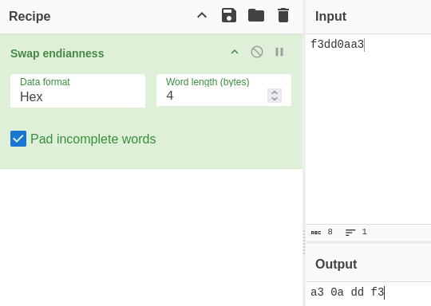
</p>

```python
>>> 0xa30addf3
2735398387
```

<p align="center">
  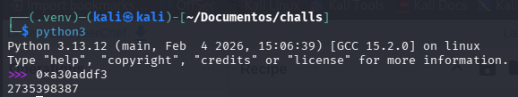
</p>

Valido el resultado y el reto 10 cae.

```
2735398387
Correct! Flag: CTF_TWH3{3nd14nn3ss}
```

<p align="center">
  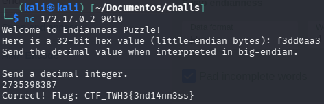
</p>

**Flag:** `CTF_TWH3{3nd14nn3ss}`

---

> [!CAUTION]
> **Reto 4 — Sandboxed REPL** `(puerto 9004)`: El propio profesorado indicó que no era necesario abordarlo. La sala lo deja claro desde el primer keystroke: el entorno anula completamente los builtins de Python (`__builtins__=None`), y escapar requiere técnicas de introspección profunda mediante `__subclasses__()` que exceden el temario del módulo. Se deja documentado para una posible revisión futura, cuando las bases de bajo nivel estén más asentadas.

<p align="center">
  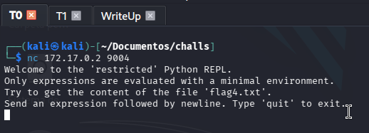
</p>

---

<hr>
<p align="center">
  <i>Writeup elaborado como parte del módulo de Hacking Ético — Máster en Ciberseguridad.</i>
</p>
