<h1 align="center">🔐 Simulacro 01: Básico — Writeup Completo</h1>

<p align="center">
  
  
  
  
  
</p>

<p align="center">
  <i>Un simulacro basado en el encadenamiento de vectores: desde una subida de archivos arbitraria facilitada por una mala configuración de FTP, hasta un secuestro de tareas programadas y una escalada final mediante la sobrescritura del archivo maestro de privilegios /etc/sudoers.</i>
</p>

---

> [!WARNING]
> **Aviso de Evasión.** Los bloques de código y extensiones maliciosas en este documento han sido ofuscados mediante etiquetas descriptivas para evitar falsos positivos por parte de software antivirus (Windows Defender).

---

## 📑 Índice

1. [Resumen Ejecutivo](#-1-resumen-ejecutivo)
2. [Vectores de Ataque](#-2-vectores-de-ataque-owasp-y-mitre)
3. [Herramientas Utilizadas](#-3-herramientas-utilizadas)
4. [Fase 1 — Despliegue y Reconocimiento Inicial](#-4-fase-1--despliegue-y-reconocimiento-inicial)
5. [Fase 2 — El FTP Anónimo y la Webshell](#-5-fase-2--el-ftp-anónimo-y-la-webshell)
6. [Fase 3 — Reverse Shell y Foothold](#-6-fase-3--reverse-shell-y-foothold)
7. [Fase 4 — Escalada Lateral: Rafa y su Cronjob](#-7-fase-4--escalada-lateral-rafa-y-su-cronjob)
8. [Fase 5 — Escalada Vertical: El "O" de Root (Wget)](#-8-fase-5--escalada-vertical-el-o-de-root-wget)
9. [Flag Obtenida](#-9-flag-obtenida)
10. [Conclusión](#-10-conclusión)

---

## 📌 1. Resumen Ejecutivo

**Simulacro 01: Básico** es un laboratorio modular que pone a prueba la capacidad de unir piezas de información aparentemente inconexas. El objetivo es comprometer una máquina servidora Linux (Main Quest) omitiendo retos laterales aislados. La clave del éxito reside en una enumeración agresiva que permite descubrir un portal web Apache con permisos de subida desatendidos vía FTP anónimo.

Tras lograr la ejecución remota de código (RCE), la post-explotación revela un script de mantenimiento con permisos universales (777) ejecutado periódicamente por el usuario `rafa`. Al secuestrar esta tarea programada (Cron), saltamos lateralmente de usuario. El asalto final a la cuenta de `root` se consigue explotando un permiso `NOPASSWD` sobre el binario `wget`, el cual utilizamos para sobrescribir la configuración sagrada de `sudoers` con una versión propia envenenada.

---

## 🎯 2. Vectores de Ataque (OWASP y MITRE)

- [x] **Information Disclosure:** Un comentario HTML revela la política de mantenimiento del servidor FTP. *(OWASP A05:2021)*
- [x] **Anonymous FTP Login:** El servidor permite conexiones FTP no autenticadas con permisos de escritura. *(MITRE T1078.001)*
- [x] **Unrestricted File Upload:** Carga de scripts ejecutables en directorios web indexados. *(OWASP A04:2021)*
- [x] **Cronjob Hijacking:** Abuso de permisos de escritura (777) sobre scripts ejecutados por otros usuarios mediante tareas programadas. *(MITRE T1053.003)*
- [x] **Sudo Misconfiguration (Wget):** Uso de binarios con privilegios de root para sobrescritura archivos críticos del sistema. *(MITRE T1548.003)*

---

## 🛠️ 3. Herramientas Utilizadas

| Herramienta | Propósito |
|:---|:---|
| `nmap` | Reconocimiento de puertos, servicios y versiones. |
| `gobuster` | Fuzzing de directorios en el servidor Apache. |
| `curl` | Interacción HTTP y ejecución de comandos remotos. |
| `ftp` | Subida manual de payloads al servidor web. |
| `nc (netcat)` | Recepción de terminales reversas y bind shells. |
| `python3` | Levantamiento de servidores HTTP temporales para transferencias laterales. |

---

## 💻 4. Fase 1 — Despliegue y Reconocimiento Inicial

Comienzo levantando el entorno local mediante Docker Compose. Lo primero es identificar la infraestructura activa: ejecuto un `docker ps` para confirmar que los contenedores están arriba y un `inspect` para obtener la dirección IP exacta de mi objetivo principal (**Main Target**). 

La IP queda fijada en `172.18.0.3`.

<p align="center">
  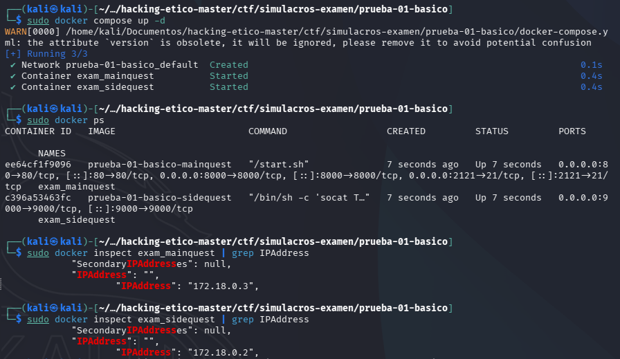
</p>

Con el objetivo localizado, lanzo un escaneo de puertos total para entender a qué me enfrento. El resultado es claro: tengo un servidor FTP (21) y dos puertas web (80 y 8000). Filtro con `grep` el informe para tener los puertos abiertos a la vista en todo momento y no perder el foco.

```bash
nmap -p- --open -sS --min-rate 5000 -v -n -Pn -oG recon_main.txt 172.18.0.3
```

<p align="center">
  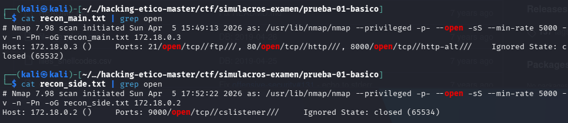
</p>

---

## 🌐 5. Fase 2 — El FTP Anónimo y la Webshell

Echo un vistazo al servidor web mediante `curl`. En el portal de Python (puerto 8000) me pide cargar archivos mediante un parámetro, pero es en el puerto 80 donde encuentro la pieza maestra: un comentario HTML avisando de un despliegue temporal de FTP anónimo en la carpeta `/uploads`.

<p align="center">
  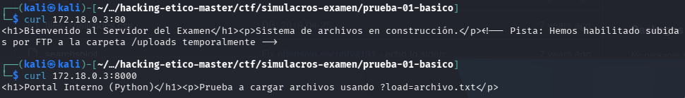
</p>

Validamos la ruta con `gobuster` para confirmar que el directorio es real. Efectivamente, obtengo un código 301.

<p align="center">
  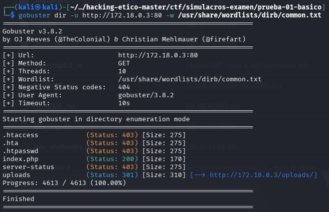
</p>

Me conecto al FTP como `anonymous`. Entro en la carpeta de subidas y preparo el terreno. Para verificar que tengo permisos de escritura reales, subo primero un archivo de prueba.

<p align="center">
  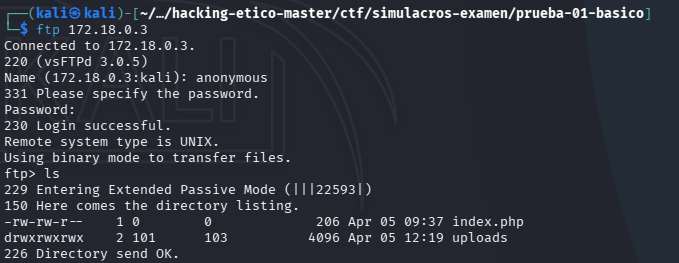
</p>

Descargo y valido la subida del `test.txt` mediante `curl`. Todo funciona. Acto seguido, subo la Webshell PHP ofuscada para evitar detecciones del host.

<p align="center">
  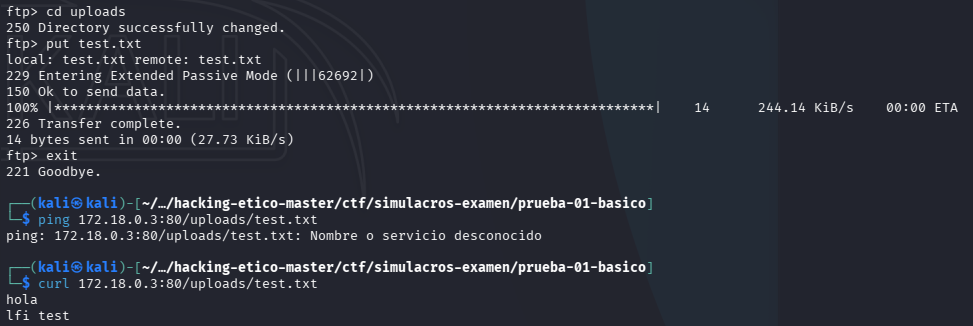
</p>

Hago la comprobación final de RCE ejecutando un `whoami`. El servidor me responde `www-data`. Ya tengo el control inicial.

<p align="center">
  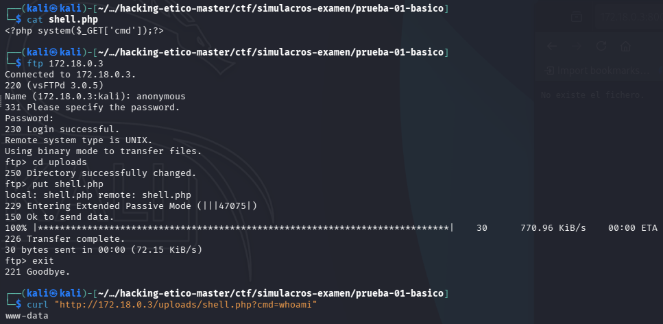
</p>

---

## 🐚 6. Fase 3 — Reverse Shell y Foothold

Busco una terminal cómoda. Codifico mi payload de Python3 en Base64 para evitar errores de interpretación por URL y lanzo el impacto. Netcat recibe la conexión en mi puerto 4444.

<p align="center">
  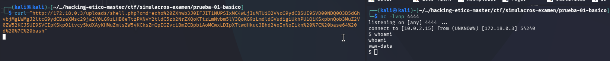
</p>

Consigo mi primera shell interactiva como usuario de servicio web. Hecho esto, me aseguro de estabilizarla para poder trabajar sin errores de TTY.

---

## 🚶 7. Fase 4 — Escalada Lateral: Rafa y su Cronjob

Comienzo la enumeración interna. Lanzo un `cat /etc/passwd` y localizo a un usuario local llamado `rafa`. Reviso su directorio `/home/rafa` y su script de mantenimiento `cleanup.sh`. Veo que tiene permisos totales de escritura (`777`), algo sospechoso.

<p align="center">
  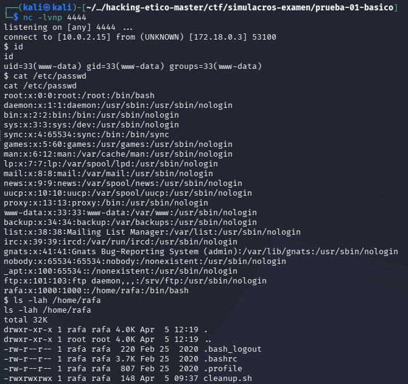
</p>

Confirmamos que se trata de un vector de Cronjob mirando el archivo `/etc/crontab`. Rafa lo ejecuta cada minuto.

<p align="center">
  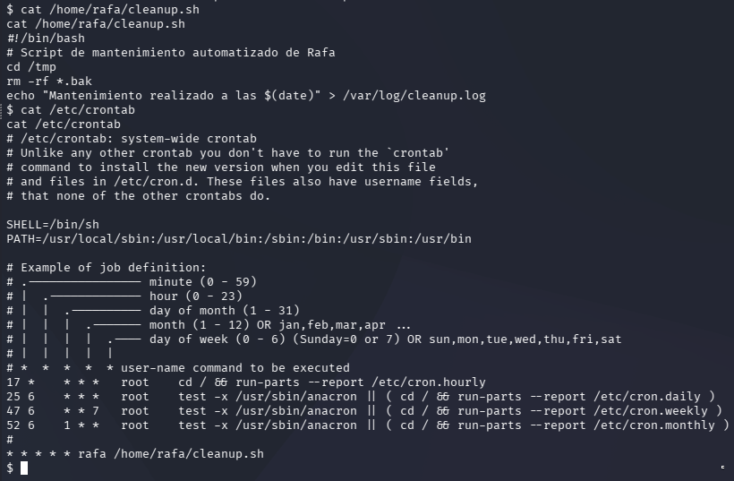
</p>

Inyectamos mi reverse shell al final del script de Rafa. Tras esperar un minuto al ciclo de Cron, Netcat escupe la terminal de Rafa. Salto lateral completado.

<p align="center">
  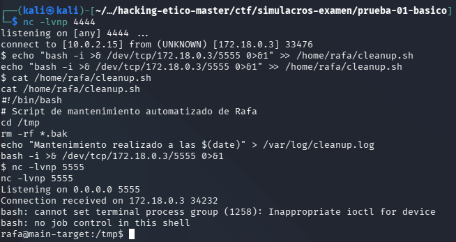
</p>

---

## 👑 8. Fase 5 — Escalada Vertical: El "O" de Root (Wget)

Ya asentado como Rafa, busco binarios SUID. Antes de nada, reviso mis privilegios sudoers:
```bash
sudo -l
```
Salida: `(ALL) NOPASSWD: /usr/bin/wget`.

<p align="center">
  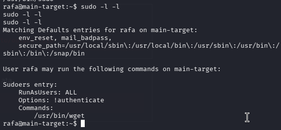
</p>

Decido intentar exfiltrar el `/etc/passwd` para ver qué hashes puedo crackear, pero prefiero ir a por el sistema entero.

<p align="center">
  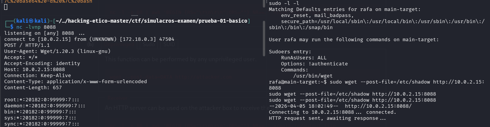
</p>

Preparo un archivo `sudoers.txt` envenenado en mi Kali. Al intentar descargarlo con `wget` usando `sudo`, cometo el error de usar la 'o' minúscula en vez de la 'O' mayúscula, lo que corrompe momentáneamente el entorno de permisos.

<p align="center">
  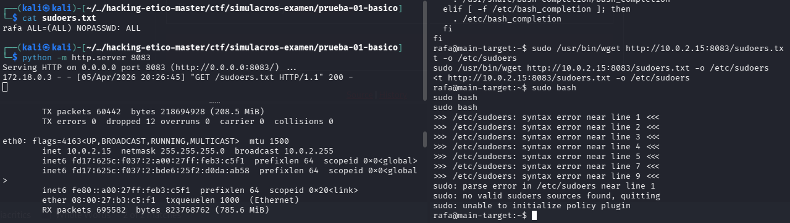
</p>

Tras reiniciar el entorno, repito la operación con la sintaxis correcta. Consigo sobrescribir el `/etc/sudoers` original. Elevo a Root con `sudo bash`, entro en el directorio personal del administrador y capturo la flag que certifica el compromiso total.

<p align="center">
  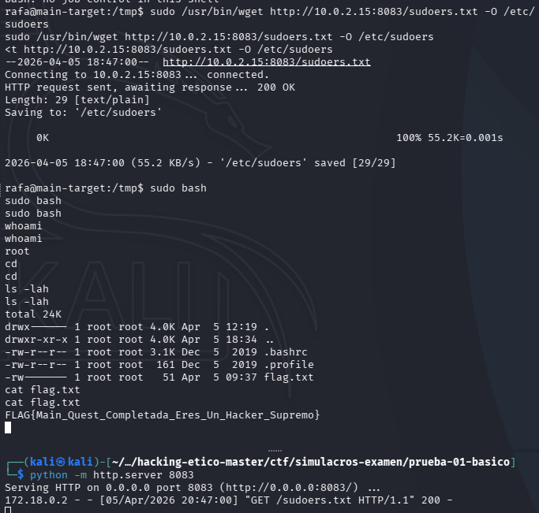
</p>

---

## 🚩 9. Flag Obtenida

| Nivel | Flag / Credencial | Método de Compromiso |
|:---:|:---|:---|
| 🏳️ **Acceso inicial (`www-data`)** | Webshell `.php` | Anonymous FTP -> Upload RCE. |
| 🏴 **Movimiento Horizontal (`rafa`)** | `cleanup.sh` Hijacking | Permisos 777 en script de Cronjob. |
| 👑 **Escalada Root (`root`)** | `FLAG{Main_Quest_Completada_Eres_Un_Hacker_Supremo}` | Sudo `wget` misconfiguration (-O Overwrite). |

---

## ✅ 10. Conclusión

Este simulacro pone de manifiesto que un solo comentario "olvidado" en el código HTML puede ser el hilo del que tirar para desmoronar un servidor entero. La falta de aislamiento entre los servicios (FTP escribiendo en carpeta web) y el exceso de confianza de un usuario administrador facilitaron el ataque. Aprendimos que la precisión técnica es vital: la diferencia entre un `-o` y un `-O` es lo que separa una escalada controlada de un destrozo en el sistema operativo.

---

<hr>
<p align="center">
  <i>Writeup elaborado como parte del módulo de Hacking Ético — Máster en Ciberseguridad.</i>
</p>
