<h1 align="center">🥷 Simulacro 02: SUID Ninja — Writeup</h1>

<p align="center">
  
  
  
  
  
</p>

<p align="center">
  <i>Segundo simulacro de examen en modalidad Caja Negra. El escenario combina explotación web (CMDi), escalada lateral mediante Python Library Hijacking sobre un cronjob, y escalada vertical vía el binario <code>find</code> con sudo NOPASSWD.</i>
</p>

---

> [!WARNING]
> **Aviso Legal.** Los contenidos de este repositorio han sido elaborados íntegramente con fines académicos en entornos locales controlados. Ninguna de las técnicas documentadas debe ser replicada fuera de un entorno con autorización explícita. El autor declina toda responsabilidad por el uso irresponsable de esta información.

---

## 📑 Índice

1. [Resumen Ejecutivo](#-1-resumen-ejecutivo)
2. [Vectores de Ataque (OWASP / MITRE)](#-2-vectores-de-ataque-owasp--mitre)
3. [Herramientas Utilizadas](#-3-herramientas-utilizadas)
4. [Fase 1 — Reconocimiento](#-4-fase-1--reconocimiento)
5. [Fase 2 — Explotación Web (CMDi)](#-5-fase-2--explotación-web-cmdi)
6. [Fase 3 — Reverse Shell](#-6-fase-3--reverse-shell)
7. [Fase 4 — Post-Explotación y Enumeración](#-7-fase-4--post-explotación-y-enumeración)
8. [Fase 5 — Escalada Lateral: Python Library Hijacking](#-8-fase-5--escalada-lateral-python-library-hijacking)
9. [Fase 6 — Escalada Vertical: Sudo find](#-9-fase-6--escalada-vertical-sudo-find)
10. [Flags Obtenidas](#-10-flags-obtenidas)
11. [Conclusión](#-11-conclusión)

---

## 📌 1. Resumen Ejecutivo

El simulacro **SUID Ninja** orquesta tres etapas de compromiso progresivo.

La superficie inicial es un servidor web Apache con una herramienta de diagnóstico (`ping tool`) que no implementa ningún tipo de sanitización de la entrada del usuario. La inyección de metacaracteres de shell confirma de inmediato la ejecución de comandos arbitrarios como `www-data`. Una reverse shell Python establece acceso interactivo al sistema.

En la fase de post-explotación, la enumeración de directorios con permisos de escritura conduce a `/opt/scripts/`, donde reside `backup.py` —ejecutado por el usuario `hacker` cada minuto a través de cron. La vulnerabilidad es un Python Library Hijacking clásico: el script importa la librería `random`, pero dado que el directorio tiene permisos `777`, es posible crear un `random.py` local con un payload de reverse shell. Cuando el cronjob activa el script, Python resuelve el import desde el directorio local primero, ejecutando el payload con la identidad de `hacker`.

La escalada vertical cierra el compromiso: `sudo -l` muestra que `hacker` puede ejecutar `find` como root sin contraseña. GTFOBins proporciona el one-liner exacto para obtener una shell de root.

---

## 🎯 2. Vectores de Ataque (OWASP / MITRE)

| Vector | Clasificación | Descripción |
|:---|:---|:---|
| **Command Injection** | OWASP A03 — Injection / MITRE T1059 | Ejecución de comandos OS mediante parámetro web sin sanitización |
| **Python Library Hijacking** | MITRE T1574.006 — Hijack Execution Flow | Inyección de librería maliciosa en directorio con permisos 777 ejecutado por cron |
| **Sudo Binary Exploitation** | MITRE T1548.003 — Abuse Elevation Control | `find` con NOPASSWD ejecutado como root → shell interactiva |

---

## 🛠️ 3. Herramientas Utilizadas

| Herramienta | Propósito |
|:---|:---|
| `nmap` | Reconocimiento de puertos y versiones |
| `curl` / Firefox | Inspección inicial de la superficie web |
| `nc` (Netcat) | Listener para reverse shells |
| `find` | Enumeración post-explotación + vector de escalada vertical |
| GTFOBins | Referencia de escalada mediante binarios del sistema |

---

## 💻 4. Fase 1 — Reconocimiento

El objetivo del simulacro es la IP del contenedor Docker. Escaneo de puertos con salida en formato greppable:

```bash
nmap -p- --open -sS --min-rate 5000 -v -n -Pn -oG recon_main.txt 172.18.0.2
```

<p align="center">
  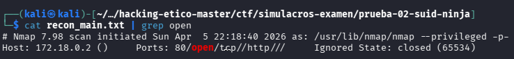
</p>

El único puerto en escucha es el **80/tcp** con Apache. Una petición `curl` inicial confirma que el servidor devuelve contenido HTML funcional.

<p align="center">
  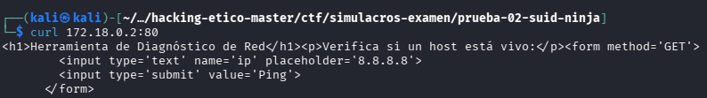
</p>

---

## 🌐 5. Fase 2 — Explotación Web (CMDi)

El servidor expone una herramienta de diagnóstico de tipo "ping" accesible desde Firefox. La validación del campo de entrada es nula. La inyección de un punto y coma (`;`) como metacarácter de shell permite encadenar comandos arbitrarios.

Prueba de concepto básica:

```
localhost ; whoami
```

La respuesta devuelve `www-data`. La inyección funciona sin restricciones.

<p align="center">
  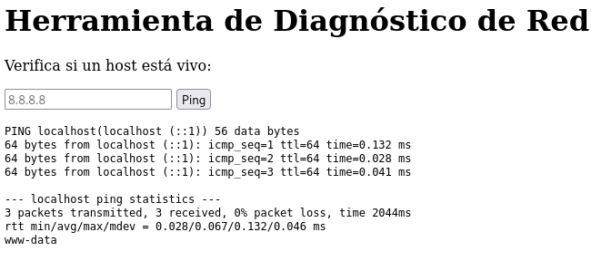
</p>

Inspeccionando el código fuente del `index.php` se confirma la ausencia total de filtros sobre el parámetro de entrada:

<p align="center">
  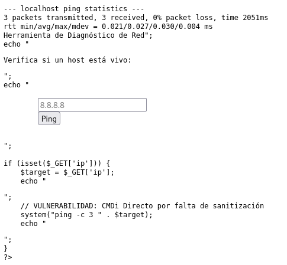
</p>

Se verifica la presencia de Python 3 en el sistema, condición necesaria para lanzar una reverse shell:

```
localhost ; which python3
```

<p align="center">
  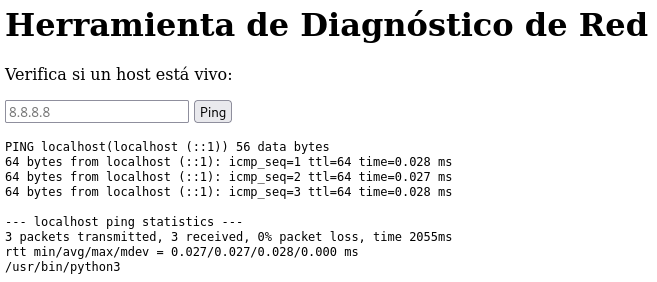
</p>

---

## 🐚 6. Fase 3 — Reverse Shell

Con Python 3 disponible, se prepara el listener en la máquina atacante antes de lanzar el payload:

```bash
nc -lvnp 4444
```

> [!NOTE]
> Durante la ejecución de este simulacro se produjo un erro de procedimiento: el listener de Netcat no estaba activo cuando se enviaron los primeros payloads de reverse shell, lo que provocó conexiones rechazadas. Una vez levantado el listener correctamente, todos los payloads previamente descartados funcionaron sin problemas. La lección es clara: **el orden importa**. Listener primero, payload después.

La reverse shell Python se inyecta a través del parámetro de la herramienta de ping. La conexión revierte al listener con una shell interactiva como `www-data`.

<p align="center">
  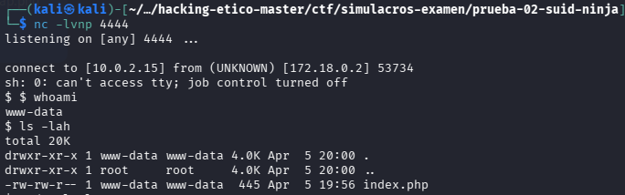
</p>

---

## 🚶 7. Fase 4 — Post-Explotación y Enumeración

Establecida la sesión como `www-data`, el primer paso es identificar puntos de escritura que permitan persistencia o escalada:

```bash
find / -writable -type d 2>/dev/null
```

<p align="center">
  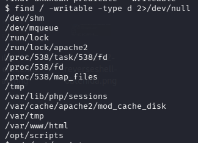
</p>

El directorio `/opt/scripts/` aparece con permisos `777`. Su contenido incluye un script llamado `backup.py`. Este patrón —directorio escribible + script Python— es un indicador claro de posible cronjob ejecutado por otro usuario.

<p align="center">
  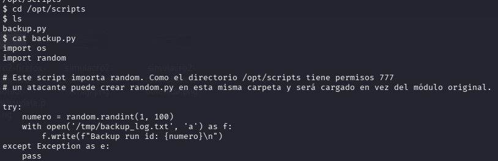
</p>

---

## 📂 8. Fase 5 — Escalada Lateral: Python Library Hijacking

Análisis del contenido de `backup.py`: el script importa la librería `random` de Python para generar números aleatorios. La vulnerabilidad es directa.

Verificación del `crontab` del sistema:

```bash
cat /etc/crontab
```

<p align="center">
  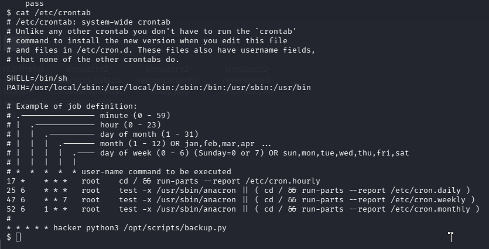
</p>

El usuario `hacker` ejecuta `/opt/scripts/backup.py` cada minuto. Dado que el directorio tiene permisos `777`, es posible crear un fichero `random.py` en la misma ruta con un payload de reverse shell. Python resolverá el import buscando primero en el directorio del script ("."), ejecutando el payload malicioso con la identidad de `hacker`.

Se levanta un nuevo listener:

```bash
nc -lvnp 5555
```

Se crea el fichero `random.py` en `/opt/scripts/` con el payload correspondiente y se espera a que el cronjob lo ejecute. Transcurrido un minuto, el listener recibe la conexión.

> [!NOTE]
> Durante este paso se cometió un error menor: las comillas alrededor de la IP en el payload no estaban bien formadas, lo que provocó que la reverse shell no se interpretara correctamente. Una vez corregida la sintaxis, el payload funcionó en la siguiente ejecución del cronjob.

<p align="center">
  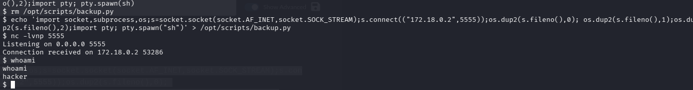
</p>

Con la identidad de `hacker` activa, se accede a la flag de usuario:

<p align="center">
  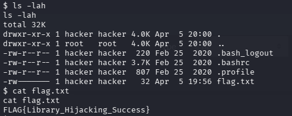
</p>

---

## 👑 9. Fase 6 — Escalada Vertical: Sudo find

Protocolo estándar al obtener una nueva identidad: `sudo -l`.

<p align="center">
  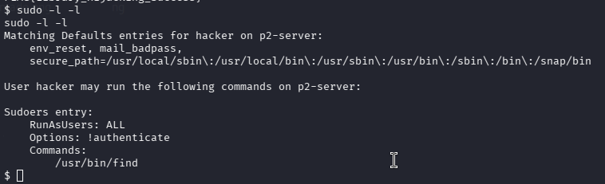
</p>

El usuario `hacker` puede ejecutar `/usr/bin/find` como root sin contraseña. GTFOBins documenta el vector de escalada para este binario:

```bash
sudo find . -exec /bin/sh \; -quit
```

El prompt `#` aparece inmediatamente. Control total del sistema.

<p align="center">
  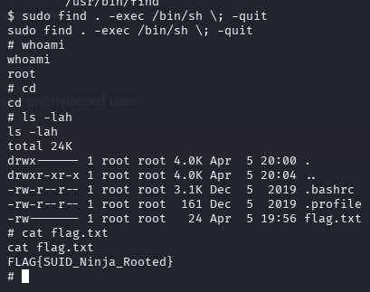
</p>

---

## 🚩 10. Flags Obtenidas

| Nivel | Flag | Vector de Compromiso |
|:---:|:---|:---|
| 🏳️ **User** (`hacker`) | `FLAG{Library_Hijacking_Success}` | Python Library Hijacking sobre cronjob |
| 👑 **Root** | `FLAG{SUID_Ninja_Rooted}` | `sudo find` con NOPASSWD → GTFOBins |

---

## ✅ 11. Conclusión

El simulacro SUID Ninja demuestra cómo una cadena de vectores aparentemente simples puede resultar en el compromiso total de un sistema.

La raíz del problema no es técnicamente compleja: una herramienta de diagnóstico web sin validación de entrada es todo lo que se necesita para establecer el acceso inicial. A partir de ahí, la enumeración dirigida identifica el eslabón más débil —un directorio escribible por cualquier usuario donde un proceso privilegiado carga código Python— y el Library Hijacking hace el resto.

La lección más importante de este simulacro es **procedimental**: los errores documentados (listener inactivo, syntax error en el payload) no son fallos de conocimiento técnico, son fallos de procedimiento. La metodología estructurada —listener primero, payload después; verificar la sintaxis antes de esperar el cronjob— elimina este tipo de pérdidas de tiempo en un contexto real.

### 📚 Bibliografía y Referencias

- [GTFOBins — find](https://gtfobins.github.io/gtfobins/find/)
- [OWASP — A03:2021 Injection](https://owasp.org/Top10/A03_2021-Injection/)
- [MITRE ATT&CK — T1574.006 Python Library Hijacking](https://attack.mitre.org/techniques/T1574/006/)
- [MITRE ATT&CK — T1059 Command and Scripting Interpreter](https://attack.mitre.org/techniques/T1059/)

---

<hr>
<p align="center">
  <i>Writeup elaborado como parte del módulo de Hacking Ético — Máster en Ciberseguridad.</i>
  <br><br>
  <b>Gabriel Godoy Alfaro</b>
</p>
