<h1 align="center">🤠 Bounty Hacker — Writeup Completo</h1>

<p align="center">
  
  
  
  
  
</p>

<p align="center">
  <i>Memoria de operación ofensiva sobre la room Bounty Hacker. Reconocimiento de red marcado por caídas de conectividad, abuso de acceso FTP anónimo (descubrimiento de diccionarios internos), dominación de SSH con fuerza bruta en Hydra y escalada de privilegios burlando la restricción local al automatizar con LinPEAS la lectura de binarios SUID (tar).</i>
</p>

---

> [!WARNING]
> **Aviso Legal.** Este writeup ha sido elaborado exclusivamente con fines académicos en el contexto del **Máster en Ciberseguridad**. Las técnicas documentadas se han aplicado únicamente sobre infraestructura de TryHackMe bajo sus condiciones explícitas de uso. El autor declina toda responsabilidad por usos indebidos de la información recogida.

---

## 📑 Índice

1. [Resumen Ejecutivo](#-1-resumen-ejecutivo)
2. [Vectores de Ataque](#-2-vectores-de-ataque-owasp-y-mitre)
3. [Herramientas Utilizadas](#-3-herramientas-utilizadas)
4. [Fase 1 — La Base Inestable (Reconocimiento Nmap)](#-4-fase-1--la-base-inestable-reconocimiento-nmap)
5. [Fase 2 — Caza Web y Cierre Abrupto (Gobuster)](#-5-fase-2--caza-web-y-cierre-abrupto-gobuster)
6. [Fase 3 — Acceso Anonymous (FTP)](#-6-fase-3--acceso-anonymous-ftp)
7. [Fase 4 — El Regalo de la Tripulación (Extracción Documental)](#-7-fase-4--el-regalo-de-la-tripulación-extracción-documental)
8. [Fase 5 — Estreno Manual de Fuerza Bruta (Hydra SSH)](#-8-fase-5--estreno-manual-de-fuerza-bruta-hydra-ssh)
9. [Fase 6 — Intrusión y Flag de Usuario](#-9-fase-6--intrusión-y-flag-de-usuario)
10. [Fase 7 — Burlas y Subterfugios (Alternativas a curl)](#-10-fase-7--burlas-y-subterfugios-alternativas-a-curl)
11. [Fase 8 — Tar SUID y Flag Final](#-11-fase-8--tar-suid-y-flag-final)
12. [Flags Obtenidas](#-12-flags-obtenidas)
13. [Conclusión](#-13-conclusión)

---

## 📈 1. Resumen Ejecutivo

La room **Bounty Hacker** (Easy) de TryHackMe es un ejercicio de auditoría progresiva en tres actos: reconocimiento FTP, fuerza bruta SSH y escalada mediante SUID. La máquina expone tres puertos —FTP, SSH y HTTP— pero es el servidor FTP con acceso `anonymous` activado el que rompe todo el esquema desde el primer momento. En su interior, dos ficheros de texto filtran el nombre de usuario `lin` y una wordlist de contraseñas confeccionada por el propio sistema. Con ese material, Hydra rompe el SSH en cuestión de segundos. Una vez dentro, `curl` no está disponible para el usuario, lo que obliga a articular un servidor HTTP temporal en Kali para inyectar LinPEAS mediante `wget`. El script de enumeración localiza que el binario `/bin/tar` tiene el bit SUID activado, y GTFOBins proporciona el one-liner exacto para convertir eso en una shell de root.

---

## 🎯 2. Vectores de Ataque (OWASP y MITRE)

- [x] **Security Misconfiguration:** Servicio FTP expuesto con tolerancia total en inicios de sesión anónimos, facilitando el acceso a listas temporales de los empleados. *(OWASP A05:2021)*
- [x] **Identificación Rota:** Existencia de notas privadas y un catálogo de contraseñas plano compartido remotamente a la vista de todo oyente no autorizado. *(OWASP A07:2021)*
- [x] **Brute Force (Fuerza Bruta):** Implementación de fuerza bruta paramétrica sobre SSH mediante `Hydra` valiéndose de la filtración interna para no generar bloqueos y validar credenciales. *(MITRE T1110)*
- [x] **Privilege Escalation (SUID Abuse):** Abuso a lo largo de un vector nativo (Embalador `/bin/tar`) configurado al bit SUID elástico capaz de invocar `/bin/sh`. *(MITRE T1548.001)*

---

## 🛠️ 3. Herramientas Utilizadas

| Herramienta | Propósito |
|:---|:---|
| `nmap` | Auditoría, listado de *ports*, versiones base y firmas SO. |
| `gobuster` | Fuzzing agresivo a nivel web (descartado en ejecución final). |
| `ftp` y `get` | Software nativo cliente para interactuar en consolas expuestas a *anonymous*. |
| `hydra` | Gestor que domina nuestro ataque emparejando automáticamente credenciales filtradas. |
| `linpeas.sh` | Shellscript recolector. El automatizador que barre el equipo infectado Línux. |
| `python3 http / wget` | Entorno emulador local y receptor para transportar datos hacia la remota. |
| `GTFOBins` | Refuerzo documental online especializado en la mala praxis de permisos de ficheros. |

---

## 💻 4. Fase 1 — Reconocimiento Nmap

Se realizó un escaneo de puertos para identificar los servicios activos en la máquina objetivo.

```bash
nmap -p- -T4 -sV -A -Pn -v -oN ./recon-bounty.txt 10.130.188.22
```

El escaneo reveló tres servicios abiertos:
- **21/tcp:** `vsftpd 3.0.5`
- **22/tcp:** `OpenSSH 8.2p1`
- **80/tcp:** `Apache httpd 2.4.41`

<p align="center">
  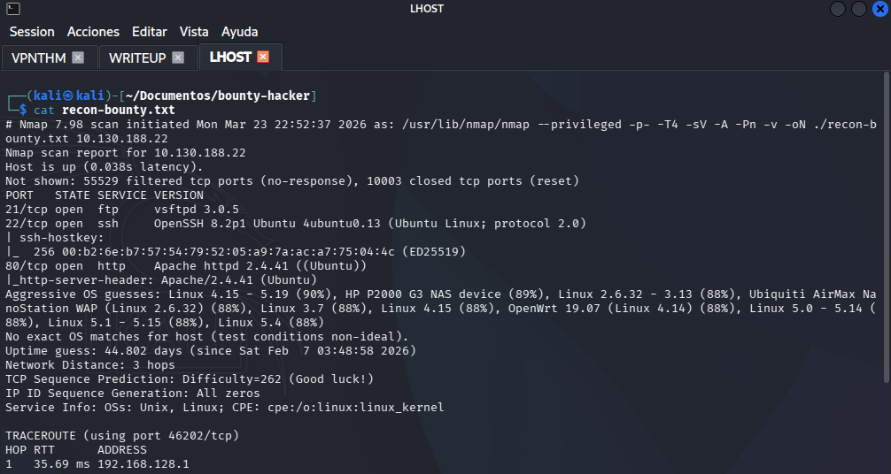
</p>

---

## 🌐 5. Fase 2 — Inspección Web y Gobuster

La inspección del puerto 80 mostró una página estática con referencias a personajes de Cowboy Bebop. El análisis del código fuente permitió identificar nombres de usuario potenciales. El uso de Gobuster para enumeración de directorios no arrojó resultados significativos debido a la inestabilidad de la red.

<p align="center">
  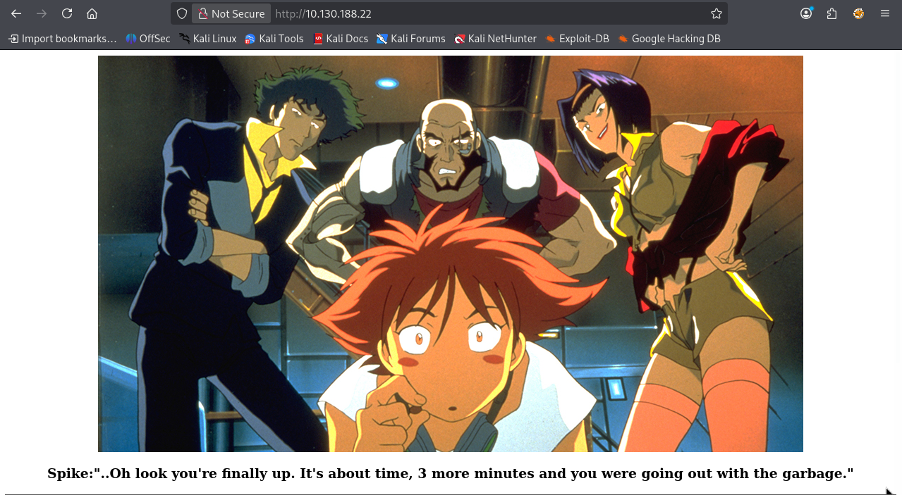
</p>

---

## 📂 6. Fase 3 — Acceso Anonymous (FTP)

Ante la falta de resultados en la capa web, se procedió a auditar el servicio FTP. Se confirmó que el servidor permitía el acceso mediante el usuario `anonymous`, permitiendo listar el contenido del directorio raíz sin necesidad de contraseña.

<p align="center">
  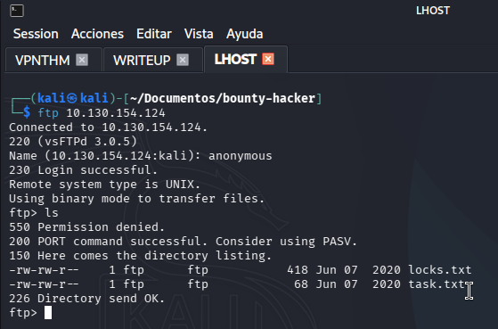
</p>

---

## 📜 7. Fase 4 — Extracción Documental: Usuario y Wordlist

Se descargaron dos archivos del servidor FTP: `task.txt` y `locks.txt`. El primero confirmó el usuario `lin`, mientras que el segundo contenía una lista de contraseñas que facilitaría el acceso al sistema.

<p align="center">
  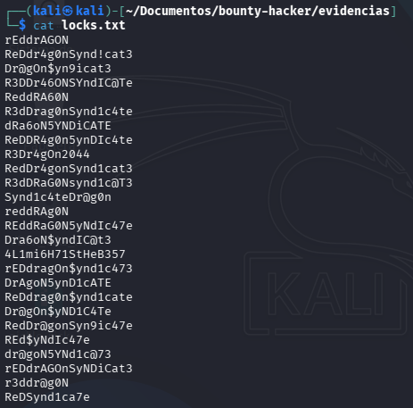
</p>

---

## 🔐 8. Fase 5 — Fuerza Bruta SSH con Hydra

Con usuario (`lin`) y wordlist propia en mano, Hydra al SSH:

```bash
hydra -l lin -P ./locks.txt -t 4 -V -f 10.129.153.35 ssh
```

Hydra cruza la wordlist entera y en cuestión de segundos reporta match positivo: `lin:RedDr4gonSynd1cat3`.

<p align="center">
  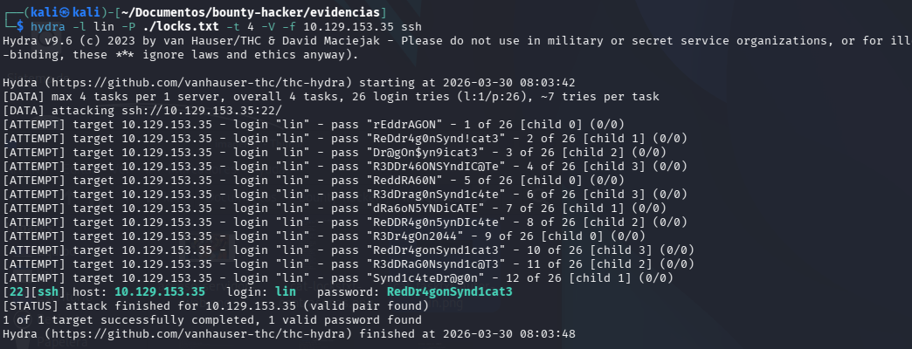
</p>

---

## 🏳️ 9. Fase 6 — Intrusión SSH y Flag de Usuario

Se estableció una sesión SSH utilizando las credenciales obtenidas. Tras acceder al sistema, se localizó el archivo `user.txt` en el directorio `Desktop` del usuario `lin`.

<p align="center">
  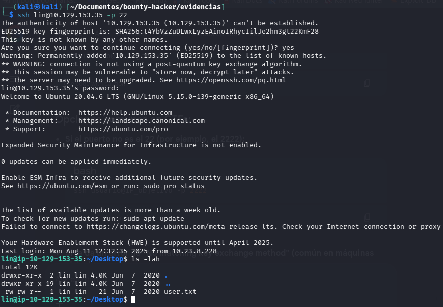
</p>

`cat user.txt` entrega la primera flag.

<p align="center">
  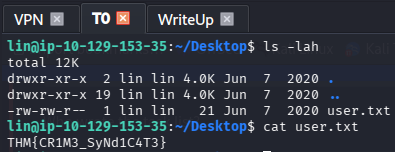
</p>

---

## ⚡ 10. Fase 7 — Transferencia de LinPEAS (Bypass de curl)

Para la escalada de privilegios, se utilizó LinPEAS. Ante la ausencia de `curl`, se levantó un servidor HTTP en la máquina atacante y se utilizó `wget` desde la víctima para descargar el script de enumeración.

<p align="center">
  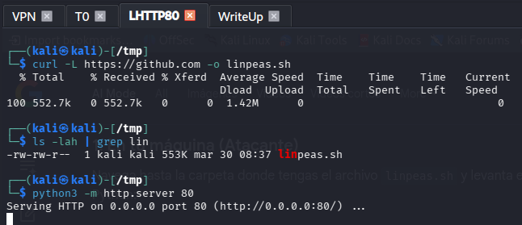
</p>

---

## 🏄 11. Fase 8 — SUID Tar y Flag de Root

LinPEAS analiza el sistema y resalta en rojo la sección de binarios con permisos interesantes. El hallazgo clave: `/bin/tar` tiene el bit **SUID** activado con permisos de root.

<p align="center">
  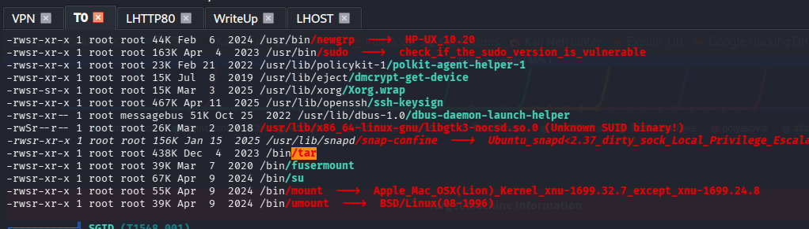
</p>

Consulto GTFOBins para `tar` con SUID. El one-liner es directo:

<p align="center">
  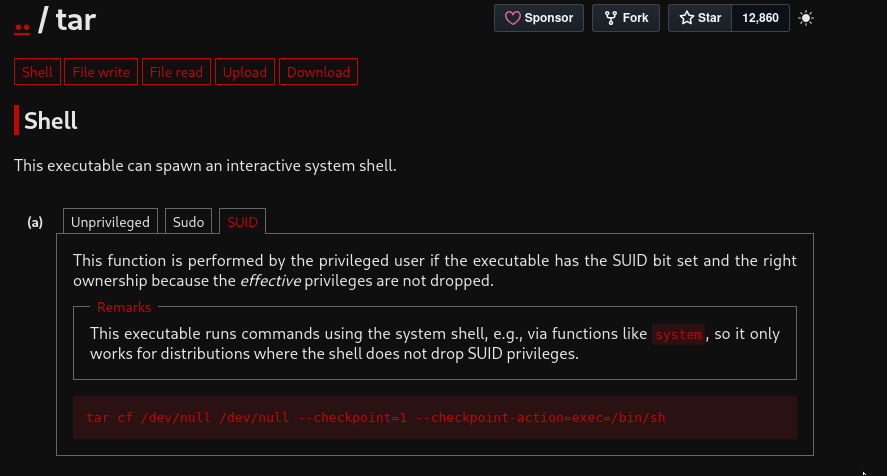
</p>

```bash
sudo tar cf /dev/null /dev/null --checkpoint=1 --checkpoint-action=exec=/bin/sh
```

Estas dos opciones de `checkpoint` hacen que `tar` ejecute `/bin/sh` como root antes de crear el archivo. El prompt `#` aparece inmediatamente. `whoami`: `root`. Me muevo a `/root/root.txt` y capturo la flag final.

<p align="center">
  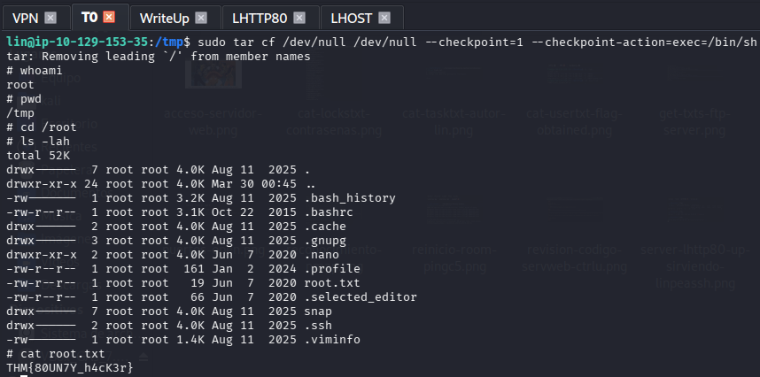
</p>

Ambas flags validadas en TryHackMe. Room al 100%.

<p align="center">
  
</p>

---

## 🚩 12. Flags Obtenidas

| Nivel Operativo | Hash Visual Validado | Ruta de Almacenaje Base |
|:----:|:-----|:-----|
| 🏳️ **Usuario (User)** | `THM{CR1M3_SyNd1C4T3}` | `/home/lin/Desktop/user.txt` |
| 🏴 **Sistema (Root)** | `THM{80UN7Y_h4cK3r}` | `/root/root.txt` |

---

## ✅ 13. Conclusión

Bounty Hacker enseña dos lecciones que se quedan grabadas. La primera: el FTP con `anonymous` activado no es una peculiaridad histórica inofensiva —es un vector de exfiltración completo si los ficheros que aloja no están controlados. En este caso, el propio sistema dejó expuesta la identidad de un usuario y su wordlist sobre un servidor accesible sin autenticación. La segunda: la indisponibilidad de `curl` no es un bloqueo, es un obstáculo de ruta. Entender que `wget` cumple la misma función para transferencias y saber levantar un servidor HTTP temporal en el atacante es conocimiento que se aplica constantemente en post-explotación real.

El SUID en `tar` es el tipo de misconfiguración que GTFOBins documenta perfectamente y que aparece con frecuencia en entornos reales descuidados en sus auditorías periódicas.

### 📚 Bibliografía y Referencias

- [TryHackMe — Bounty Hacker](https://tryhackme.com/room/cowboyhacker)
- [GTFOBins — Tar Exploitation SUID](https://gtfobins.github.io/gtfobins/tar/#suid)
- [Hydra THC Documentation](https://github.com/vanhauser-thc/thc-hydra)
- [OWASP Top 10 — Security Misconfiguration](https://owasp.org/Top10/A05_2021-Security_Misconfiguration/)

---

<hr>
<p align="center">
  <i>Writeup elaborado como parte del módulo de Hacking Ético — Máster en Ciberseguridad.</i>
  <br><br>
  <b>Gabriel Godoy Alfaro</b>
</p>
