<h1 align="center">👊 Brute It — Writeup Completo</h1>

<p align="center">
  
  
  
  
  
</p>

<p align="center">
  <i>Memoria de operación ofensiva centrada en la tenacidad y la fuerza pura. En "Brute It" he puesto a prueba el arte del Brute Forcing a través de HTTP POST (Hydra) para derribar un panel de administrador, descifrado cruzado de llaves RSA protegidas con passphrase (John The Ripper) y una escalada de privilegios a root por partida doble (explorando el Bypass del binario Cat, y refactorizando el aprendizaje mediante un volcado e intrusión lícita atacando el /etc/shadow).</i>
</p>

---

> [!WARNING]
> **Aviso Legal.** Este writeup ha sido elaborado exclusivamente con fines académicos en el contexto del **Máster en Ciberseguridad**. Las técnicas documentadas se han aplicado únicamente sobre infraestructura propia de TryHackMe bajo sus condiciones de uso. El autor declina toda responsabilidad por usos indebidos de la información recogida.

---

## 📑 Índice

1. [Resumen Ejecutivo](#-1-resumen-ejecutivo)
2. [Vectores de Ataque](#-2-vectores-de-ataque-owasp-y-mitre)
3. [Herramientas Utilizadas](#-3-herramientas-utilizadas)
4. [Fase 1 — El Terreno de Juego (Reconocimiento)](#-4-fase-1--el-terreno-de-juego-reconocimiento)
5. [Fase 2 — El Descuido en Producción (Directorio Web)](#-5-fase-2--el-descuido-en-producción-directorio-web)
6. [Fase 3 — Machacando el HTTP (Hydra en Acción)](#-6-fase-3--machacando-el-http-hydra-en-acción)
7. [Fase 4 — El Doble Candado (Crackeando Muros RSA)](#-7-fase-4--el-doble-candado-crackeando-muros-rsa)
8. [Fase 5 — Intrusión SSH e Identidad de Usuario](#-8-fase-5--intrusión-ssh-e-identidad-de-usuario)
9. [Fase 6 — El Espejismo de la Suerte (Sudo Cat Directo)](#-9-fase-6--el-espejismo-de-la-suerte-sudo-cat-directo)
10. [Fase 7 — Hackeando con Criterio (Volcado de Shadow)](#-10-fase-7--hackeando-con-criterio-volcado-de-shadow)
11. [Flags Obtenidas](#-11-flags-obtenidas)
12. [Conclusión](#-12-conclusión)

---

## 📈 1. Resumen Ejecutivo

La sala **Brute It** plantea un ejercicio de resiliencia paramétrica que combina tres vectores distintos de forma encadenada. El reconocimiento inicial revela solo dos puertos: SSH y HTTP con Apache. La enumeración web localiza un directorio `/admin/` donde el código fuente HTML expone directamente el nombre de usuario de administración. Con esa información, Hydra fuerza el formulario POST del panel web y obtiene la contraseña `xavier`. Tras el login, el panel entrega la primera flag y una clave privada RSA protegida con passphrase. `ssh2john` convierte la llave a un formato crackeable, y John the Ripper rompe la passphrase en segundos con `rockyou.txt`: `rockinroll`. Una vez dentro del sistema como `john`, `sudo -l` revela que el usuario puede ejecutar `/bin/cat` como root sin contraseña. Se documentan dos rutas de escalada: la oportunista (leer directamente `/root/root.txt`) y la metodólogicamente correcta (volcar `/etc/shadow`, crackear el hash de root y elevar vía `su root`).

---

## 🎯 2. Vectores de Ataque (OWASP y MITRE)

- [x] **Brute Force Attack (HTTP Form & SSH):** Implementación de una tormenta de contraseñas cruzando peticiones POST para evadir el panel de administración expuesto. *(MITRE T1110)*
- [x] **Sensitive Data Exposure:** Código comentado `<!-- -->` dejado por despiste por el desarrollador dentro de la plantilla HTML, filtrando un usuario de administración válido de primera mano. *(OWASP A03:2021)*
- [x] **Insecure Cryptographic Storage / Password Cracking:** Exposición de *hashes* en llaves privadas vulnerables a conversión (ssh2john) forzando el descifrado pasivo de la credencial protectora de SSH.
- [x] **Privilege Escalation (Sudo Misconfiguration):** Cesión inadvertida de privilegios en modo `NOPASSWD` sobre `/bin/cat`, desencadenando la filtración indiscriminada del fichero protegido vital `/etc/shadow`. *(MITRE T1548.003)*

---

## 🛠️ 3. Herramientas Utilizadas

| Herramienta | Propósito |
|:---|:---|
| `nmap` | Auditoría de puertos y versiones base. |
| `gobuster` | Fuzzing dinámico a nivel perimetral sobre la red HTTP. |
| `curl` / `firefox` | Interacción y recolección de código fuente expuesto o vulnerable a inyecciones. |
| `hydra` | Artillería pesada usada para desbordar variables de autenticación en formularios web. |
| `John The Ripper` | Herramienta maestra para destrozar hashes filtrados de llaves encriptadas y el *shadow*. |
| `ssh2john` | Conversor necesario para transformar llaves privadas a un formato vulnerable y analizable por John. |

---

## 💻 4. Fase 1 — Reconocimiento

Verificación de conectividad con `ping -c 5 10.129.182.218`: latencia estable, respuestas sin pérdida. El reconocimiento con `nmap` integral descubre un Ubuntu con dos servicios activos: SSH en el 22 y Apache en el 80.

<p align="center">
  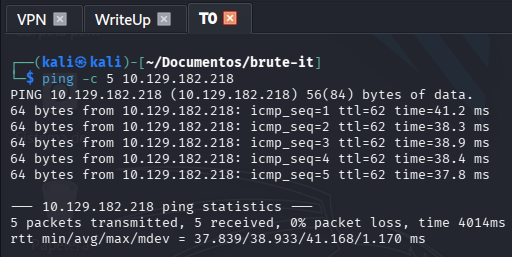
</p>

Las versiones (`OpenSSH 7.6p1` y `Apache 2.4.29`) no presentan vectores de explotación pública directos. El puerto 80 es el vector prioritario.

<p align="center">
  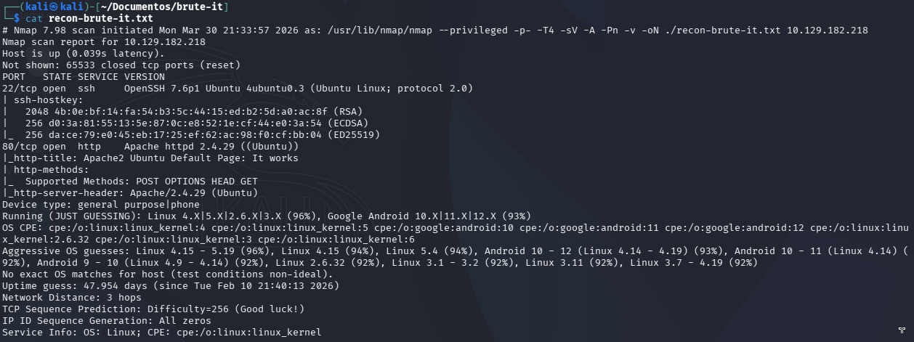
</p>

---

## 🌐 5. Fase 2 — El Descuido en Producción (Directorio Web)

Gobuster encuentra el subdirectorio `/admin/` casi de inmediato, con un 301.

<p align="center">
  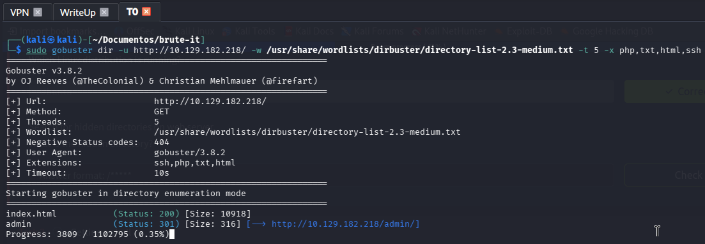
</p>

Un `curl` al endpoint revela algo directamente en el HTML: un comentario olvidado por el programador que expone el nombre de usuario de administración:

`<!-- Hey john, if you do not remember, the username is admin -->`

<p align="center">
  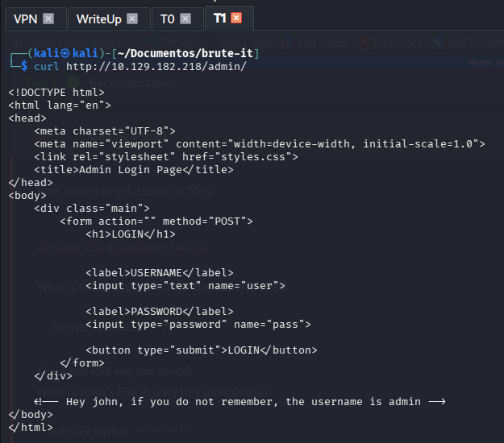
</p>

Intento obvian la autenticación del formulario directamente en Firefox sin éxito. El ataque de fuerza bruta sobre el POST es el siguiente paso.

<p align="center">
  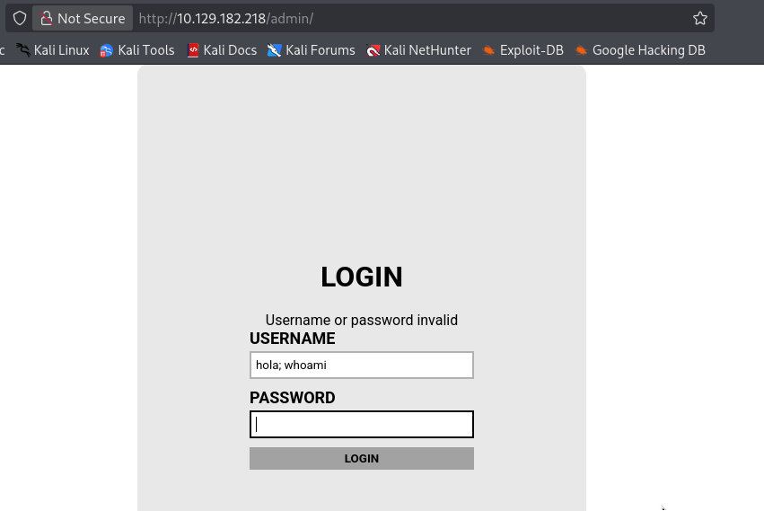
</p>

---

## 💣 6. Fase 3 — Machacando el HTTP (Hydra en Acción)

Sabiendo fehacientemente que mi usuario natural de recolección era innegociable (`admin`), todo residía en automatizar mi diccionario de `rockyou.txt` hacia ese panel infernal.

Aquí es donde me las vi con la crudeza natural de Hydra en parámetros POST asíncronos. Mis setups estándar (las plantillas que casi siempre funcionan del tirón) estaban cayéndose y fallando lógicamente. Tras investigar encarnizadamente las directivas de documentación necesarias (dado que `rockyou` porta 14 millones de líneas), configuré el apuntador de variables de error de mi panel para que supiera exactamente dónde recargar las iteraciones del script con la flag `:F=Username or password...`.

```bash
hydra -l admin -P /usr/share/wordlists/rockyou.txt 10.129.182.218 http-post-form "/admin/index.php:user=^USER^&pass=^PASS^:F=Username or password invalid" -V
```

<p align="center">
  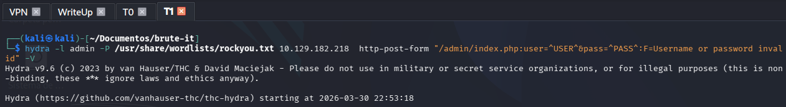
</p>

El terminal empezó a tragar líneas, variables y latencia sin un mínimo pestañeo durante un buen puñado de minutos. Ver bajar los millones de intentos a la nada puede desesperar al pentester principiante. Sin embargo, justo frente a mi cara, a la fuerza de impacto se rebeló su verdad: ¡Valid password found: `xavier`! 

<p align="center">
  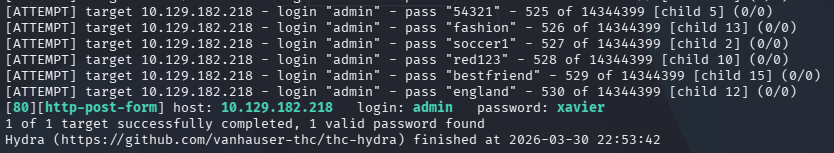
</p>

Accedí con las llaves extraídas en mi host de Firefox y hallé con júbilo dos perlas ocultas tras el muro: 
1. La primera bandera web de validación del reto: `THM{brut3_f0rce_is_e4sy}`.
2. Un hermoso y prometedor encriptado total de Llave RSA.

<p align="center">
  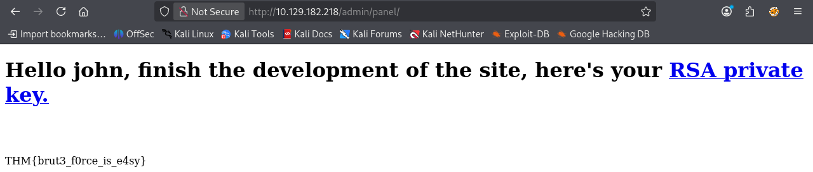
</p>

Copio por entero todos estos hashes dorados a mi atacante Línux en la subversión de `/evidencias` con su pertinente nombre base `llave-privada`.

<p align="center">
  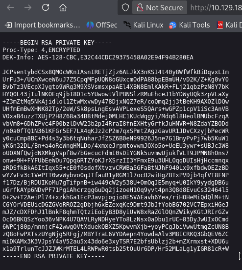
</p>

---

## 🔐 7. Fase 4 — El Doble Candado (Crackeando Muros RSA)

La clave privada está cifrada con passphrase. Proceso:

```bash
chmod 600 llave-privada
ssh -i llave-privada john@10.129.182.218  # Rechazado — pide passphrase
```

<p align="center">
  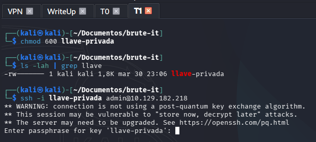
</p>

Convierto la llave al formato que John the Ripper puede procesar, y ataco el hash resultante con `rockyou.txt`:

```bash
ssh2john llave-privada > hash_llave.txt
john --wordlist=/usr/share/wordlists/rockyou.txt hash_llave.txt
```

John rompe el hash en segundos. La passphrase es `rockinroll`.

<p align="center">
  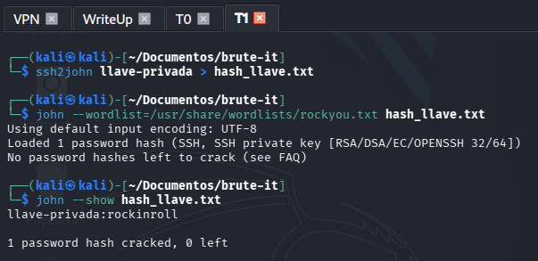
</p>

---

## 🏄 8. Fase 5 — Intrusión SSH e Identidad de Usuario

Con passphrase descifrada, el acceso SSH se establece sin obstáculos:

```bash
ssh -i llave-privada john@10.129.182.218
```

Bienvenido, john. El sistema carga el MOTD de Ubuntu y el directorio home tiene `user.txt` a la vista.

<p align="center">
  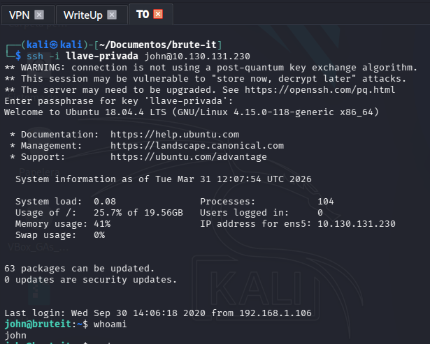
</p>

`cat user.txt` entrega la flag de usuario.

<p align="center">
  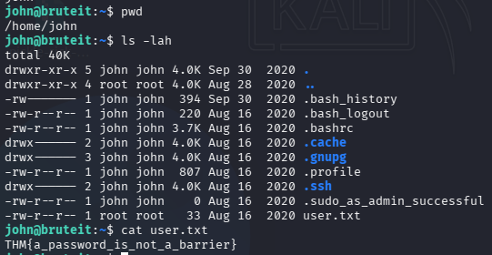
</p>

---

## 🔥 9. Fase 6 — El Espejismo de la Suerte (Sudo Cat Directo)

`sudo -l` como primer paso al obtener acceso: `john` puede ejecutar `/bin/cat` como root sin contraseña.

Consulto GTFOBins para `cat` con sudo. Este binario no proporciona un escape de shell directo, pero permite leer cualquier fichero del sistema con permisos de root. En el contexto de un CTF, es posible usarlo para leer `/root/root.txt` directamente:

```bash
sudo cat /root/root.txt
```

Funcióna. Flag obtenida en una línea.

<p align="center">
  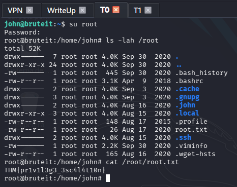
</p>

> [!NOTE]
> Esta ruta funciona en un CTF porque la ubicación de la flag es predecible. En una auditoría real, leer `/root/root.txt` sin importar qué hay en esa ruta no demuestra control total del sistema. La ruta metodológicamente correcta es elevar privilegios de forma completa, lo que se documenta en la siguiente fase.

---

## 🎩 10. Fase 7 — Hackeando con Criterio (Volcado de Shadow)

La ruta metodológicamente sólida consiste en usar el `cat` con NOPASSWD para exfiltrar `/etc/shadow` —el fichero que almacena los hashes de contraseñas de todos los usuarios del sistema— y crackear el hash de root localmente.

```bash
sudo cat /etc/shadow
```

El hash SHA-512 del usuario `root` aparece en la salida. Lo copio íntegro a un fichero local.

<p align="center">
  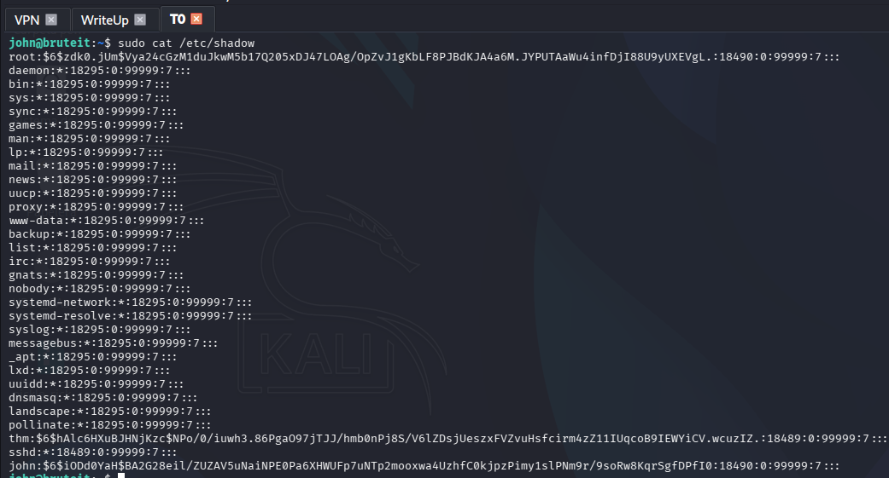
</p>

John the Ripper ataca el hash con `rockyou.txt` y lo rompe. La contraseña de root resulta ser `football`.

<p align="center">
  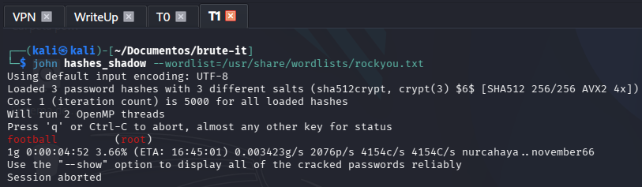
</p>

---

## 🚩 11. Flags Obtenidas

| Nivel Operativo | Hash Visual Validado | Métrica Lograda |
|:----:|:-----|:-----|
| 🏳️ **Web App** | `THM{brut3_f0rce_is_e4sy}` | Fuerza bruta del Panel `HTTP POST` Admin |
| 🏳️ **Usuario (User)** | `THM{a_password_is_not_a_barrier}` | Fuerza bruta de sub-hashes de llavero cerrado `SSH` |
| 🏴 **Sistema (Root)** | `THM{pr1v1l3g3_3sc4l4t10n}` | Extraída vía crackeo absoluto de volcado en `/etc/shadow` |

---

## ✅ 12. Conclusión

Brute It enseña que la línea entre una auditoría superficial y una rigurosa está en cómo se documenta la escalada. Leer `/root/root.txt` con `sudo cat` en un CTF funciona porque la ubicación es predecible, pero en un entorno real eso no es explotación: es adivinanza con privilegios. El valor real de esta sala está en la cadena metodológica: exposición de usuario en código fuente → Hydra en formulario POST → RSA con passphrase crackeada con John → sudo cat para exfiltrar `/etc/shadow` → crackeo del hash root → acceso completo vía `su`. Cada paso es justificable y reproducible.

### 📚 Bibliografía y Referencias

- [TryHackMe — Brute It](https://tryhackme.com/room/bruteit)
- [THC Hydra — HTTP Form Bruteforcing](https://github.com/vanhauser-thc/thc-hydra)
- [GTFOBins — Cat](https://gtfobins.github.io/gtfobins/cat/)
- [John The Ripper — SSH Key Passphrase Cracking](https://www.openwall.com/john/)

---

<hr>
<p align="center">
  <i>Writeup elaborado como parte del módulo de Hacking Ético — Máster en Ciberseguridad.</i>
</p>
