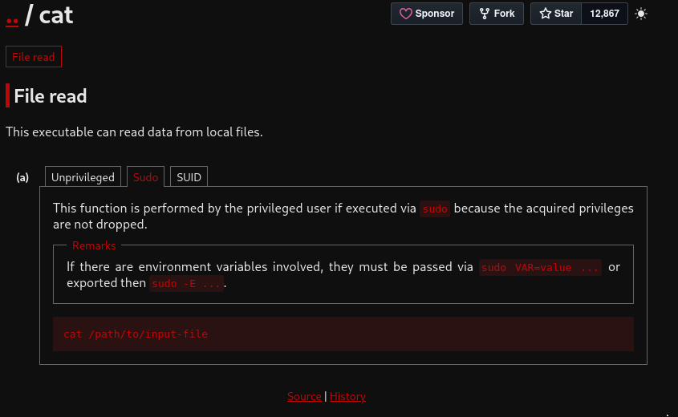
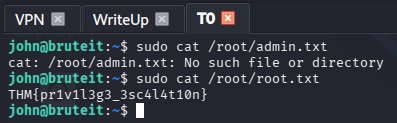
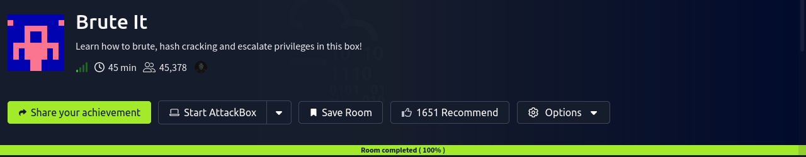

<h1 align="center">👊 Brute It — Writeup Completo</h1>

<p align="center">
  
  
  
  
  
</p>

<p align="center">
  <i>Memoria de operación ofensiva centrada en la tenacidad y la fuerza pura. En "Brute It" he puesto a prueba el arte del Brute Forcing a través de HTTP POST (Hydra) para derribar un panel de administrador, descifrado cruzado de llaves RSA protegidas con passphrase (John The Ripper) y una escalada de privilegios a root por partida doble (explorando el Bypass del binario Cat, y refactorizando el aprendizaje mediante un volcado e intrusión lícita atacando el /etc/shadow).</i>
</p>

---

> [!WARNING]
> **Aviso Legal.** Este writeup ha sido elaborado exclusivamente con fines académicos en el contexto del **Máster en Ciberseguridad**. Las técnicas documentadas se han aplicado únicamente sobre infraestructura propia de TryHackMe bajo sus condiciones de uso. El autor declina toda responsabilidad por usos indebidos de la información recogida.

---

## 📑 Índice

1. [Resumen Ejecutivo](#-1-resumen-ejecutivo)
2. [Vectores de Ataque](#-2-vectores-de-ataque-owasp-y-mitre)
3. [Herramientas Utilizadas](#-3-herramientas-utilizadas)
4. [Fase 1 — El Terreno de Juego (Reconocimiento)](#-4-fase-1--el-terreno-de-juego-reconocimiento)
5. [Fase 2 — El Descuido en Producción (Directorio Web)](#-5-fase-2--el-descuido-en-producción-directorio-web)
6. [Fase 3 — Machacando el HTTP (Hydra en Acción)](#-6-fase-3--machacando-el-http-hydra-en-acción)
7. [Fase 4 — El Doble Candado (Crackeando Muros RSA)](#-7-fase-4--el-doble-candado-crackeando-muros-rsa)
8. [Fase 5 — Intrusión SSH e Identidad de Usuario](#-8-fase-5--intrusión-ssh-e-identidad-de-usuario)
9. [Fase 6 — El Espejismo de la Suerte (Sudo Cat Directo)](#-9-fase-6--el-espejismo-de-la-suerte-sudo-cat-directo)
10. [Fase 7 — Hackeando con Criterio (Volcado de Shadow)](#-10-fase-7--hackeando-con-criterio-volcado-de-shadow)
11. [Flags Obtenidas](#-11-flags-obtenidas)
12. [Conclusión](#-12-conclusión)

---

## 📌 1. Resumen Ejecutivo

La sala **Brute It** es un excelente ejercicio de resiliencia paramétrica. Empezamos validando conectividad y barriendo puertos descubriendo Apache y SSH. Recogiendo pistas tiradas negligentemente en el código fuente de un subdirectorio (`/admin/`), extraemos nuestro usuario. Ajustamos iteraciones crudas en `Hydra` para batir formularios y lograr llaves privadas las cuales, irónicamente, están de nuevo encriptadas bajo *passphrases*. Traduciendo el formato con `ssh2john` partimos la llave y entramos en SSH. La escalada a superusuario `root` me planteó un cruce de moralidad técnica: usar la fuerza de un binario obvio "a ciegas" para pescar una bandera por suerte (adivinar), o explotar dignamente la vulnerabilidad de base para volcar las entrañas del *shadow* local, crackear de nuevo la vida real del root y poseer el servidor íntegramente de cara al cliente final y la auditoría. Opté por documentar y realizar ambas.

---

## 🎯 2. Vectores de Ataque (OWASP y MITRE)

- [x] **Brute Force Attack (HTTP Form & SSH):** Implementación de una tormenta de contraseñas cruzando peticiones POST para evadir el panel de administración expuesto. *(MITRE T1110)*
- [x] **Sensitive Data Exposure:** Código comentado `<!-- -->` dejado por despiste por el desarrollador dentro de la plantilla HTML, filtrando un usuario de administración válido de primera mano. *(OWASP A03:2021)*
- [x] **Insecure Cryptographic Storage / Password Cracking:** Exposición de *hashes* en llaves privadas vulnerables a conversión (ssh2john) forzando el descifrado pasivo de la credencial protectora de SSH.
- [x] **Privilege Escalation (Sudo Misconfiguration):** Cesión inadvertida de privilegios en modo `NOPASSWD` sobre `/bin/cat`, desencadenando la filtración indiscriminada del fichero protegido vital `/etc/shadow`. *(MITRE T1548.003)*

---

## 🛠️ 3. Herramientas Utilizadas

| Herramienta | Propósito |
|:---|:---|
| `nmap` | Auditoría de puertos y versiones base. |
| `gobuster` | Fuzzing dinámico a nivel perimetral sobre la red HTTP. |
| `curl` / `firefox` | Interacción y recolección de código fuente expuesto o vulnerable a inyecciones. |
| `hydra` | Artillería pesada usada para desbordar variables de autenticación en formularios web. |
| `John The Ripper` | Herramienta maestra para destrozar hashes filtrados de llaves encriptadas y el *shadow*. |
| `ssh2john` | Conversor necesario para transformar llaves privadas a un formato vulnerable y analizable por John. |

---

## 💻 4. Fase 1 — El Terreno de Juego (Reconocimiento)

Mi primera norma vital a la hora de encarar cualquier sala es comprobar si la VPN y la máquina se hablan como deben, así que lancé mi clásico `ping -c 5 10.129.182.218` para validar que mis pulsos rebotaban felizmente con 38ms de retorno. 

<p align="center">
  
</p>

Con el campo asegurado, saqué a pasear la artillería de reconocimiento de red: un `nmap` integral para abarcarlo todo: `-p- -T4 -sV -A -Pn`. El output rebotó pronto mostrándome un Ubuntu clásico albergando el par predilecto de esta división de nivel: **22 (SSH)** y **80 (HTTP)**. Las versiones (`OpenSSH 7.6p1` y `Apache 2.4.29`) me parecieron sólidas en su base nativa, por lo que mi principal interés apuntaba al contenido del puerto 80 web antes que lanzar exploits públicos.

<p align="center">
  
</p>

---

## 🌐 5. Fase 2 — El Descuido en Producción (Directorio Web)

Como sé que la enumeración es la madre de la ciencia en todo buen pentesting que se digne de ser expuesto, invoqué a `gobuster dir` sin esperar nada más; lo aso con fuego ligero y pidiendo listar explícitamente `txt, php y html` buscando en el diccionario básico.

<p align="center">
  
</p>

De manera inusitadamente prematura, devolvió y vomitó casi sin haber superado el 1% de su diccionario un contundente _301_ y un enlace apuntando hacia el subdirectorio `http://10.129.182.218/admin/`. Mientras dejaba Gobuster quemando RAM atrás, mi intuición priorizó esto. 

Lance a la carrera un simple `curl` para chupar rápidamente las entrañas de este panel; y me llevé las manos a la cabeza. Además del formulario `POST` base, asomaba con total nitidez en la matriz del HTML una desidia típica de programador aburrido: 

`<!-- Hey john, if you do not remember, the username is admin -->`

<p align="center">
  "/>
</p>

Sabiendo esto, probé mi suerte abriéndolo de lado y lado en Firefox, queriendo inyectar o inhabilitar validaciones por mera curiosidad destructiva intentando saltarme sus defensas. No hubo trato. Si la puerta no se hackeaba solita de base, iba a tener que partirla literalmente de un tortazo por pura fuerza bruta.

<p align="center">
  
</p>

---

## 💣 6. Fase 3 — Machacando el HTTP (Hydra en Acción)

Sabiendo fehacientemente que mi usuario natural de recolección era innegociable (`admin`), todo residía en automatizar mi diccionario de `rockyou.txt` hacia ese panel infernal.

Aquí es donde me las vi con la crudeza natural de Hydra en parámetros POST asíncronos. Mis setups estándar (las plantillas que casi siempre funcionan del tirón) estaban cayéndose y fallando lógicamente. Tras investigar encarnizadamente las directivas de documentación necesarias (dado que `rockyou` porta 14 millones de líneas), configuré el apuntador de variables de error de mi panel para que supiera exactamente dónde recargar las iteraciones del script con la flag `:F=Username or password...`.

```bash
hydra -l admin -P /usr/share/wordlists/rockyou.txt 10.129.182.218 http-post-form "/admin/index.php:user=^USER^&pass=^PASS^:F=Username or password invalid" -V
```

<p align="center">
  
</p>

El terminal empezó a tragar líneas, variables y latencia sin un mínimo pestañeo durante un buen puñado de minutos. Ver bajar los millones de intentos a la nada puede desesperar al pentester principiante. Sin embargo, justo frente a mi cara, a la fuerza de impacto se rebeló su verdad: ¡Valid password found: `xavier`! 

<p align="center">
  
</p>

Accedí con las llaves extraídas en mi host de Firefox y hallé con júbilo dos perlas ocultas tras el muro: 
1. La primera bandera web de validación del reto: `THM{brut3_f0rce_is_e4sy}`.
2. Un hermoso y prometedor encriptado total de Llave RSA.

<p align="center">
  
</p>

Copio por entero todos estos hashes dorados a mi atacante Línux en la subversión de `/evidencias` con su pertinente nombre base `llave-privada`.

<p align="center">
  
</p>

---

## 🔐 7. Fase 4 — El Doble Candado (Crackeando Muros RSA)

Teniendo en poder supremo la credencial llave SSH, todo era sentarse a degustar, cambiarle sus permisos restrictivos con `chmod 600 llave-privada` y conectar directamente al servidor al usuario que había documentado el HTML por el descuido inicial (el bueno de `john`).

Pero la ciberseguridad no suele dar dos pasos libres al mismo infierno sin una pared. Al tirarlo... el servidor me repelió dictaminando que la llave, internamente, estaba de nuevo bloqueada por una contraseña virtual general impuesta de fábrica por su creador: una *Passphrase*.

<p align="center">
  
</p>

Frustrado en gran parte... y teniendo las bases del cracking de la room sobre la palestra procedí con uno de las triquiñuelas más ingeniosas de la auditoría y de lo que más amo del pentesting: **Vamos a crackear un cifrado del que ni siquiera sabemos qué password tiene ni dónde está.**

Primero inyecté la llave extraída en el modulador base de `JohnTheRipper`. Le ordené exprimir sus entrañas con `ssh2john llave-privada > hash_llave.txt` produciendo la matemática vulnerable nativa. 

Acto posterior... enfrenté mi lista de diccionarios global ante este nuevo hash rebelde mediante comandos puros en línea para someter por pura fricción la encriptación originaria. 

¡Cayó redonda ante el rockyou! Literalmente cantó que la *Passphrase* nativa requerida era: **`rockinroll`**.

<p align="center">
  
</p>

---

## 🏴 8. Fase 5 — Intrusión SSH e Identidad de Usuario

El puente ya estaba bajado con puentes estruendosos y fuego por todas partes. Volví a acatar el orden SSH original pero dictando a su vez, al prompt rebotante, sin un mínimo fallo visual. La shell cargó los MOTDs nativos de Ubuntu LTS. Era la panacea. 

Bienvenido, John.

<p align="center">
  
</p>

Ya acantonado logísticamente en su directorio Home, validé mi instancia en él e imprimí a consola todo rincón oculto (`ls -lah`). Yacía de frente mi galardón de asalto raso en el archivo general `user.txt`. 

Le impongo la vista con `cat` y me devuelve el hash correspondiente a la sala terminando de unificar y sellando la mitad del camino como victorioso.

<p align="center">
  
</p>

---

## 🔥 9. Fase 6 — El Espejismo de la Suerte (Sudo Cat Directo)

Como remate siempre se me impone reventar a root. Por mi protocolo base, pregunto con un `sudo -l` al terminal y éste canta que yo, john, puedo lanzar comandos puros y exentos de passwords de validación dictando a través del simple listador: `/bin/cat`.

Revisando el LoLBin de *GTFOBins*, esto no parece poseer un gran desvío de buffer de Shell. Lo que significa, en buen castellano, que puedo leer absolutamtente cualquier cosa interna del equipo matriz estando blindado por mis propios permisos heredados NOPASSWD.

<p align="center">
  
</p>

Como novato y pecando un pelín de listillo y adivino, decidí usar la intuición en vez del rigor: si estábamos en el juego clásico, sabía que la flag estaría plantada como `root.txt` o `admin.txt` en el `/root` nativo de la víctima. Tirando "flechas a ciegas", inyecté:

```bash
sudo cat /root/root.txt
```

¡Pum! Exito inmediato y la bandera final a mi bolsillo.

<p align="center">
  
</p>

... Sin embargo, con todo y todo sellado y subido victorioso al muro del THM oficial, noté un hormigueo raro. Adivinar ubicaciones ajenas porque es una Room de juego es una gran putada en la vida real. El pentesting **NO CONSISTE en hacer algo que no puedes explicar porque la suerte está de cara.**

El camino fácil había ganado, pero el camino ético es el que debía documentar. 

---

## 🎩 10. Fase 7 — Hackeando con Criterio (Volcado de Shadow)

Borrando el hito anterior de la cabeza, decidí hacer lo que el manual indica que el cibercriminal hará aprovechando un cat ilimitado: Obtener *las entrañas del mundo entero de identidades*. Extraer por fuerza de suplicio el archivo ultra-bloqueado al superusuario absoluto: el escurridizo `/etc/shadow`.

```bash
sudo cat /etc/shadow
```

Al instante la consola vomita el mar de sangre de cifrados SHA-512 repletos de sus sales correspondientes a los usuarios troncales. Copié entero el hash del dictador supremo (el root) con suma delicadeza para tratar de reventarlo de manera externa.

<p align="center">
  
</p>

Pegándolo asiduamente guardado en `/evidencias` sobre mi atacante (como `hashes_shadow`), vuelvo a recostar sobre el poderoso y omnipresente John the Ripper armándolo al 500% de CPU en un choque violento dictaminatorio. 

La respuesta fue una delicia para mi ego formacional... Reventó al hash revelándonos al auditor un hallazgo letal: que sin dudas la contraseña estúpida final nativa escondida para regentar toda la fortaleza servil real de la máquina como superusuario por la maldita puerta principal correspondía vil y burdamente a: `football`.

<p align="center">
  
</p>

---

## 👑 11. Fase 8 — Coronación como Root

Regresando feliz de la vida al cliente SSH base... hice un simple cambio de escalada tradicional acatando `su root` sobre consola interactiva, introduciendo `football` de credencial, para acabar listando yo solito el `/root` observando mi premio frente a mis narices como un auditor total y plenipotente sobre el propio host.

<p align="center">
  
</p>

Esta sí es en definitiva la forma ideal de descorchar por propia mano y entendimiento la victoria suprema y final de TryHackMe. ¡Pleno 100%!

<p align="center">
  
</p>

---

## 🚩 12. Flags Obtenidas

| Nivel Operativo | Hash Visual Validado | Métrica Lograda |
|:----:|:-----|:-----|
| 🏳️ **Web App** | `THM{brut3_f0rce_is_e4sy}` | Fuerza bruta del Panel `HTTP POST` Admin |
| 🏳️ **Usuario (User)** | `THM{a_password_is_not_a_barrier}` | Fuerza bruta de sub-hashes de llavero cerrado `SSH` |
| 🏴 **Sistema (Root)** | `THM{pr1v1l3g3_3sc4l4t10n}` | Extraída vía crackeo absoluto de volcado en `/etc/shadow` |

---

## ✅ 13. Conclusión

Hacer la de "mirar a ciegas debajo del tapete" por intuición usando trucos genéricos te salvará de un laberinto en una prueba corta de juego para novatos. Pero como he interiorizado severamente en este proceso con mi choque en la fase seis, en una auditoría de despliegue de nivel maestro, tu nivel estriba exactamente a cuánto puedes entender y doblegar la inoperancia real de tu enemigo. Sabiendo que tienes acceso crudo al `cat`, no vas en busca de banderas ridículas de juguete; exfiltras el cerebro (`shadow`) para partirles en dos el imperio validando localmente el poder en host de `John The Ripper`. 

Si bien Hydra es una maravilla atrozmente ruidosa de lanzar en la cara en el tráfico L7 web perimetral frente a tu IPS, sigo atrincherándome con John para un craqueo pasivo brutal de nivel Línux; el hecho de que su propio conversor `ssh2john` parta de la vulnerabilidad abstracta inyectando descifrado forzoso habla de forma gloriosa de lo insegura que es una mala gestión RSA que recaiga en una patética contraseña secundaria del top 10 mundial de un diccionario de rockyou. 

### 📚 Bibliografía y Referencias

- [TryHackMe — Brute It](https://tryhackme.com/room/bruteit)
- [THC Hydra - HTTP Form Bruteforcing Documentación](https://github.com/vanhauser-thc/thc-hydra)
- [GTFOBins — Cat Privilege Scalation Abuse Local Mode](https://gtfobins.github.io/gtfobins/cat/)
- [John The Ripper - Cracking SSH Key Encrypted Base Passphrases](https://www.openwall.com/john/)

---

<hr>
<p align="center">
  <i>Writeup elaborado como parte del módulo de Hacking Ético — Máster en Ciberseguridad.</i>
</p>
