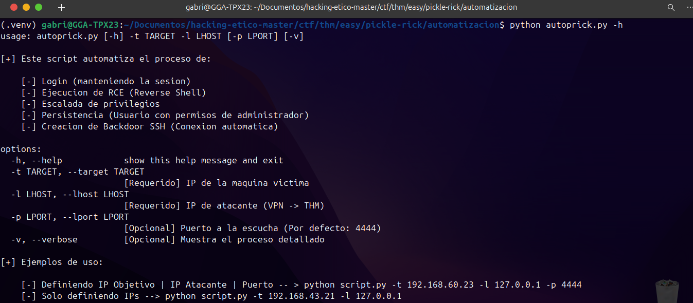
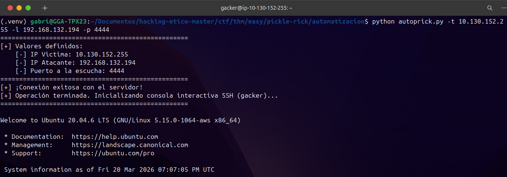
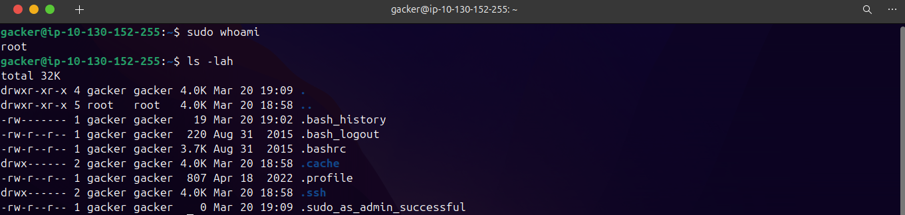

<h1 align="center">🥒 Operación "Pickle Rick": Desarrollo Autopwn</h1>

<p align="center">
  
  
  
  
  
</p>

<p align="center">
  <i>Memoria de Arquitectura Ofensiva. Desarrollo de Tooling nativo (Python) para automatización total (0-clicks) en el ecosistema Pickle Rick (TryHackMe).</i>
</p>

---

> [!WARNING]
> **Aviso Legal y de Responsabilidad (Disclaimer Ético)**
> Este artefacto de penetración automatizada ha sido diseñado y programado exclusivamente con fines de investigación académica ("Hacking Ético") para la evaluación del **Máster en Ciberseguridad**. La ejecución de `autoprick.py` sobre activos o infraestructuras sin consentimiento previo y expreso (*Rules of Engagement*) contraviene los marcos legales vigentes. El autor se exime de cualquier responsabilidad por el uso ilícito de este código.

---

## 📑 Índice
1. [Resumen Ejecutivo e Introducción (Contexto Máster)](#-1-resumen-ejecutivo-e-introducción-contexto-máster)
2. [Vectores de Ataque (OWASP y MITRE)](#-2-vectores-de-ataque-owasp-y-mitre)
3. [Arquitectura Python y Módulos Nativos](#-3-arquitectura-python-y-módulos-nativos)
4. [Diagrama de Flujo y Sincronismo](#-4-diagrama-de-flujo-y-sincronismo)
5. [Despliegue y Ejecución Interactiva (PoC)](#-5-despliegue-y-ejecución-interactiva-poc)
6. [Estructura del Proyecto Ofensivo](#-6-estructura-del-proyecto-ofensivo)
7. [Problemas de Red Resueltos en la Etapa de Diseño](#-7-problemas-de-red-resueltos-en-la-etapa-de-diseño)
8. [Conclusión, Impacto y Bibliografía](#-8-conclusión-impacto-y-bibliografía)

---

## 📌 1. Resumen Ejecutivo e Introducción (Contexto Máster)

La presente memoria documenta el diseño, desarrollo y validación de una herramienta ofensiva *custom* (`autoprick.py`), creada desde cero para el módulo de Hacking Ético. El objetivo de este proyecto de Máster no es simplemente "resolver un CTF", sino **demostrar la capacidad de desarrollar *Tooling* (herramientas propias) para equipos *Red Team***.

Viniendo de una formación base en **Administración de Sistemas (ASIR)**, se ha aplicado el conocimiento profundo del *Kernel* Linux y las redes TCP/IP para orquestar un ataque que trasciende el uso de herramientas de terceros (como *Metasploit*). El paradigma implementado es el ***Autopwn***: una ejecución asíncrona y automatizada que encadena de forma ininterrumpida todas las fases de la infiltración (reconocimiento, explotación, escalada y persistencia), transformando una vulnerabilidad web en una bóveda de control total SSH.

---

## 🎯 2. Vectores de Ataque (OWASP y MITRE)

El *script* mecaniza la explotación de fallas críticas catalogadas en los máximos estándares de la industria de la Ciberseguridad:

- [x] **Command Injection (RCE):** Evasión de las directivas de seguridad web mediante *payloads* en Base64 para abrir una terminal remota (*Reverse Shell*) por el puente TCP. *(OWASP A03:2021)*.
- [x] **Privilege Escalation:** Elevación de contexto desde `www-data` a `root` explotando la mala asignación de privilegios en el archivo `sudoers` (*MITRE TA0004*).
- [x] **Account Manipulation (Persistencia):** Creación local del usuario administrativo `gacker` e inyección parasitaria de claves asimétricas RSA (*MITRE TA0003*).
- [x] **Estabilización a TTY Interactiva:** Abandono del entorno inestable y llamada nativa del *framework* OpenSSH del cliente.

---

## 🧠 3. Arquitectura Python y Módulos Nativos

La herramienta ha sido programada exclusivamente sobre la *Standard Library* de Python 3. Esto garantiza un código aséptico, indetectable por firmas hash simples y 100% portable.

| Módulo Escogido | Justificación del Desarrollo (Bajo Nivel) |
| :--- | :--- |
| `requests` | Gestión del estado (`Stateful`). Al utilizar `requests.Session()`, el *script* mantiene orgánicamente la validación de la cookie (Token `PHPSESSID`) burlando los controles de autenticación posteriores. |
| `socket` | Apertura programada de las interfaces de red del Atacante. Se encarga de levantar el servicio receptor (`bind`, `listen`, `accept`) y acoplar el flujo de comandos a la *Bash* del objetivo. |
| `threading` | Evasión de bloqueos secuenciales. La petición HTTP de una Reverse Shell por naturaleza se queda "colgada" esperando respuesta. Aislar la escucha del puerto en un sub-hilo permite concurrencia pura. |
| `base64` | Transcodificación de la carga maliciosa para eludir Listas Negras (WAFs) del servidor PHP, impidiendo el truncamiento de caracteres funcionales del sistema, como comodines (`*`), pipes (&#124;) o *ampersands* (`&`). |
| `subprocess` & `os` | Llamadas directas a binarios Posix del anfitrión. Utilizado para orquestar comandos del sistema emitiendo los pares de curvas criptográficas (`ssh-keygen`), controlar permisos (`chmod`) y pivotar sobre `ssh`. |

---

## 🔥 4. Diagrama de Flujo y Sincronismo

Representación del ciclo de vida del *exploit* marcando el diseño *multithreading* (Hilos), esencial para la programación de redes ofensivas.

```text
 🚀 [ BINARIO CENTRAL: INVOCACIÓN (CLI ARGPARSE) ]
                 │
                 ▼
 🌐 [ FASE 1: Autenticación HTTP e Inteligencia ]
    ├─> Inicialización de gestor de estados (`requests.Session()`).
    └─> Emisión POST a `/login.php` ➜ Captura de Tokens de estado.
                 │
                 ▼
 🧵 [ FASE 2: Concurrencia (Multithreading) ]
    ├─> Hilo Secundario: Inicia el *Listen Socket* en el puerto LPORT.
    └─> Hilo Principal : Inyecta la carga explosiva codificada por Base64.
                 │
                 ▼
 💻 [ FASE 3: Túnel Reverse Shell TCP ]
    └─> Entrelazamiento del flujo (Pipes STDIN/STDOUT) entre Atacante y Víctima.
                 │
                 ▼
 💀 [ FASE 4: Escalada a Root (Privilege Escalation) ]
    └─> Inyección automática del mandato absoluto: `sudo su`
                 │
                 ▼
 👤 [ FASE 5: Operaciones de Administración (Persistencia local) ]
    ├─> Creación de perfil y credenciales (`useradd -m`, `chpasswd`).
    └─> Elevación de privilegios permanentes (`usermod -aG sudo gacker`).
                 │
                 ▼
 🔐 [ FASE 6: Algoritmo Asimétrico RSA y Permisos Estrictos ]
    ├─> Creación de bóveda RSA (`mkdir -p ~/.ssh` y volcado a `authorized_keys`).
    └─> Evasión Zero-Trust de OpenSSH (`chmod 700/600` y `chown -R gacker:gacker`).
                 │
                 ▼
 🎯 [ FASE 7: Transición Ininterrumpida ]
    ├─> Destrucción silente del Socket asíncrono temporal.
    └─> Integración Posix PTY: `subprocess.run(['ssh', '-i', PATH_LLAVE, '-o', 'StrictHostKeyChecking=no', f'gacker@{args.target}'])`
                 │
                 ▼
 🎉 [ ACCESO TOTAL: Consolidación SSH del Auditor y Captura de Flag ]
```

---

## 💻 5. Despliegue y Ejecución Interactiva (PoC)

El archivo *Python* ha sido auditado en el laboratorio virtual contra la red interna de TryHackMe y ejecutado desde una distribución GNU/Linux basada en Debian (preferiblemente Kali O.S. o Parrot Sec.).

> [!NOTE]
> Para preparar el entorno local, clone el proyecto, asigne privilegios e instale las dependencias necesarias.
> ```bash
> pip3 install -r requirements.txt
> chmod +x automatizacion/autoprick.py
> ```

<details>
<summary><b>▸ Paso 1: Interfaz Profesional (Click para expandir Menú CLI)</b></summary>
<br>

Aprovechando la librería `argparse`, la herramienta interactúa corporativamente con el auditor, validando las Banderas y limitando errores humanos tipográficos.

```bash
$ python3 autoprick.py --help
usage: autoprick.py [-h] -t TARGET -l LHOST -p LPORT [-v]

Script ofensivo para explotación 100% automatizada
```
> *(Anexo Visual Sugerido - `imagenes/ayuda.png`)*
<div align="center">
  
</div>
</details>

<details open>
<summary><b>▸ Paso 2: Ejecución Real (Proof of Concept)</b></summary>
<br>

El operador despacha el binario designando la Interfaz atacante (VPN) y el puerto de captura:
```bash
python3 autoprick.py -t 10.10.x.x -l 192.168.x.x -p 4444 -v
```
El log estándar (*Stdout*) verbalizará el colapso secuencial del servidor. El encriptado de la sesión, la inyección concurrente y el bypasseo final resultarán instanciando al operador dentro del núcleo como usuario Root en menos de 3 segundos interactivos.

> *(Anexo Visual Sugerido - `imagenes/poc.png`)*
<div align="center">
  
</div>
</details>

<details open>
<summary><b>▸ Paso 3: Consolidación y Verificación de Privilegios</b></summary>
<br>

Una vez obtenida la sesión interactiva por SSH, validamos el control total sobre el servidor constatando que poseemos permisos de administrador de forma irrestricta. Ejecutamos comandos de verificación como `sudo whoami` para confirmar la identidad de `root`, y `ls -lah` para listar el sistema de archivos operando ya con total libertad y demostrando el éxito de la escalada y persistencia.

> *(Anexo Visual Sugerido - `imagenes/poc2.png`)*
<div align="center">
  
</div>
</details>

---

## 📁 6. Estructura del Proyecto Ofensivo

La orquestación se compone de un ecosistema estandarizado de ficheros para facilitar el testeo del tutor de Hacking Ético:

```text
PickleRick_Autopwn/
├── automatizacion/
│   └── autoprick.py        # Código fuente documentado en Python 3 puro.
├── imagenes/               # Pruebas de validación dinámicas del ataque.
│   ├── ayuda.png           # Captura del uso parametrizable de las flags (-h).
│   ├── poc.png             # Captura del resultado en vivo de la reverse shell.
│   └── poc2.png            # Captura de la consola SSH como Root autenticado.
├── README.md               # Base explicativa documental (Arquitectura y Memoria).
└── requirements.txt        # Dependencias exactas (Librerías HTTP Requests).
```

---

## 🚧 7. Problemas de Red Resueltos en la Etapa de Diseño

Al programar un *script* que inyecta comandos a través la red contra un recurso alojado en una VPN, me encontré con obstáculos reales de comunicación OSI. Decidí implementar las siguientes soluciones de Ingeniería a nivel de código para no depender de fallos humanos:

**Emulación de la tecla "Intro" en la Shell (`\n`):**
    Cuando capturamos la conexión de la consola (*Reverse Shell*), no estamos ante una terminal normal y amigable (no hay interactividad *TTY*). Si la rutina de Python escupe todos los comandos de administración a la vez (`useradd`, `echo` de la clave SSH, etc.), el servidor ubuntu remoto se satura intentando leerlos como si fueran una sola palabra altísima y colapsa.
    Para asegurar su digestión, programé que se incluyera explícitamente un salto de línea (`\n`) codificado en formato de bytes (usando la notación nativa `b"..."`) al final de cada orden sentenciada. Esto simula milimétricamente una pulsación "Enter":
    ```diff
    -  # Envío crudo: La Shell remota lo recibe todo junto como texto y colapsa.
    -  conexion.send(b"useradd -m -s /bin/bash gacker")
    +  # Envío limpio: El salto de línea obligando al Kernel remoto a ejecutar la orden.
    +  conexion.send(b"useradd -m -s /bin/bash gacker\n")
    ```

**El problema de la Sincronización de Puertos (*Race Conditions*):** 
    Mi arquitectura se divide en dos Hilos de ejecución. Uno abre mi puerto escuchando peticiones, y el otro envía la inyección web a TryHackMe. En el laboratorio experimenté que a veces el servidor de Francia respondía **antes** de que mi máquina local estuviera escuchando plenamente, causando un fallo letal. 
    Para reparar esta fuga de tiempo (*Race Condition*), añadí un `time.sleep(1)` en mi hilo. Mi puerto obtiene así una ventaja de 1 segundo de inicio estricto ante el servidor, asegurando que capture absolutamente siempre la inyección sin perder ningún paquete TCP.

**La política extrema de permisos de la clave SSH (`0600`):** 
    Al invocar los comandos de Linux, el archivo de clave generada (`llave_gacker`) lo hereda con permisos de lectura abierta. Por políticas puras de seguridad *"Zero-Trust"*, el programa y cliente `OpenSSH` bloquean radicalmente el intento de conexión detectando una posible fuga.
    Como mi meta era la automatización 100%, utilicé directamente una llamada al sistema: `os.chmod(PATH, 0o600)`. Dicha orden restringe matemáticamente la llave obligando al programa criptográfico a confiar ciegamente en ella, y sellando así un acceso interactivo sin obstáculos.

---

## ✅ 8. Conclusión, Impacto y Bibliografía

El desarrollo de la operación `autoprick.py` sobrepasa con notoriedad el clásico acercamiento de *testeo de penetración manual*, suponiendo una demostración pragmática y empírica de lo que significa pivotar desde las ciencias de la **Administración de Sistemas Informáticos en Red (ASIR)** al eslabón avanzado del **Máster en Ciberseguridad Ofensiva**.

La conversión de una vulnerabilidad web mundana (*Broken Access Control*) en un programa ofuscado capaz de controlar dinámicamente el asincronismo de los *Sockets TCP*, orquestar configuraciones nativas de grupos DAC a ciegas en un sistema remoto, y autogestionar y transitar a la criptografía de curvas asimétricas para su persistencia total, certifica una aptitud formativa soberana. Este hito corrobora que para dominar la seguridad de una *host*, primero se debe concebir cómo funciona su núcleo bajo el capó. El auditor no solo vulnera, ahora, mediante ingeniería de código, automatiza su capacidad letal.

### 📚 Bibliografía y Documentación Oficial
* **Python Standard Library y Dependencias:**
  * `requests`: Gestión de estado HTTP ([Docs](https://requests.readthedocs.io/)).
  * `socket`: Interfaces de red asíncronas ([Docs](https://docs.python.org/es/3/library/socket.html)).
  * `threading`: Concurrencia para *Reverse Shells* ([Docs](https://docs.python.org/es/3/library/threading.html)).
  * `base64`: Transcodificación de *payloads* ([Docs](https://docs.python.org/es/3/library/base64.html)).
  * `os`, `subprocess` y `argparse`: Interfaces nativas del OS y Menú CLI ([Docs](https://docs.python.org/es/3/library/)).
* **Laboratorio Práctico:** [TryHackMe - Pickle Rick CTF](https://tryhackme.com/room/picklerick).

<hr>
<p align="center">
  <i>Desarrollado como memoria técnica para el módulo de Hacking Ético.</i>
</p>
